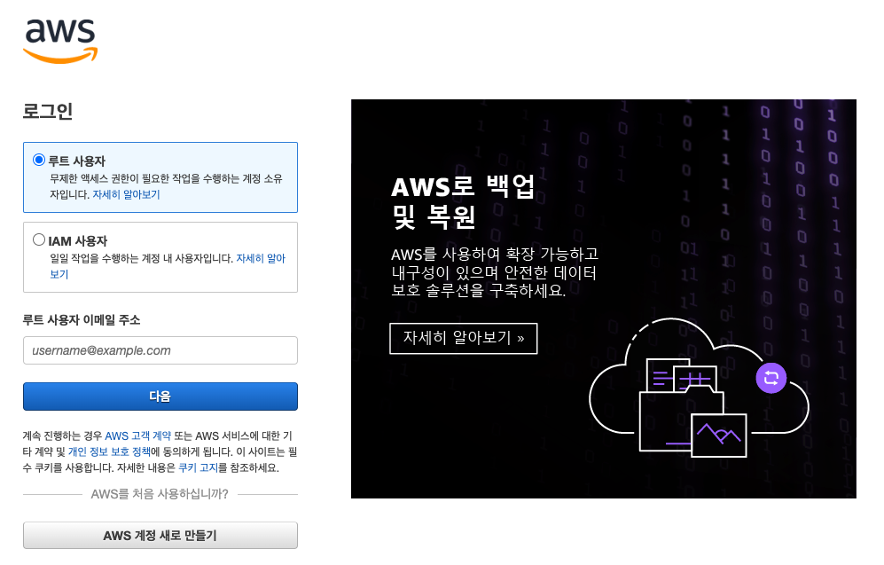

# 클라우드 컴퓨팅

* 인터넷에 연결되어있는 거대한 컴퓨터를 사용한다
* 아마존이 제공하는 상품들을 살펴본다

​                   

## 1. AWS 회원가입

* VISA, MASTER 카드 번호가 필요하다


​                  

## 2. 보안설정

* 프리티어지만 일정 조건을 만족해야 무료로 사용할 수 있다.
* 전화번호를 통해 인증을 진행한다.

​                   

## 3. 로그인



​                       

## 4. 보안설정

* 해킹을 늘 주의해야한다.
* 2단계 인증을 통해 로그인한다.
  * Activate MFA on your root account
  * 보통 구글 OTP APP을 사용

​                   

## 5. 지역

* 특정 사이트를 이용해 지역별 서버 속도를 확인하고 AWS의 가격을 이용해 비교한다. 

```
http://www.clouding,info
```

​               

### - availability zone (가용영역)

* 한 지역에 여러 개의 건물을 통해 연결하고 특정 부분에서 문제가 발생했을 때 백업할 수 있도록 데이터를 저장한다.

