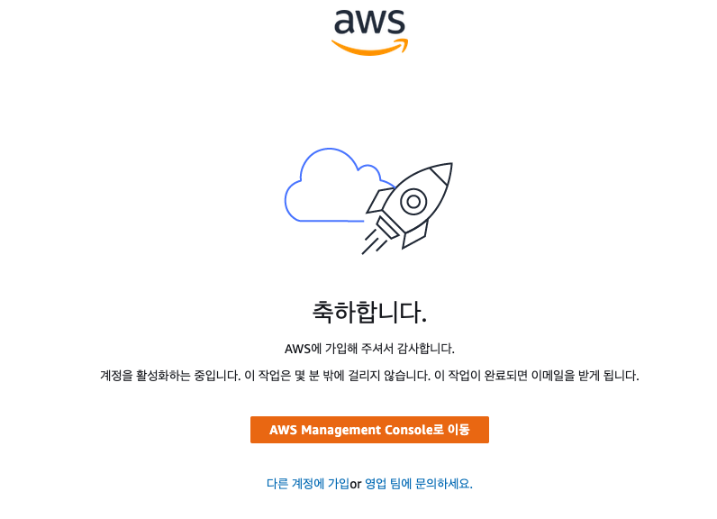
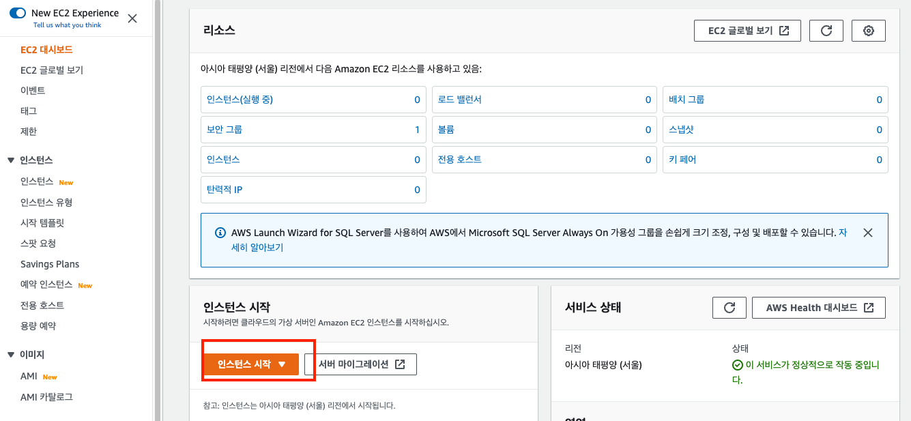
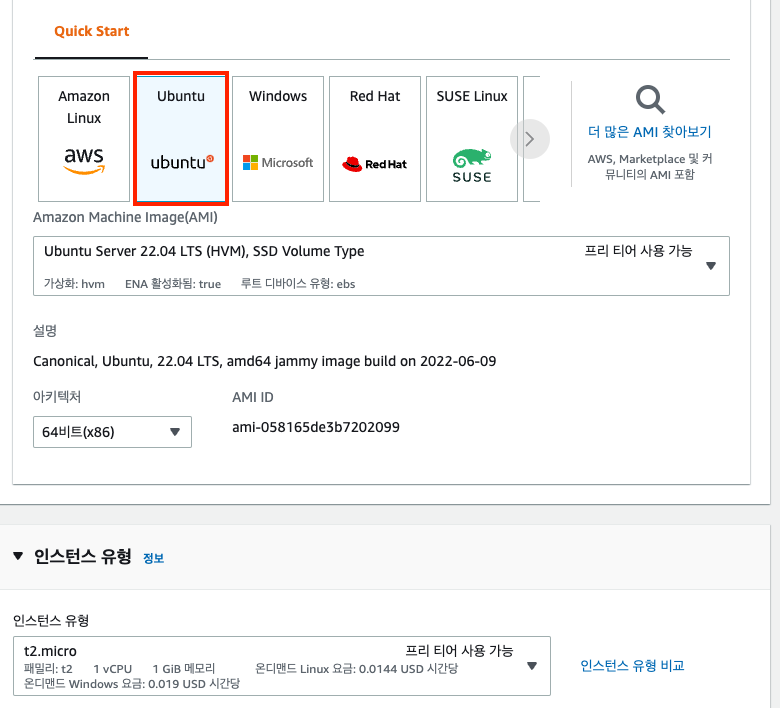
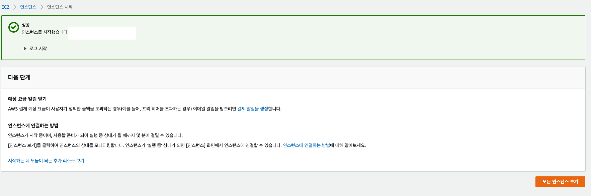

# 개인 프로젝트 AWS 배포

​                

#### <레퍼런스>

```
```

​              

### 1. AWS 가입 후 서버 배당

* EC2 프리티어를 받는다.



​            

### 2. 인스턴스 시작



​              

### 3. 인스턴스 세팅 및 생성 완료

* 우분투 사용
* 프리티어는 t2.micro



