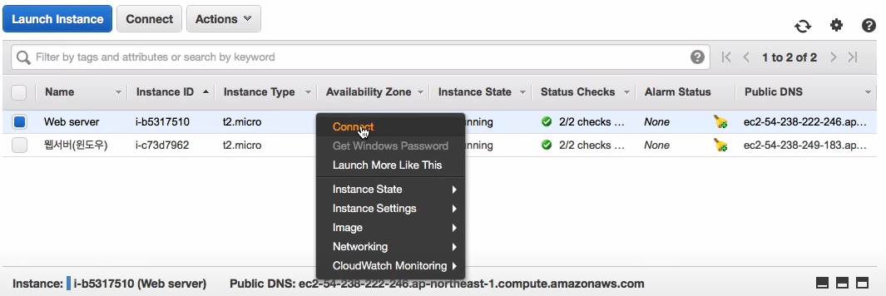
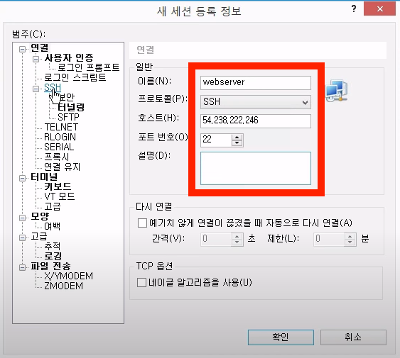
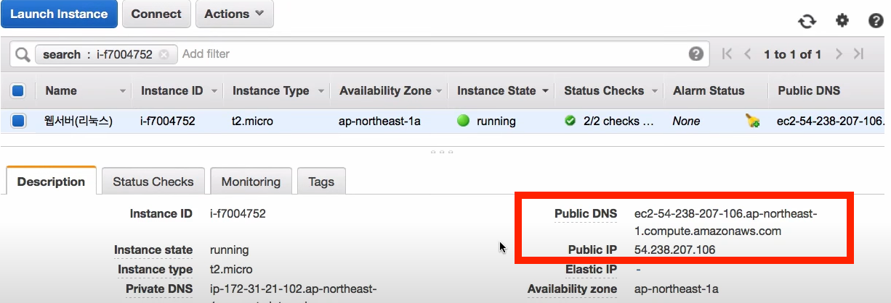
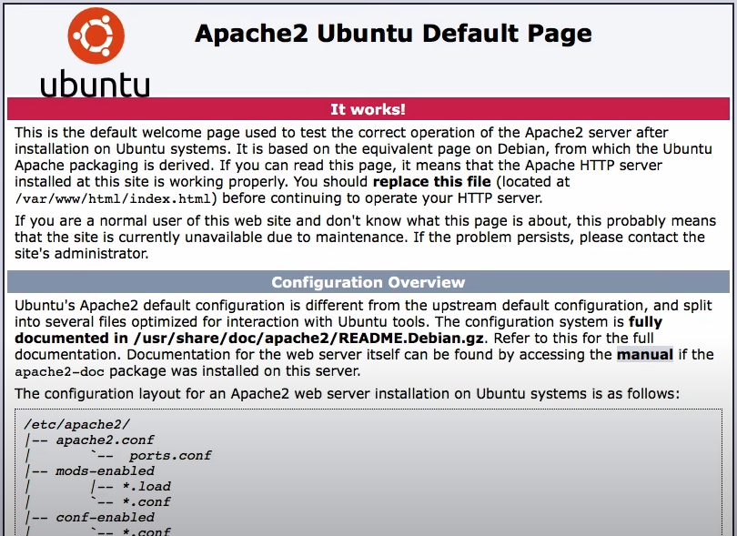

# EC2

* 가장 범용적인 서비스

​            

## 1) Instance 생성

​                   

### 0. 가격 정책

```
https://aws.amazon.com/ko/ec2/pricing/
```

* Linux, Window 일 때의 요금이 각각 다르다.
* t2 nano를 사용하면 한달에 7000원 정도로 유지할 수 있다.
* 1시간만 사용한다면 20원 정도로 매우싸다.

​                          

### 1. Instances

> Lauch Instance 클릭 - Ubuntu - SSH, HTTP 포트 등 추가 후 instance 추가

* 컴퓨터 1대 = instance 1개
* 컴퓨터 삭제 = terminate = 요금이 더 이상 발생하지 않음

​                

### 2. Configure Instance

* Number of instance: 많은 수를 추가하지 않도록 주의해야하지만 이후 확장성을 고려한다.
* Shutdown behavior
* Enable termination protection
  * 삭제가 워낙 쉬우므로 삭제 방지

​              

### 3. Storage

* Volume Type
* Delete on Termination
  * 서버는 종료해도 저장장치가 켜져있으면 비용이 청구되므로 주의한다.

​              

### 4. Configure Security Group

* 방화벽과 같은 기능
* Type: 만든 인스턴스에 접속하는 방법
  * 제한된 방법으로만 접근 가능: FTP, HTTP, SSH 등
* Source
  * SSH - My IP: 원격접속을 할 수 있는 IP를 현재 IP로 지정, Linux에서 사용
  * HTTP - Anywhere: HTTP접속은 모든 곳에서 가능하도록 설정
  * RDP: Window 제어에서 사용

​                 

### 5. Review And Launch

* 비밀번호: 해킹 방어를 위해 엄청 긴 비밀번호를 파일로 저장
* Launch Instance: 인스턴스 생성

​                        

​                      

## 2) 원격제어

​                    

### 1. Mac에서 Linux 원격제어

* Instance 우클릭 - Connect - A standalone SSH client



* Instance를 생성할 때 받은 비밀번호를 이용해 SSH 접속

* `dev`-`key` 디렉토리(없으면 생성)에 비밀번호 파일을 이동

  ```bash
  $ chmod 400 aws_password.pem # 해당 사용자가 아니면 보거나 열지 못하도록 접근 권한 설정
  # Mac에서는 우클릭 - 파일 정보 보기를 통해 권한을 확인할 수도 있다.
  ```

* ip 접속 설정: password 파일을 이용해 접속하도록 설정

  ```bash
  $ ssh -i "aws_password.pem" ubuntu@54.238.222.246 # instance가 ubuntu 이므로 이렇게 입력
  ```

* 접속 완료

* 접속 종료

  ```bash
  $ exit
  ```

​                 

### 2. Windows에서 Linux 원격제어

* SSH를 따로 설치해야한다.

  * 여기서 추천하는 프로그램: XShell

    ```
    www.netsarang.co.kr/download/main.html
    ```

* 열기 - 새로만들기

  

​                  

* 연결 - 사용자 인증
  * **사용자 이름**: 우분투를 사용하면 `ubuntu`, 다른 상품을 사용한다면 `ec2-user` 등 정해진 이름이 있음에 유의한다.
  * 사용자 키 - 찾아보기: 비밀번호 파일 찾아서 추가

​                

* 연결하기

* 접속 종료

  * XShell을 끄거나 다음 명령어 입력

  ```bash
  $ exit
  ```

  ​                  

### 3. Linux에서 웹서버 사용

​                   

  #### [1] apt-get 업데이트

```bash
$ sudo apt-get update
```

​                     

#### [2] apt-get를 통해 apache 설치

```bash
$ sudo apt-get install apache2
```

​               

### [3] 네트워크 주소 확인

* instance 관리창 - Description

  

* DNS 주소를 통해 확인

  

​                    

