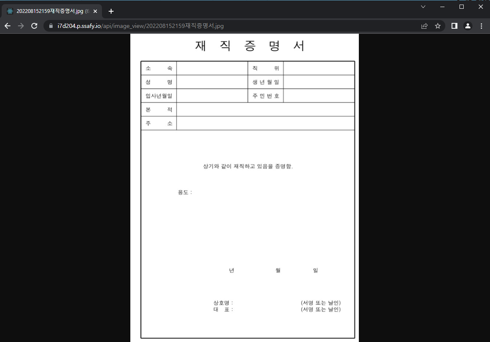

# Spring Docker image 저장

> 컨테이너를 지우고 다시 띄울 때 컨테이너 내부에 저장된 파일들은 모두 삭제된다.
> 
> 그러므로 컨테이너 외부에 데이터를 남겨놓아야 한다.
> 
> 컨테이너 외부는 결국 파이어베이스 스토리지나 우분투(컨테이너 외부) 내 저장하는 것이다.

### 1. 주의사항

* 테스트 환경이 되는 로컬(Window 또는 Mac)에서의 경로와 배포 시의 Ubuntu 내에서의 저장/열람 경로가 모두 다르다. 이 때문에 파일/이미지 경로 세팅에 필요한 변수들을 배포 환경에 따라 다르게 해야하고, 그렇기 때문에 배포 설정파일과 로컬 설정파일을 분리하는 것이 좋다.

* 분리된 설정파일마다 변수를 따로 저장한다. 변수를 저장하는 것은 그냥 아무렇게나 만들면 된다.
  
  ```properties
  variable.image.search.path=file:///C:/image/
  variable.image.save.path=C:/image/
  ```

* Controller/Service 내 값 불러오기
  
  ```java
  @Value("${variable.image.view}")
      String imagePath;
  
  @Value("${variable.image.search.path}")
      String removePath;
  ```
  
  * 설정파일마다 다른 경로가 저장되어있기 때문에 불러오는 경로도 모두 다르다.

### 2. 저장 로직

* 파일을 save 하기 위한 메서드를 따로 만든다.
  
  ```java
  try {
      SimpleDateFormat simpleDateFormat = new SimpleDateFormat("yyyyMMddHHmm");
      String uploadDate = simpleDateFormat.format(new Date());
      String profile = save(file, uploadDate);
  }
  ```
  
  * save 메서드
    
    ```java
     private String save(MultipartFile file, String uploadDate) {
    
            try {
                String newFileName = uploadDate + file.getOriginalFilename();
                byte[] bytes = file.getBytes();
                Path path = Paths.get(FILE_PATH + newFileName);
                Files.write(path, bytes);
                return path.toString();
            } catch (Exception e) {
                e.printStackTrace();
                return null;
            }
        }
    ```

### 3. URL과 이미지 파일 매핑하기

> WebMvcConfigurer을 상속한 WebConfig파일을 이용해 특정 Url을 지정해 로컬에 있는 파일 경로로 대입시켜줄 수 있다.

```java
@Configuration //Cors 세팅을 위한 인터셉터
public class WebConfig implements WebMvcConfigurer {

    @Value("${variable.image.search.path}")
    String imagePath;
    @Override
    public void addCorsMappings(CorsRegistry registry) {
        registry.addMapping("/**")
                .allowedOrigins("http://localhost:80","https://localhost:80",
                        "http://localhost:3000", "https://localhost:3000", "https://i7d204.p.ssafy.io", "*")
                .allowedMethods("*");
    }

    @Override
    public void addResourceHandlers(ResourceHandlerRegistry registry) {
        registry.addResourceHandler("/image_view/**")
                .addResourceLocations(imagePath); //리눅스 root에서 시작하는 폴더 경로
    }
}
```

* 만약 리액트에서 `localhost:8080/api/image_view/tttt.png`를 요청하면
  
  알아채고 우분투나 로컬 내의 지정된 경로로 바로 연결해서 이미지를 보여준다.

### - 예시


