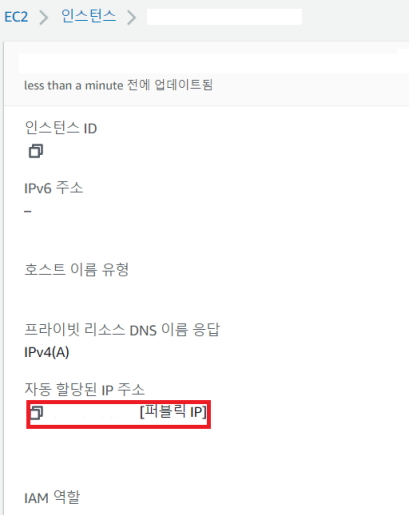

# 개인 프로젝트 AWS 배포

​                

#### <레퍼런스>

```
https://dev2som.tistory.com/141
https://crispyblog.kr/development/common/10
AWS 인바운드: https://dbjh.tistory.com/65
https://velog.io/@lluna/%EB%82%B4%ED%94%84%EB%A1%9C%EC%A0%9D%ED%8A%B8-1.-Ubuntu-%EC%97%90-%EB%8F%84%EC%BB%A4%EC%99%80-Nginx-%EC%84%A4%EC%B9%98
https://velog.io/@lluna/Deploy-EC2%EC%97%90-jenkins-nginx-%EB%A5%BC-%EB%8F%84%EC%BB%A4%EB%A1%9C-%EC%84%A4%EC%B9%98%EC%8B%9C-v%EB%A1%9C-%EB%B3%BC%EB%A5%A8-%EB%A7%A4%ED%95%91%ED%95%98%EA%B3%A0-%EA%B8%B0%EB%B3%B8-%EC%84%A4%EC%A0%95%ED%8C%8C%EC%9D%BC-%EA%B4%80%EB%A6%AC%ED%95%98%EA%B8%B0
http://dev.blog.sellmate.co.kr/post/continuous-deployment/
```

​            

#### <용어>

```
마운트: 컨테이너가 호스트 시스템에 파일을 저장할 수 있는 두가지 옵션
사용이유: 컨테이너가 삭제되면 데이터도 날아가는데 그것을 보존하기 위함
종류: volume/bind mounts
volume: Docker에서 관리하는 호스트 파일 시스템 일부에 저장(도커 관련 프로세스가 아니면 사용하지 않는다.)
 - 실행 중인 여러 컨테이너 간에 데이터를 공유할 때 볼륨이 좋다.
bind mount: 호스트 시스템 아무 곳에 저장할 수 있다. 비 Docker 컨테이너도 사용할 수 있다.
 - 호스트 시스템에서 컨테이너로 구성을 공유하는 경우
```

​              

### 4. 인스턴스 SSH 연결

* 인스턴스 연결 버튼 클릭

* Git Bash 환경에서 SSH 접속
  
  ```bash
  $ cd {pem키가 있는 곳으로 들어가기}
  $ chmod 400 {내가정한이름}
  $ ssh -i "내가정한이.pem" ubuntu@{AWS에서 알려준 주소}
  ```
  
  

    

* SSH 클라이언트에 들어가기


<br>

* 접속 완료
  
  

<br>

### 5. 초기세팅

```bash
$ sudo apt-get update # apt-get 업데이트
```

```bash
$ sudo apt-get install docker.io # 도커 설치
$ sudo ln -sf /usr/bin/docker.io /usr/local/bin/docker # 링크 생성
$ docker -v # 버전확인
$ sudo chmod 666 /var/run/docker.sock # docker sock 접근 해제, 안되면 직접 찾아가
```

```url
https://hub.docker.com/r/jenkins/jenkins
```

* 위 경로에서 lts버전을 확인할 수 있다.
  * lts와 lts-jdk11 의 차이점은 일반 lts은 jdk8로 실행. 이후 오라클 라이센스문제로 한동안 도커로 안나왔지만 11부터 다시 도커로 나온다.
  * 도커 내부에 jenkins를 설치하면 자바 설치 없이 Jenkins가 구동되는 장점을 가진다.


* 만약 root user 권한이 아닌 현재 유저의 권한으로 docker 명령어를 사용하려면, 해당 user가 docker를 이용할 수 있도록 설정하도록하자. root가 아닌 user로 docker 명령어를 실행하게 될 경우 에러문구가 나올것이다.
  
  ```bash
  $ echo $USER
  $ sudo usermod -aG docker $USER # 현재 유저 docker 권한 추가
  $ docker restart # 도커재시작
  ```
  
  ```bash
  $ docker images # 
  ```

​             

#### [방법 1] 도커에 젠킨스 설치

```
https://velog.io/@lot8229/DevOps-%EB%8F%84%EC%BB%A4%EB%A5%BC-%EC%82%AC%EC%9A%A9%ED%95%B4%EC%84%9C-Jenkins-%EB%A5%BC-%EC%84%A4%EC%B9%98-%ED%9B%84-%EA%B5%AC%EC%84%B1-%ED%95%98%EA%B8%B0
```

```bash
$ docker pull jenkins/jenkins:lts-jdk11

# 컨테이너 내부에서 sudo를 사용하게 하기 위해 다음과 같은 명령어를 사용하기도 한다.
# 젠킨스 내부 접속시 id라는 명령어를 사용하면 사용자의 uid/gid를 확인할 수 있다.
$ sudo chown -R 1000:1000 $PWD/jenkins_home/
# jenkins 디렉토리의 유저 및 그룹 소유자를 id 1000으로 설정한다.

$ docker run -d --name jenkins -p 9090:8080 -v /jenkins:/var/jenkins_home -v /usr/bin/docker:/usr/bin/docker -v /var/run/docker.sock:/var/run/docker.sock -u root jenkins/jenkins:lts

$ sudo docker image ls   

# docker container rm jenkins : 잘못 생성했을 때 사용
# docker rm -f jenkins : ㅅ
```

* **-v /jenkins:/var/jenkins_home**

  * 젠킨스 컨테이너의 설정을 호스트 서버와 공유, 서버가 삭제되는 경우에도 설정을 유지
* **-v /usr/bin/docker:/usr/bin/docker -v /var/run/docker.sock:/var/run/docker.sock**

  * 젠킨스 컨테이너 내부에서도 호스트 서버의 도커를 사용할 수 있도록 함

  * **DooD(Docker out of Docker)** 방식이라고 한다.
* -p 8080:8080

  * 젠킨스 9090을 호스트의 8080과 연결
* `50000`: 슬레이브 포트
  * 충돌문제가 발생하면 연결되는 포트

* docker.sock
  * 도커 컨테이너 내부에서 데몬과 상호 작용할 수 있게 해주는 Unix 소켓
  * 도커 엔진은 Host OS(현재 우분투)의 `/var/run/docker.sock` 아래에 마운트 된 Unix 소켓을 사용한다.


​               

#### [방법 2] 도커에 젠킨스 설치

* 홈에 폴더를 만들고 그곳에 바인드 마운팅을 해주는 방식
  * `-v`를 이용해 호스트 경로와 컨테이너 경로를 연결한다.
  * 컨테이너가 삭제되어도 호스트 경로에 정보가 남는다.

```bash
$ mkdir jenkins_home
```

```bash
docker run --name jenkins 
-d 
--restart always 
-p 9090:8080 
-p 50000:50000 
-e TZ=Asia/Seoul  
-v $PWD/jenkins_home:/var/jenkins_home 
-v /var/run/docker.sock:/var/run/docker.sock  
-v /usr/bin/docker:/usr/bin/docker 
jenkins/jenkins:lts-jdk11
```

```bash
$ docker run --name jenkins -d --restart always -p 9090:8080 -p 50000:50000 -e TZ=Asia/Seoul -v $PWD/jenkins_home:/var/jenkins_home -v /var/run/docker.sock:/var/run/docker.sock -v /usr/bin/docker:/usr/bin/docker jenkins/jenkins:lts-jdk11
```

​              

### 6. 포트 포워딩

* 위의 경우, **로컬의 9090포트로** 들어오는 요청을 **도커엔진** 위에 떠있는 jenkins 컨테이너(8080을 일반적으로 사용함)로 포트포워딩 하는데, 9090 포트로 들어오는 요청이 정상적으로 들어올 수 있게 인바운드 허용을 해줘야한다.

* AWS 관리페이지에서 [네트워크 및 보안] - [보안 그룹]
  
  

* 둘 중 보안 그룹 이름이 더 긴 것을 선택해 체크
  
  * 보안 그룹 ID(파란색)을 클릭하면 인바운드 규칙 설정을 할 수 있다.

* 인바운드 규칙 허용에서 `9090`포트의 접근을 허용해준다.
  
  

* IP접근: AWS에서 발급하는 `[IP주소]:9090` 으로 접속한다.
  
  

 <br>

### 7.  Jenkins

* jenkins 접속화면
  
  

* docker에서 jenkins 내부 컨테이너의 비밀번호 파일 값 읽기
  
  ```bash
  $ docker exec jenkins cat /var/jenkins_home/secrets/initialAdminPassword
  ```

* 만약 직접 jenkins 접속하고 싶다면 다음 명령어 사용
  
  ```bash
  # 도커 컨테이너 내부로 접속
  $ docker exec -it  도커컨테이너ID /bin/bash
  
  # example
  $ docker exec -it  6832359260fd /bin/bash
  ```

<br>

* 설치: install suggested plugins
  
  

* 설치 진행
  
  

​                 

### 8. Jenkins와 Github 연결

* 라이브러리 설치: [Jenkins 관리] - [플러그인 관리]

  

* Github API, Github, Gradle 플러그인 설치

​              

* Global Setting 설정

  

  * JDK, Gradle 설정

    

    

    

​              

### 9. Github 연동

* 프로젝트 생성


* 바로 클론하지 않고 프로젝트 내부 최상위 루트에서 터미널 창을 연다.

  * 만약 프로젝트명이 A라면 A디렉토리 내부 중 최상위 위치

    ```bash
    $ git init
    $ git remote add origin [git 주소]
    $ git add .
    $ git commit -m "first CI"
    $ git push origin master
    ```

  

* 토큰 발급: 자신의 깃허브에서 Profile - Settings - Developer Settings - Personal Access Token 클릭

  * Generate New Token 클릭

    * repo. webhook 체크

      

    

    

* 레포지토리로 나가서 Webhook 설정

  

  * webhook Payload URL 추가

    ```
    http://[EC2 ip 또는 DNS 주소]/github-webhook/
    ```

    

​           

#### - Jenkins 세팅

```
https://junhyunny.github.io/information/jenkins/github/jenkins-github-webhook/
```

* 인증 등록

  * Add를 눌러 인증을 등록하고 `Secret Text`선택 후 Secret에 token 넣기

  

* 새로운 Item 클릭

  

* 생성

  

* Add를 눌러 인증을 등록하고 `Secret Text`선택 후 Secret에 token 넣기

  

  
