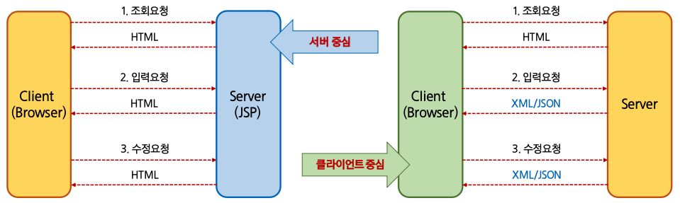

# Ajax

> (Asynchronous Javascript And XML)의 약어.
>
> 언어나 프레임워크가 아닌 구현하는 방식을 의미
>
> **화면을 갱신하지 않고** 데이터를 서버로부터 가져와 처리하는 방법
>
> Javascript의 XMLHttpRequest(XHR) 객체로 데이터를 전달하고 **비동기 방식**으로 결과를 조회
>
> 화면 갱신이 없으므로 사용자 입장에서 편리하지만 동적으로 DOM을 구성해야 하므로 구현이 복잡하다.

### 동기 vs 비동기

> 동적, 정적 개념과는 다른 개념이다.

* 화면이 전체가 바뀌는 것: 동기방식
  * Ex) location, reload, onload 등이 사용되는 환경
* 화면의 일부분이 바뀌는 것: 비동기 방식

​                      

### 일반 요청에 대한 응답 [동기]

* data를 입력 후 event 발생
* Ajax를 적용하지 않은 요청은 서버에서 data를 이용하여 logic처리
* logic 처리에 대한 결과에 따라 응답 page를 생성하고 client에 전송(화면 전환)

​       

### Ajax 요청에 대한 응답 [비동기]

* data 입력 후 event 발생
* Ajax를 적용하면 event 발생시 서버에서 요청을 처리한 후 Text, XML 또는 JSON으로 응답
* Client(Browser)에서는 이 응답 data를 이용해 화면 전환없이 현재 페이지에서 동적으로 화면을 재구성

​           

​             

## 서버와 클라이언트의 상호작용



* 웹 화면을 구성하는 방식: 서버 중심의 상호작용 방식 / 클라이언트 중심의 상호작용 방식
  * 서버 중심(server-side script, 동기): 화면 구성이 서버에서 이루어진다.
  * 클라이언트 중심(비동기): 개발방식은 클라이언트에서 화면 구성, HTML을 다시 받는 것이 아닌 XML/JSON으로 통신
  * Ajax는 클라이언트 중심의 개발 방식이며 비동기 요청보다는 **동적 화면구성**이 관건

​              

​                   

## Javascript AJAX

* `XMLHttpRequest`는 자바스크립트가 Ajax 방식으로 통신할 때 사용하는 객체 **[비동기식 방법에서 필수]**

  * Ajax 통신 시 전송방식, 경로 등 전송정보를 싣는 역할
  * 실제 서버와 통신은 브라우저의 Ajax 엔진에서 수행
  * 직접 자바스크립트로 Ajax를 프로그래밍할 경우 브라우저마다 방식이 달라 코드가 복잡해진다. 

  ​      

  ### ready State

  | 값   | 의미          | 설명                                                    |
  | ---- | ------------- | ------------------------------------------------------- |
  | 0    | Uninitialized | 객체만 생성(open 메소드 호출 전)                        |
  | 1    | Loading       | open 메소드 호출                                        |
  | 2    | Loaded        | send 메소드 호출. status의 헤더가 아직 도착되기 전 상태 |
  | 3    | Interactive   | 데이터 일부를 받은 상태                                 |
  | 4    | Completed     | 데이터 전부를 받은 상태                                 |

  ​              

  ### Status

  | 값   | 텍스트(status Text)   | 설명           |
  | ---- | --------------------- | -------------- |
  | 200  | OK                    | 요청 성공      |
  | 403  | Forbidden             | 요청 거부      |
  | 404  | Not Found             | 페이지 없음    |
  | 500  | Internal Server Error | 서버 오류 발생 |

  ​        

### 테스트

* Java: 이클립스를 켜고 new - Other - Web - Dynamic Web Project에서
  * Target runtime을 아파치 톰캣 버전에 맞게 선택
* 만약 안된다면 Preference 에서 Web Browser를 검색하고 New 에서 크롬을 연결하기
  * Window 메뉴 - Web Browser - 크롬 선택 후 Run

​        

​            

## jQuery AJAX 함수

| 옵션 속성 이름                | 설명                             | 자료형           |
| ----------------------------- | -------------------------------- | ---------------- |
| async                         | 동기/비동기 지정(디폴트: 비동기) | Boolean          |
| **url**                       | 대상 URL 지정                    | String           |
| **data**                      | 요청 매개변수 지정               | Object, String   |
| **type**                      | GET / POST 방식 지정             | String           |
| **success(data, status,xhr)** | Ajax 성공 이벤트 리스너 지정     | Function, Array  |
| complete(xor, status)         | Ajax 완료 이벤트 리스너 지정     | Function         |
| error(xor,status,error)       | Ajax 실패 이벤트 리스너 지정     | Function         |
| timeout                       | 만료 시간 지정                   | Number           |
| jsonp                         | JSONP 매개변수 이름을 지정       | String           |
| jsonpCallback                 | JSONP 콜백 함수 이름을 지정      | String, Function |

​          

### `$.get()`  `$.post()`

```javascript
$.xxx(url, function(result, textStatus, jqXHR){});
$.xxx(url, data, function(result, textStatus, jqXHR){});
```

​           

​         

## GET 방식과 POST 방식

### GET 방식의 특징

* URL에 변수를 포함시켜 요청한다
* 데이터를 **Header**에 포함하여 전송한다.
* URL에 데이터가 노출되어 보안에 취약하다.
* 전송하는 길이에 제한이 있다.
* 캐싱할 수 있다.

### POST 방식의 특징

* URL에 변수 노출을 하지 않고 요청한다
* 데이터를 Body에 포함시킨다.
* URL에 데이터가 노출되지 않기에 기본 보안은 되어있다.
* 전송하는 길이에 제한이 없다
* 캐싱할 수 없다.

​            

## $(selector).load(url)

```javascript
$(selector).load(url, data, function(result, textStatus, jqXHR){}));
```

