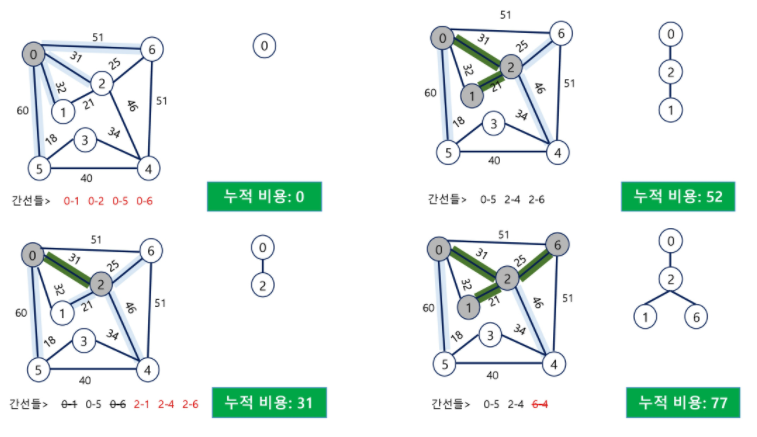

# 최소 신장 트리(MST)

> 간선이 적으면 쿠루스칼 간선이 많으면 프림 (간적쿠 간만프)

* 그래프에서 최소 비용 문제
  * 모든 정점을 연결하는 간선들의 가중치의 합이 최소가 되는 트리
  * 두 정점 사이의 최소 비용의 경로 찾기
* 신장 트리
  * n개의 정점으로 이루어진 무향 그래프에서 n개의 정점과 n-1개의 간선으로 이루어진 트리
* **최소 신장 트리**(Minimum Spanning Tree)
  * 무향 가중치 그래프에서 신장 트리를 구성하는 간선들의 가중치의 합이 최소인 신장 트리
  * 그 어떤 지점도 **고립되지 않고 연결망으로 연결**

​                

​                 

# KRUSKAL 알고리즘

> 간선의 수가 너무 많은 경우 정렬로 인한 비효율성이 높아진다


* 간선을 하나씩 선택해서 MST를 찾는 알고리즘

  1. 최초, 모든 간선을 가중치에 따라 오른차순으로 정렬
  2. 가중치가 낮은 간선부터 선택하면서 트리를 증가시킴
     * 사이클이 존재하면 다음으로 가중치가 낮은 간선 선택
  3. n-1개의 간선의 선택될 때까지 2를 반복

  ​      

​       

## 사이클 확인 방법

> **유니온 파인드**의 개념을 도입한다

​        

### 최소 신장 트리 조건을 만족

* 원소가 N개일 때 **N-1개의 간선이 존재**해야하며 **사이클이 존재해서는 안된다.**

* 만약 A-B 가 서로 연결되어있고 C와의 간선을 넣기 전 사이클이 만들어지는지 확인하기 위해 **각 집합의 대표값을 비교**한다
  * 만약 **같은 대표값이라면 서로 원소에 이미 포함되어있기 때문에 사이클이 발생**
  * 이러한 합집합 연산을 N-1번 만족하면 간선이 N-1개 생성되어 최소신장트리(MST)가 완성된다.

```java
// G.V : 그래프의 정점 집합
// G.E : 그래프의 간선 집합

MST-KRUSKAL(G, w)
	FOR vertex v in G.V
		MakeSet(v)
		
	G.E에 포함된 간선들을 가중치 w를 이용한 오름차순 정렬
	
	FOR 가중치가 가장 낮은 간선 (u, v) ∈ G.E 선택(n-1개)
		IF Find-Set(u) != Find-Set(v)
				Union(u,v)
```

​        

### 전체코드      

```java
import java.io.*;
import java.util.*;
public class Solution {
	
	static int N,parents[];
	static Edge[] edgeList;
	
	static class Edge implements Comparable<Edge>{ //간선 객체 구현, 정렬을 위한 인터페이스 구현
		int from, to, weight;

		public Edge(int from, int to, int weight) { // 생성자로 인스턴스 값 저장
			super();
			this.from = from;
			this.to = to;
			this.weight = weight;
		}
		
		@Override
		public int compareTo(Edge o) {
			return this.weight-o.weight;
		}
	}
	
	static int find(int a) { //대표찾기
		if(parents[a]==a) return a;
		
		parents[a] = find(parents[a]); // 압축
		return parents[a];
	}
	
	static boolean union(int a, int b) { //합치기
		int aRoot = find(a);
		int bRoot = find(b);
		if(aRoot == bRoot) return false; //두 집합이 같은 경우 리턴
		
		parents[bRoot] = aRoot; // 다르면 한쪽에 합치기
		return true;
	}
	
public static void main(String[] args) throws IOException{
	BufferedReader br = new BufferedReader(new InputStreamReader(System.in));
	StringTokenizer st;
	
	 st = new StringTokenizer(br.readLine());
	 N = Integer.parseInt(st.nextToken());
	 int E = Integer.parseInt(st.nextToken());
	 
	 parents = new int[N+1];
	 edgeList = new Edge[E];
	 
	 for(int i=0; i<N+1; i++) {
		 parents[i] = i; //자기 자신이 대표
	 }
		 
	 for(int i=0; i<E; i++) {
		 st = new StringTokenizer(br.readLine());
		 int from = Integer.parseInt(st.nextToken());
		 int to = Integer.parseInt(st.nextToken());
		 int weight = Integer.parseInt(st.nextToken());
		 
		 edgeList[i] = new Edge(from,to,weight); // 간선 정보 저장
	 }
	 
	 Arrays.sort(edgeList); //최소 가중치로 정렬
	 
	 int result = 0, cnt = 0; //최소값을 저장할 변수
	 
	 for(Edge edge : edgeList) { //가중치로 정렬된 간선들을 최대한 합치면서 진행
		 if(union(edge.from,edge.to)) { //트리가 생성되면서 최소값 도출
			 result += edge.weight;
			 
			 if(++cnt == N-1) break;
		 }
	 }
		 
	 System.out.println(result);
}
}
```

​               

​                 

​                   

# PRIM 알고리즘

> 현재 연결되지 않은 정점을 기준으로 간선을 살핀다
>
> 간선의 길이가 최소인 곳을 골라 다시 연장한다.



* 하나의 정점에서 연결된 간선들 중에 하나씩 선택하면서 MST를 만들어 가는 방식
  1. 임의 정점을 하나 선택
  2. 선택한 정점과 인접한 정점들 중 최소 비용의 간선이 존재하는 정점을 선택
     * 최소값을 선택하기 위해서 처음 저장된 값은 정수의 최대값
  3. 모든 정점이 선택될 때까지 1,2 과정을 반복
* 서로소인 2개의 집합(2 disjoint-sets) 정보를 유지
  * 트리의 정점들(tree vertices) - MST를 만들기 위해 선택된 정점들
  * 비트리 정점들(non-tree vertices) - 선택되지 않은 정점들

```java
MST-PRIM(G, r) // G : 그래프, r : 시작 정점, minEdge[] : 각 정점 기준으로 타 정점과의 최소 간선 비용
  result = 0, cnt = 0  // result: MST 비용, cnt: 처리한 정점수, visited[]: MST에 포함된 정점 여부
  
  FOR u in G.V
  	minEdge[u] = 가장 큰 값으로 시작
  minEdge[r] = 0; // 시작 정점 r의 최소비용 0 처리

	WHILE true
    	u = Extract-MIN() // 방문하지 않은(MST에 포함되지 않은 정점) 최소 비용 찾기
    	visited[u] = true // 방문 처리
    	result = result + minEdge[u] // 비용 누적
    	
    	if(++cnt == N) break; // 모든 정점이 연결되었다면 MST 완성

			FOR v in G.Adj[u] // u 의 인접 정점들
        	IF visited[u] == false AND w(u,v) < minEdge[v] // u->v 비용이 최소비용보다 작다면 갱신
        			minEdge[v] = w(u,v)
        
  return result
```

​            

### 전체코드

```java
public static void main(String[] args) throws IOException{
	BufferedReader br = new BufferedReader(new InputStreamReader(System.in));
	StringTokenizer st;
	
	 N = Integer.parseInt(br.readLine()); //정점 개수
	 int[][] adjMatrix = new int[N][N]; //인접행렬
	 int[] minEdge = new int[N]; //타정점에서 자신으로의 간선비용 중 최소비용
	 boolean[] visited = new boolean[N]; // 방문체크 배열
	 
	 for (int i = 0; i < N; i++) {
		st = new StringTokenizer(br.readLine());
		for (int j = 0; j < N; j++) {
			adjMatrix[i][j] = Integer.parseInt(st.nextToken());
		}
		minEdge[i] = Integer.MAX_VALUE; //충분히 큰 값으로 최소화
	 }
	 //minEdge[] : 현재 연결되지 않은 노드들의 최소값을 갱신하는 배열
  
	 int result = 0; //MST 비용
	 minEdge[0] = 0;

		 
  	//정점 하나하나를 살핀다
	 for(int c=0; c<N; c++) { // N개의 정점을 연결
		 // 신장트리에 연결되지 않은 정점 중 가장 유리한 비용의 정점을 선택
		 int min = Integer.MAX_VALUE;
		 int minVertex = 0;
		 
		 for(int i=0; i < N; i++) {
			 if(!visited[i] && min>minEdge[i]) { //연결되지 않은 노드 중 최소 노드 길이를 찾기
				 min = minEdge[i];
				 minVertex = i;
			 }
		 }
		 
		 //선택된 정점을 신장트리에 포함
		 visited[minVertex] = true;
		 result += min;
		 
		 // 선택된 정점 기준으로 신장트리에 포함되지 않은 다른 정점으로의 간선 비용을 따지고 최소값 갱신
		 for(int i=0; i<N; i++) {
			if(!visited[i] && adjMatrix[minVertex][i]!=0 && minEdge[i]>adjMatrix[minVertex][i]) {
				// 원래 minVertex 는 잠금 상태 (정수 최대값) 그러나 연결해주는 순간 그 주변 노드들은 잠금 풀림 
        // 현재 노드에서 간선 하나를 사용했으므로 
        // 트리에 포함되지 않고, 방금 체크한 트리와 연결된 노드와 연결된 노드의 최소 간선을 업데이트
        // 즉 팔을 새로 하나 뻗고 그에 포함되지 않은 노드들에 대한 간선 정보를 업데이트(해금)
        	minEdge[i] = adjMatrix[minVertex][i];
			 }
		 }
	 }
	 
		 
	 System.out.println(result);
}
```


**전체코드2**

```java
package algoStudy;
import java.util.Arrays;
import java.util.Scanner;

/*
 * 
5
0 5 10 8 7 
5 0 5 3 6 
10 5 0 1 3 
8 3 1 0 1 
7 6 3 1 0

output==>10

7
0 32 31 0 0 60 51
32 0 21 0 0 0 0
31 21 0 0 46 0 25
0 0 0 0 34 18 0
0 0 46 34 0 40 51
60 0 0 18 40 0 0
51 0 25 0 51 0 0

output==>175
 * 
 * 
 */


public class MST_PrimeTest_Copy {

	public static void main(String[] args) {
		Scanner sc = new Scanner(System.in);
		int N = sc.nextInt();

		int[][] map = new int[N][N];

		for(int i =0; i < N; i++) {
			for(int j = 0; j < N; j++) {
				map[i][j] = sc.nextInt();
			}
		}
		
		//신장트리에 포함여부 판단 배열
		boolean[] v = new boolean[N];
		//다른 정점에서 자신으로의 최소비용을 저장하는 배열 공간 선언 및 최대값으로 초기화
		int[] minEdge = new int[N];
		Arrays.fill(minEdge, Integer.MAX_VALUE);
		// MST 저장변수
		int result = 0;
		//임의의 정점을 시작점부터 발생하기 위함 처음 방문하는 지점 최소비용(0)으로 초기화
		minEdge[0] = 0;
		for(int c = 0; c < N; c++) { //모든 정점에서 연결해야 하는 최소갯수는 N-1
			//1.신장트리에 연결되지 않은 정점중에서 가장 유리한 정점을 선택
			int min = Integer.MAX_VALUE;
			int minIdx = -1;
			// 최소값을 가지고 있는 정점선택
			for(int i = 0; i < N; i++) {
				//이미 신장트리에 포함된 정점은 제외
				if(v[i]) continue;
				// 최소비용배열에서 신장트리에 포함되지 않은 정정에서 최소 비용과 위치를 찾음
				if(min > minEdge[i]) {
					min = minEdge[i];
					minIdx = i;
				}
			}
		
			
			//2. 선택된 정점을 신장트리에 포함 시킴
			v[minIdx] = true;
			// 그때 선택된 정점에 대한 최소 비용을 결과값에 저장
			result += min;
			
			//3. 방금 선택된 정점 기준으로 신장트리에 포함되지 않은 정점으로 연결된
			//   간선비용을 따져봐서 최소비용을 업데이트 함
			//   (이 부분이 정렬하지 않고 최소값으로 찾기 만으로 다음 정점을 선택함)
			for(int i = 0; i < N; i++) {
				//신장트리에 포함된 놈은 제외
				if(v[i]) continue;
				
				 //연결되지 않은 정점은 무시
				if(map[i][minIdx]==0) continue;
				 //연결된 정점에서 최소값으로 갱신
				if(map[i][minIdx]<minEdge[i]) {
					minEdge[i] = map[i][minIdx];
				}
			}
		}
		//MST값 출력
		
		System.out.println(result);
	}

}
```


​       

## PRIM with PriorityQueue

```java
MST-PRIM(G, r) // G : 그래프, r : 시작 정점, midEdge[] : 각 정점 기준 타 정점과의 최소 간선 비용
	result = 0, cnt = 0
	
	FOR u in G.V
		minEdge[u] = 가장 큰값으로 시작
	
	minEdge[r] = 0
	
	WHILE true
			u = Extract-MIN() // 방문하지 않은 최소비용 정점 찾기
  
  return result
```

```java
import java.util.Arrays;
import java.util.PriorityQueue;
import java.util.Scanner;

import javax.xml.crypto.Data;

/*
 * 
5
0 5 10 8 7 
5 0 5 3 6 
10 5 0 1 3 
8 3 1 0 1 
7 6 3 1 0

output==>10

7
0 32 31 0 0 60 51
32 0 21 0 0 0 0
31 21 0 0 46 0 25
0 0 0 0 34 18 0
0 0 46 34 0 40 51
60 0 0 18 40 0 0
51 0 25 0 51 0 0

output==>175
 * 
 * 
 */

class Data implements Comparable<Data>{ // 배열이 아니라 객체로 최소값을 갱신
	int ver, dis;
	public Data(int ver, int dis) { // 노드 번호, 최소 거리
		super();
		this.ver = ver;
		this.dis = dis;
	}	
	@Override
	public int compareTo(Data o) { // 우선순위 큐에 넣기 때문에 우선순위를 어떻게 할 것인지 결정
		// TODO Auto-generated method stub 
		return Integer.compare(dis, o.dis); // 거리 오름차순 : 거리의 최소값이 위로 올라옴
	}
	
}

public class Main {

	public static void main(String[] args) {
		Scanner sc = new Scanner(System.in);
		int N = sc.nextInt();

		int[][] map = new int[N][N];

		for(int i =0; i < N; i++) {
			for(int j = 0; j < N; j++) {
				map[i][j] = sc.nextInt();
			}
		}
		
		//신장트리에 포함여부 판단 배열
		boolean[] v = new boolean[N];
		
    // 우선순위큐를 만들고 갱신되는 최소값들을 모두 우선순위큐에 집어넣어 바로바로 뽑도록함
		PriorityQueue<Data> pq = new PriorityQueue<>();
		pq.offer(new Data(0,0)); // 0번노드의 최소거리를 0으로 넣어줌
		// O(NlogN)
		Data cur = null;
		int res = 0;
		
		while(!pq.isEmpty()) {
			cur = pq.poll(); // 맨 위 노드를 뽑고
			
			if(v[cur.ver]) { // 이미 방문했다면 가지치기 : 하나의 노드라도 최소값이 여러번 갱신되기에
        							 // 맨 앞에 것을 뽑으면 그 뒤의 값들은 버려짐
				continue;
			}

			v[cur.ver] = true; // 방문 안했던 노드라면 방문체크
			
			res += cur.dis; // 그 값을 더해주고
			
			for(int i = 0; i<N; i++) {
				if(v[i] || map[cur.ver][i] == 0) continue; //방문하지 않았던 노드 중 연결된 노드의 값들 넣기
				
				pq.offer(new Data(i,map[cur.ver][i])); // 굳이 갱신하지 않고 우선순위 큐에 넣으면 자동으로 됨
			}
			
		}
		//MST값 출력
		
		System.out.println(res);
	}

}
```

