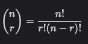
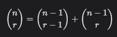

# 동적계획법


## 1. 재귀호출과 메모이제이션

* 피보나치 수를 구하는 재귀함수

  > 피보나치를 구하는 함수를 재귀함수로 구현한 알고리즘은 문제점이 있다.
  > "엄청난 **중복 호출**이 존재한다"는 것이다
  > 중복을 피하는 방법은 무엇일까?

  ```java
  fibo(n)
  	IF n < 2 : RETURN n
  	ELSE : RETURN fibo(n - 1) + fibo(n - 2)
  ```

​         

### 메모이제이션(memoization)

> Memoization: 메모리에 넣기(to put in memory) 라는 의미, 기억되어야 할 것이라는 뜻의 라틴어 memorandum에서 파생

*  컴퓨터 프로그램을 실행할 때 이전에 계산한 값을 메모리에 저장해서 매번 다시 계산하지 않도록 하여 전체적인 실행속도를 빠르게 하는 기술이다. 동적 계획법의 핵심이 되는 기술이다.

  ​          

* **Memoization** 방법을 적용한 알고리즘

  ```java
  memo를 위한 배열을 할당하고, 모두 0으로 초기화
  memo[0]을 0으로 memo[1]는 1로 초기화
  
  fibo1(n)
  	IF n >= 2 AND memo[n] = 0
    	memo[n] = fibo(n-1) + fibo(n-2)
    RETURN memo[n]
  ```

* 특징

  1) 추가적인 메모리 공간이 필요하다.
  2) 재귀함수 호출로 인한 시스템 호출 스택을 사용하게 되고 실행 속도 저하 또는 오버플로우가 발생할 수 있다.

​          

​           

## 2. 동적계획법(Dynamic Programming)

* 그리디 알고리즘과 같이 최적화 문제를 해결하는 알고리즘.
* 동적계획법은 **먼저 작은 부분 문제들의 해들을 구하고 이들을 이용하여 보다 큰 크기의 부분 문제들을 해결**하여, 최종적으로 원래 주어진 문제를 해결하는 알고리즘의 설계 기법이다.

​             

* 동적 계획법을 적용하기 위해 다음 요건을 만족해야한다.
  * 중복 부분문제 구조(Overlapping subproblems)
  * 최적 부분문제 구조(Optimal substructure)

​         

#### - 중복 부분문제 구조(Overlapping subproblems)

* DP는 큰 문제를 이루는 작은 문제들을 먼저 해결하고 작은 문제들의 최적 해(Optimal Solution)를 이용하여 순환적으로 큰 문제를 해결한다. (순환적 관계를 명시적으로 표현하기 위해 점화식을 이용한다.)
* DP는 문제의 순환적인 성질 때문에 이전에 계산되었던 작은 문제의 해가 어디선가 필요하게 되는데 이를 위해 작은 문제의 해들을 어떤 저장 공간(table)에 저장한다.
* 그리고 이렇게 저장된 해들이 다시 필요할 때마다 해를 얻기 위해 문제를 재계산하지 않고 table의 참조를 통해 중복된 계산을 피한다.

​        

#### - 최적 부분문제 구조(Optimal substructure)

* 동적 계획법이 최적화에 대한 어느 문제에나 적용될 수 있는 것은 아니다. 주어진 문제가 최적화의 원칙(Principle of Oprimality)을 만족해야만 동적 계획법을 효율적으로 적용할 수 있다.
* 최적화의 원칙이란 어떤 문제에 대한 해가 최적일 때 그 해를 구성하는 작은 문제들의 해 역시 최적이어야 한다는 것이다. 동적 계획법의 방법자체가 큰 문제의 최적 해를 작은 문제의 최적해들을 이용하여 구하기 때문에 만약 큰 문제의 최적해가 작은 문제들의 최적해로 구성되지 않는다면 이 문제는 동적 계획법을 적용할 수 없다.
* 최적의 원칙이 적용되지 않는 예: 최장경로 문제

​          

#### - 분할 정복과 동적계획법의 비교

* 연관 없는 부분 문제로 분할한다.
* 부분문제를 재귀적으로 해결한다.
* 부분문제의 해를 **결합(combine)**한다.
* 예: 병합 정렬, 퀵 정렬

​         

#### - DP

* 부분 문제들이 연관이 없으면 적용할 수 없다. 즉 부분 문제들은 더 작은 문제들을 공유한다.
* 모든 부분 문제를 한 번만 계산하고 결과를 저장하고 재사용한다.
* **부분 문제들 사이에 의존적 관계**가 존재한다.
  * 이러한 관계는 문제마다 다르고 뚜렷히 보이지 않는 경우가 많아 함축적인 순서(implicit order)라고 한다.
* 분할 정복은 하향식 방법으로 DP는 상향식 방법으로 접근한다.

​           

### 3 단계 DP 적용 접근 방법

* 최적해 구조의 특성을 파악하라
  * 문제를 부분 문제로 나눈다.
* 최적해의 값을 재귀적으로 정의하라
  * 부분 문제의 최적해 값에 기반하여 문제의 최적해 값을 정의한다.
* 상향식 방법으로 최적해의 값을 계산하라
  * 가장 작은 부분 문제부터 해를 구한 뒤 테이블에 저장한다.
  * 테이블에 저장되어 있는 부분 문제의 해를 이용하여 점차적으로 상위 부분 문제의 최적해를 구한다.(상향식 방법)

​           

#### - 피보나치 수 DP 적용 알고리즘

```java
fibo_dp(n)
	f[0] = 0
	f[1] = 1
	FOR i in 2 ~ n
		f[i] = f[i - 1] + f[i - 2]
	RETURN f[n]
```

* 재귀와 달리 중복계산이 없고 반복문으로 함수를 호출하지 않기 때문에 수행속도가 더 빠르다.

​          

​          

## 3. 동적 계획법의 기본 - 동전 거스름돈 구하기

> 동전의 종류: 1원, 4원, 6원
>
> * 8원을 거슬러주려 한다. 최소 몇 개의 동전을 거슬러 주어야 하는가?

* 그리디 방법으로 접근하면 6원, 1원, 1원이 나온다.
* 하지만 최적은 4원, 4원이다.

​          

#### - 재귀적인 접근

* 3가지 동전을 각각 선택해 재귀적으로 해결

  ```java
  1원 동전 한 개 + 7원에 대한 최적해
  4원 동전 한 개 + 4원에 대한 최적해
  6원 동전 한 개 + 2원에 대한 최적해
  
  위 세가지 방법 중 최적해를 선택
  
  		1-1: 7원에 대한 최적해는 다시 1원, 4원, 6원 동전을 선택하고 액수에 대한 최적해 계산
  				1원 동전 한 개 + 6원에 대한 최적해
  				4원 동전 한 개 + 3원에 대한 최적해
  				6원 동전 한 개 + 1원에 대한 최적해
  		...
  ```

* Call tree: 재귀적인 접근시 중복되는 구간이 분명 존재한다.

​         

#### - DP 접근 : 상향식

* 1원에 대한 최적해를 먼저 선택하고 2원, 3원.... 에 대한 최적해를 계속 선택해 나아간다.
* C[n] = n원을 거슬러 줄 때의 최적해(부분 문제의 최적해)
* **점화식**: C[n] = MIN ( C[n-1] +1 , C[n-4] + 1, C[n-6] + 1)

​          

​           

## 4. 동적 계획법 기본 - 이항 계수 구하기

> (x+y)^4 를 전개했을 때 계수와 x, y의 승을 어떻게 구할 수 있을까?

​       

### 이항정리

* 이항 다항식 x + y의 거듭제곱 (x + y)^n 에 대해서 전개한 각 항 x^k, y^(n-k) 의 계수 값을 구하는 정리이다.
* 구체적으로 x^k y^(n-k) 의 계수는 n개에서 k개를 고르는 조합의 가지수인 nCk 이고 이를 이항계수라고 한다.



#### - 파스칼의 정리



* O(nk)

```java
bino(n, k)
 B[][]

	FOR i in 0 ~ n
		FOR j in 0 ~ minimum(i, k)
			IF j = 0 OR j = i
				B[i][j] = 1
			ELSE
				B[i][j] = B[i-1][j-1] + B[i-1][j]
	
	RETURN B[n][k]
```

