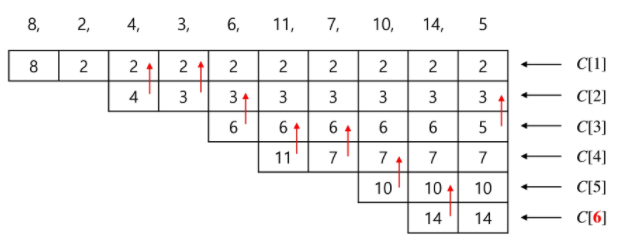

# 최장 증가 수열

​          

## 최장 증가 수열1: LIS

* 다음과 같이 어떤 수열이 왼쪽에서 오른쪽으로 나열돼 있다.
  * 3, 2, 6, 4, 5, 1
* 이 배열 순서를 유지하면서 점진적으로 커지는 가장 긴 부분수열의 길이는 얼마일까?
  * 3,4,5 가 최장 수열

​        

### 풀이

1.  Brute-force 접근방법

   * 부분집합을 모두 구하고 그 중 증가하는 수열인지 체크한다.(긴 부분집합부터 조사)
   * 부분 집합의 개수는 2의 n승이므로 복잡도는 O(2^n)이다.

2. DP 접근법

   * LIS(i)를 LIS(1), LIS(2),...LIS(i-1)과의 관계로 표현해본다.

   ```python
   FOR i in 1 ~ n
   	LIS[i] = 1
   	FOR j in 1 ~ i - 1
   		IF aj < ai AND LIS[i] < 1 + LIS[j]
   				LIS[i] = 1 + LIS[j]
   RETURN max LIS[ ]
   ```

   ​         

​            

## 최장 증가 수열2: 이진검색활용

* 이진 검색을 이용한 보다 효율적인 방법

  * C[k]: 길이 k의 증가 수열에 대하여 가장 작은 값을 C[k]에 저장
  * 각 위치에서 C []를 갱신하기 위해 이진 검색을 수행한다.
  * O(nlogn): n 길이의 전체 수열 길이만큼 이진 탐색을 반복한다.
    * i항에서의 최대 길이 수열을 계속 만들어가는 것이며 이진 탐색 위치는 원본 수열이 아니다.
    * 내가 만들고 있는 정답 후보 수열에서 이진탐색을 수행해 값을 갈아 끼워간다.

  

  * 8일 때 후보 순열: 8
  * 2일 때 후보 순열: 2
  * 4일 때 후보 순열: 2, 4
  * 3일 때 후보 순열: 2, 3
    * 즉 맨 뒤에 붙이기 전에 이전값보다 크면 그냥 붙이고 아니면 이분탐색을 통해 현재 숫자보다 작은 곳 중 최대값을 찾아 그 오른쪽에 끼워넣고 원래 있던 숫자를 대체해준다.

​         


