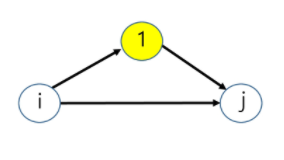

## 최단 경로(Shortest Path)

> dp를 이용해 최단 경로를 탐색하는 방법을 익힌다.

* 가중치가 있을 때 그래프에서 최단 경로를 구한다.
* 최적화 문제(Optimization problem)
  * 주어진 문제에 대하여 하나 이상의 많은 해답이 존재할 때, 이 가운데에서 가장 최적인 해답을 찾아야 한다.

​               

### 풀이

1. Brute-force
   * 한 정점에서 다른 정점으로 경로를 모두 구한 뒤 그들 중 최단 경로를 찾는다.
   * 하지만 연산결과가 팩토리얼 크기로 리턴되므로 매우 비효율적이다.

2. 다익스트라(Dijkstra)의 최단 경로 알고리즘
   * 시간 복잡도: O(n^3), n은 정점의 수
   * 가중치가 양의 정수일 때만 사용가능
3. 플로이드-워샬 알고리즘(Floyd-Warshall)
   * Warshall: transitive closure(그래프 모든 쌍의 존재 여부)를 찾아내는 동적 계획 알고리즘을 제안
   * Floyd: 이를 변형해 모든 쌍 최단 경로를 찾는 알고리즘 고안
   * 시간 복잡도: O(n^3)
   * 하지만 매우 간단해 다익스트라보다 효율적이다.

​         

### 플로이드-워샬

* 그래프의 정점이 3개라고 생각해보자(삼각형 모양).

* 정점 i와 j에 대해서 더 짧은 경로를 선택해서 도달해야한다.

  

* 정점 1로부터 시작해 정점 1, 2 정점 1, 2, 3으로 하나씩 추가한여 마지막에는 1~n까지 모든 정점을 고려한 최단 경로를 계산한다.

* **부분문제 정의**: 입력그래프의 정점을 1,2,3...,n이라고 정의한다.

  * Dk = 정점{1,2,3,4,...k}만을 경유 가능한 정점들로 고려해 정점 i로부터 j까지 모든 경로 중 가장 짧은 경로의 거리
  * 주의점: **정점1에서 정점 k까지 모든 정점을 경유하는 경로가 아님**을 주의한다.
  * D1: i에서 정점 1을 경유해  j로 가는 경로와 i에서 j로 직접 가는 경로 중에서 짧은 거리
  * D2: i에서 정점 2를 경유해 j로 가능 경로와 D1 중에서 짧은 거리를 D2로 정한다.
  * Dk: k를 계속 늘려 정점 i에서 정점 k를 경유하여 j로 가는 경로의 거리와 Dk-1 중에서 짧은 거리를 Dk로 정한다.
    * 정점 k를 경유하는 경로의 거리: Dik (k-1) + Dkj (k-1)
  * Dn: 이런식으로 모든 정점을 경유가능하도록 고려해 i와 j의 최단 경로의 거리를 찾을 수 있다.

```python
D[i][j] = 정점i에서 정점 j로의 최소비용

AllpairsShortest(D[][])
	FOR k in 1 ~ n #	추가되는 node : 경유지
		FOR i in 1 ~ n  # (단, i != k ) : 출발지
			FOR j in 1 ~ n # (단, j != k, j != i) : 도착지
				D[i][j] = min(D[i][k] + D[k][j], D[i][j])
```

* k: 경유 가능한 정점을 1부터 n까지 확장하는 작업
* 각 쌍을 고려하기 위해 i, j를 사용
* 정점 k를 고려해 다시 최단 경로의 거리를 갱신한다.
* **경출도 = 경찰과 도둑**으로 외워라