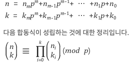

# 뤼카의 정리(Lucas Theorem)

> 이항 계수 (n k)를 구할 때 n과 k가 너무 크면 페르마의 소정리로도 한계점을 가진다.
> 이 때 뤼카의 정리를 이용해야한다.

* 음이 아닌 정수 n, k, 소수 p에 대해서 n과 k를 p 진법으로 나타냈을 때

  

* 만약 n이 1432, k가 342이고 mod가 7이라면??
  * 1432 = 4*7^3 + 1\*7^2 + 1\*7^1 + 4 = 4(7) = n % p
  *  342 = 0*7 + 6\*7^3 + 6\*7 + 6 = 6(7) = k % p 
* k % p 가 더 크면? `( n   k ) % p = 0`이 성립한다.
  * 즉 위의 답은 0이다.
* 만약 n % p 가 더 크면?
  * n과 k를 p로 차례차례 나누고 다시 p로 나눈 나머지에 대해 조합 (nx    kx) 를 모두 구한 다음 모두 곱하고 p로 나눈다.

​           

SW 3238. 이항계수 구하기

```java
import java.util.Scanner;

public class Solution {
	static long p;
	static long F(long a, long b) {
		long res = 1;
		for(long i=a; i<=b; i++) {
			res = ( res * i ) % p;
		}
		
		return res%p;
	}
	
	static long power(long a, long b) {
		if(b==1)return a%p;
		
		long half = power(a, b/2)%p;
		long full = half*half%p;
		
		if(b%2==0)return full;
		else return full*a%p;
	}
	
	static long nCk(long n, long k) { 
		return F(n-k+1,n)*power(F(1,k), p-2)%p;
	}
	public static void main(String[] args) {
			Scanner sc=new  Scanner(System.in);
			int T=sc.nextInt();
		//Lucas Theorem
		for (int t = 1; t <= T; t++) {
			long n = sc.nextLong();
			long r = sc.nextLong();
			p = sc.nextLong();
			long res;
			
			if(n%p < r%p) res = 0;
			else {
				res = 1;
				while(n!=0 || r!=0) {
					res *= nCk(n%p, r%p);
					res %= p;
					n /= p;
					r /= p;
				}
			}
				
			System.out.println("#"+t+" "+res);
		}
	}
}
```

​            

백준 11402: 뤼카의 정리 + 최적화

```java
import java.util.Scanner;

public class Main {
	static int p;
	
  //제곱에 대한 메서드만 만든다.
	static long power(long a, long b) {
		if(b==1)return a%p;
		
		long half = power(a, b/2)%p;
		
		if(b%2==0)return half*half%p;
		else return (half*half%p)*a%p;
	}
	public static void main(String[] args) {
			Scanner sc=new  Scanner(System.in);
			//Lucas Theorem
			long n = sc.nextLong();
			long r = sc.nextLong();
			p = sc.nextInt();
			long[] F;
			long res;
			
			if(n%p < r%p) res = 0;
			else if(n==r || r==0) res = 1; //같을 때 1출력
			else if(r==1 || r==n-1) res = n%p; //1개 차이날 떄 n%p 출력 : 중요!
			else { // 그 외는 뤼카의 정리를 이용
				res = 1;
				F = new long[(int)p];
				F[0] = 1;
				for(int i=1; i<p; i++) {
					F[i] = F[i-1]*i%p; //팩토리얼을 재계산하지 않기위한 배열 생성
				}
				while(n>0 || r>0) {
					res = res*F[(int) (n%p)]%p;
					res = res*power(F[(int) (r%p)]*F[(int) ((n-r)%p)]%p, p-2)%p;
					n /= p;
					r /= p;
				}
			}
				
			System.out.println(res);
	}
}
```


