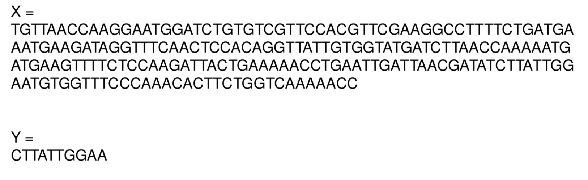
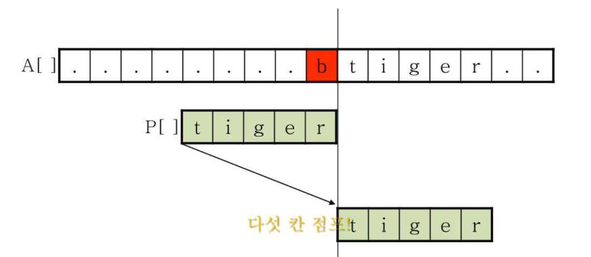
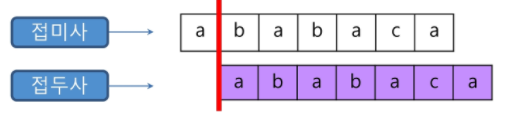

# 문자열 패턴 매칭

> X 문자열 안에 Y 문자열이 있는지 확인하여라



​         

## 고지식한 패턴 매칭?

> **Brute Force** : 앞에서부터 하나하나 일일히 비교하기
>
> O(X*Y) : X의 길이 x Y의 길이만큼의 복잡도

​             

​            

## 라빈-카프 알고리즘

> 최악의 경우(해시값이 계속 같아서 본문 비교를 계속하는 경우) : O(M*N)
>
> 평균적으로는 선형에 가까운 빠른 속도

* 문자열 검색을 위해 해시 값 함수를 이용
* 패턴 내 문자들을 일일히 비교하는 대신 패턴의 해시값과 본문 안에 있는 하위 문자열의 해시 값만을 비교

​        

### 예시

```java
6 8 4 3 2 1 2 4 3 1  // 주어진 문자열

4 3 2 1 // 찾으려는 문자열
```

* 찾으려는 문자열 4 3 2 1 을 숫자로 만든다 = 4*10^3 + 3 *10^2 + 2\*10 + 1
* 원문에서 길이만큼 자른 6 8 4 3을 해시로 구한다 = 6\*10^3 + 8*10^2 + 4\*10 + 3
* 비교한 다음 앞의 6을 버리고 8*10^2 + 4\*10 + 3에 10을 곱한다음 뒤의 수 2를 더한다.
  * 8*10^3 + 4\*10^2 + 3\*10 + 2 = 8432
* **패턴이 문자열이고 길이가 매우 길어지면 MOD 연산을 활용한다**
  * **해쉬값 일치의 오류**: MOD연산을 하는 경우 나눈 나머지가 같다고 해서 둘이 같은 수가 아니므로 본 내용끼리 한 번 더 비교해야한다.

```java
import java.io.BufferedReader;
import java.io.InputStreamReader;
import java.io.IOException;
import java.util.Random;
import java.math.BigInteger;

public class RabinKarp1 
{
	static void rabinfindPattern(String text,String pattern){
		/*
	    q a prime number
	    p hash value for pattern
	    t hash value for text
	    d is the number of unique characters in input alphabet
		 */
		int d=128;
		int q=107;
		int end=text.length();
		int m=pattern.length();
		int t=0,p=0;
		int h=1;
		int i,j;
		int start = 0;
		//hash value calculating function
		for (i=0;i<m-1;i++)
			h = (h*d)%q;
		for (i=0;i<m;i++){
			p = (d*p + pattern.charAt(i))%q;
			t = (d*t + text.charAt(i))%q;
		}
		//search for the pattern 
		for(i=0;i<end-m;i++){
			if(p==t){
				//if the hash value matches match them character by character
				for(j=0;j<m;j++)
					if(text.charAt(j+i)!=pattern.charAt(j))
						break;
				if(j==m && i>=start)
					System.out.println("Pattern match found at index "+i);            
			}
			if(i<end-m){
				t =(d*(t - text.charAt(i)*h) + text.charAt(i+m))%q;
				if(t<0)
					t=t+q;
			}    
		}                                
	}

	public static void main(String[] args) {    
		rabinfindPattern("I love yoe ve move. Plovse, love me.", "love");       
	}
}
```

​         

​             

​           

## 보이어 무어 알고리즘

> 최악의 경우 O(M*N)의 복잡도지만
>
> 최선의 시간 복잡도는 O(N/M) = O(Text/Pattern)
>
> `ababs` 같이 반복적인 문자가 많을수록 불리하다 



* 오른쪽에서 왼쪽을 비교
* 패턴 오른쪽 끝에 있는 문자가 불일치하고 이 문자가 패턴에 존재하지 않는다면 이동 거리는 패턴 길이만큼 된다.
* 위 그림에서 만약 패턴이 ti**b**ger 처럼 문자내에 b가 있다면 빨간색으로 표시된 b와 겹쳐서 다시 진행한다.

​        

#### skip 배열

* 순간 순간 계산해서 뒤로 이동하는 것이 아니라 skip배열을 참고해서 뒤로 몇 칸 이동할지 결정
* 끝 점과 패턴 맨 뒤의 문자를 비교하고 일치하지 않고  **패턴 내부를 확인할 때 해당 문자와 일치하는 경우** 
  * 아래 배열의 칸만큼 이동할 때 사용

| t    | i    | g    | e    | r    | 다른 모든 문자 |
| ---- | ---- | ---- | ---- | ---- | -------------- |
| 4    | 3    | 2    | 1    | 5    | 5              |

* 맨 뒤 글자가 서로 다른데 t이고 tiger에 t는 포함되므로 글자를 4칸 민다.

```java
public class Boyer_Moore {
	
	static int skipTable[];
	public static void main(String[] args) {
		skipTable = new int[256];
		String str = "I love you ve move. Plovse, love me.";
		String pattern = "love";
		
		generateSkipTable(pattern, pattern.length());
		int found = search(str, str.length(), 0, pattern, pattern.length());
//		System.out.println(found);
		while (found != -1 && found < str.length()){
			System.out.println(found);
			found = search(str, str.length(), found + pattern.length(), pattern, pattern.length());
		}
		
	}
	static void generateSkipTable(String pattern, int patternLength){
		for (int i = 0; i < 256; i++)
			skipTable[i] = pattern.length();
		for (int i = 0; i < pattern.length(); i++)
			skipTable[pattern.charAt(i)] = pattern.length() - 1 - i;
	}
	
	static int strcmp(String str, int str_index, String pattern, int pattern_length){
		int index = pattern_length - 1;
		while (index >= 0 && str.charAt(str_index) == pattern.charAt(index)  ){
			str_index--;
			index--;
		}
		return index;
	}
	
	static int search(String str, int str_length, int start_index, String pattern, int pattern_length){
		int index = start_index + pattern.length() - 1; //starting point
		while (index < str_length){
			if (str.charAt(index) == pattern.charAt(pattern.length() - 1)){
				int p_index = strcmp(str, index, pattern, pattern_length);
				if (p_index == -1){
					return index - pattern_length + 1; //found
				}
				index = index - pattern_length + 1 + p_index; //틀린 문자가 있는 위치
			}
			index = index + skipTable[str.charAt(index)];	//틀린 문자에 해당되는 거리만큼 jump
		}
		return -1; //not found
	}	
}
```

​              

#### 보이어 무어: 나만의 구현

```java
import java.io.BufferedReader;
import java.io.IOException;
import java.io.InputStreamReader;
import java.util.ArrayList;
import java.util.Arrays;
import java.util.Comparator;
import java.util.HashMap;
import java.util.LinkedList;
import java.util.Map;
import java.util.Queue;
import java.util.StringTokenizer;

public class Main {
	static boolean isIncluded(String target, Map<Character, Integer> skip, String content) {
		//마지막 문자부터 비교
		int i = content.length() - 1; //검사를 시작하는 곳
		
		while(i < target.length()) { // 끝점이 검사하는 대상의 길이를 초과하면 종료
			int j = content.length() - 1;
			
			while(j>=0 && target.charAt(i) == content.charAt(j)) { //두 값이 일치하지 않을 때까지 지속
				i--;
				j--;
			}
			if(j < 0) return true; //모두 일치하는 경우 메서드의 값을 true로 반환
		
			//일치하지 않는 경우 멈춘 부분을 skip에서 검사해 얼마나 뒤로보낼껀지 정해주기
			
			i += skip.getOrDefault(target.charAt(i), content.length());
		}
		return false;
	}
	public static void main(String[] args) throws IOException {
			
		Map<Character, Integer> skip = new HashMap<Character, Integer>();
		String content = "ABAC";
		String target = "ABAD";
		int length = content.length() - 1; // 전체 길이에서 -1한 값에서부터 출발
		
		for(int i=0; i<content.length()-1; i++) {
			char c = content.charAt(i);
			
			skip.put(c, length - i);
			//System.out.println(c+" "+ (length - i));
		}
		
		System.out.println(isIncluded(target, skip, content));
	}
}

```


​          

​          

## KMP 알고리즘(Knuth-Morris-Pratt Algorithm)

> 시간복잡도 O(M-N)
>
> 중복되는 문자가 많을 때 유리
>
> **패턴 내부에 서로 부분 일치하는 곳을 파악할 수 있는 배열 생성**

* 불일치가 발생한 텍스트 문자열의 앞 부분에 어떤 문자가 있는지 미리 알고 있으므로 불일치가 발생한 앞 부분에 대하여 다시 비교하지 않고 매칭을 수행

````java
ab c ab t // 비교하는 문자열
ab x ab z // 패턴
````

* 위의 경우 `ab`가 중복사용되는데 다시 검사하지않고 미리 만들어둔 배열을 이용해 바로 이동

```java
ab c ab t
	 	 ab x ab z //검사하지 않고 바로 뒤 x부터 검사 시작
```

​        

#### KMP 테이블 배열

* 맨 앞부터 해당 인덱스까지의 길이가 2이상인 부분문자열 중 접두사이면서 접미사인 최대 문자열 구하기
  * 매칭이 실패했을 때 패턴 포인터가 돌아갈 곳을 계산
  * 패턴 0번째 인덱스를 제외한 인덱스마다 맨 앞부터 해당 인덱스까지 **부분 문자열** 중 접두사와 접미사가 일치하는 최대 길이 계산



| i    | i 위치까지 부분 문자열 | 접두사이면서 접미사인 최대 문자열 | 길이 |
| ---- | ---------------------- | --------------------------------- | ---- |
| 0    | a                      | X                                 | 0    |
| 1    | ab                     | X                                 | 0    |
| 2    | **a**b**a**            | a                                 | 1    |
| 3    | **abab**               | ab                                | 2    |
| 4    | **ababa**              | aba                               | 3    |
| 5    | ababac                 | X                                 | 0    |
| 6    | **a**babac**a**        | a                                 | 1    |

​          

### 이해

* i 와 j 두 개의 인덱스를 활용한다

```javascript
a b a c a a b a
j i
0
```

* j와 i가 일치하지 않으면 i가 증가하고 해당 자리는 0이된다

```java
a b a c a a b a
j x i
0 0
```

* 둘이 일치하는 순간 1을 넣어주고 다음 문자도 같은지 최대 길이를 확인해야하기 때문에 i와 j를 둘 다 증가시켜준다

```java
a b a c a a b a
  j   i
0 0 1
```

* 근데 같지 않으므로 j를 다시 초기화시킨다.

```java
a b a c a a b a
j     i
0 0 1 
```

* 둘을 다시 비교하기 시작하지만 같지 않다. i는 증가하고 그 자리는 0이 된다.

```java
a b a c a a b a
j       i
0 0 1 0
```

* i와 j가 일치하기 때문에 1을 넣어주고 i와 j가 둘다 이동

```java
a b a c a a b a
  j       i
0 0 1 0 1
```

* 둘이 다시 일치하지 않기 때문에 j를 0인덱스로 이동

```java
a b a c a a b a
j         i
0 0 1 0 1
```

* 새로운 길이에서 i와 j가 일치 : 1을 넣고 둘 다 이동

```java
a b a c a a b a
  j         i
0 0 1 0 1 1
```

* j와 i가 달라질 때마다 j는 초기화되기 때문에 현재 j위치는 지금까지 같아진 값이라고도 판단할 수 있다.
* i와 j가 같으므로 j에 1을 더한 2를 써준다

```java
a b a c a a b a
    j         i
0 0 1 0 1 1 2
```

* 다시 둘이 일치하므로 이동시킨다음 j의 위치인 2에 1을 더한 3을 써준다.

```java
a b a c a a b a
    j         i
0 0 1 0 1 1 2 3
```

​           

#### 테이블의 의미

 ```java
 a b a c a a b a         
 0 0 1 0 1 1 2 3
 
 // 배열의 i의 값의 뜻 : 문자열 0 인덱스부터 i인덱스까지 문자의 접두사 접미사 최대 일치길이
 // 2번 인덱스가 1인데 a b a 의 접두사 접미사 같은 최대 길이가 1임을 의미 
 ```

​        

### 코드로 이해

```java
import java.util.ArrayList;


//KMP 알고리즘
public class KMPTest {
	public static void main(String[] args) {
		ArrayList<Integer> list = kmp("ABCDabacaabaABCabacaabaDABEE", "abacaaba");
		System.out.println(list);
	}

  // 테이블 구축함수
	public static ArrayList<Integer> kmp(String str, String pattern) { 
		ArrayList<Integer> list = new ArrayList<Integer>(); 
		int[] pi = getPi(pattern); 
		for(int i = 0 ; i < pi.length; i++){
			System.out.print(pi[i]);
		}
		int n = str.length(), m = pattern.length();
		char[] s = str.toCharArray(); // 검사할 문자열
		char[] p = pattern.toCharArray(); // 패턴   
		
    int j = 0;
		for (int i = 1; i < n; i++) { // j는 0, i는 1부터 시작
      
			while (j > 0 && s[i] != p[j]) { 
				j = pi[j - 1]; // j위치에서 1을 뺀 값의 테이블 값으로 j가 이동
			} 
			if (s[i] == p[j]) {  // 패턴 문자와 같아지는 순간
				if (j == m - 1) { 
			
					list.add(i - m + 1); 
					
					j = pi[j]; 
				} else { // 둘이 일치하면 j위치의 1만큼 더해줌
					j++;
				}
			}
		}
		return list; 
	}
//	실패시 이후 인덱스 위치 구하는 메소드
	public static int[] getPi(String pattern) {
		int m = pattern.length();
		int j = 0;
		char[] p = new char[m];
		int[] pi = new int[m];

		p = pattern.toCharArray();
		for (int i = 1; i < m; i++) {
			while (j > 0 && p[i] != p[j]) {
				j = pi[j - 1];
			}
			if (p[i] == p[j]) {
				pi[i] = ++j;

			}

		}
		return pi;
	}
}
```

​     

### 또 다른 설명

```java
import java.util.ArrayList;


//KMP 알고리즘
public class KMPTest {
	public static void main(String[] args) {
		ArrayList<Integer> list = kmp("ABCDabacaabaABCabacaabaDABEE", "abacaaba");
		System.out.println(list);
	}

	public static ArrayList<Integer> kmp(String str, String pattern) { 
		ArrayList<Integer> list = new ArrayList<Integer>(); 
		int[] pi = getPi(pattern); 
		for(int i = 0 ; i < pi.length; i++){
			System.out.print(pi[i]);
		}
		int n = str.length(), m = pattern.length(), j = 0; 
		char[] s = str.toCharArray(); 
		char[] p = pattern.toCharArray();         
		// str - 전체 문자열, pattern - 찾을 문자열 
		// j - 찾을 문자열의 비교 인덱스. 
		// i - 전체 문자열과 비교할 인덱스이기 때문에 1씩 증가하기만 함. 절대 불규칙적으로 변경되지 않음. 
		for (int i = 0; i < n; i++) { 
			while (j > 0 && s[i] != p[j]) { 
				// 중간 단계 뛰어넘기. 
				// pi배열을 이용하여 j인덱스를 변경시킴으로써 while문 중단. 
				j = pi[j - 1]; 
			} 
			if (s[i] == p[j]) { 
				if (j == m - 1) { 
					// j는 비교 인덱스로써, 인덱스가 찾을 문자열의 크기에 도달하면 문자열 찾음. 
					list.add(i - m + 1); 
					// 여러 개의 찾을 문자열이 있을 수 있기 때문. 
					j = pi[j]; 
				} else { 
					j++;
				}
			}
		}
		return list; 
	}
//	실패시 이후 인텍스 위치 구하는 메소드
	public static int[] getPi(String pattern) {
		int m = pattern.length();
		int j = 0;
		char[] p = new char[m];
		int[] pi = new int[m];

		p = pattern.toCharArray();
		for (int i = 1; i < m; i++) {
			while (j > 0 && p[i] != p[j]) {
				j = pi[j - 1];
			}
			if (p[i] == p[j]) {
				pi[i] = ++j;

			}

		}
		return pi;
	}
}
```

