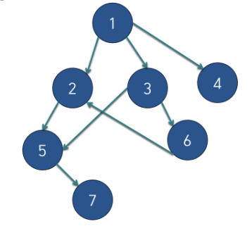

# 위상 정렬

* 여러 일들에 순서가 정해져 있을 때 순서에 맞게 나열하는 행위



* **진입차수**: 현재 나를 기준으로 나에게 올 수 있는 노드의 개수
  * 위 그림에서 1노드의 진입차수는 0, 2는 2, 3은 1이다.
* 진입차수가 0인 노드는 현재 **가장 상위의 노드**이다.
* 진입차수가 0인 노드들을 뽑아서 큐에 집어넣고 그 노드와 연결된 노드의 진입차수를 1씩 감소시키며 차수가 0이되면 다시 큐에 넣는다.

​           

### 입력값 받는법

* 2차원 배열로 받을 수 있지만 그래프 모양이기 때문에 `ArrayList`로 받으면 탐색시 유리하다.
* 상위 노드 배열에 연결된 하위노드를 기록한다.
* 하지만 **진입차수는 하위노드에만 추가**한다. (상위 노드에서 하위노드로 접근하는 것이기 때문)

````java
	while(M-->0) {
		st = new StringTokenizer(br.readLine());
		
    int x = Integer.parseInt(st.nextToken()); //상위 노드
		int y = Integer.parseInt(st.nextToken()); //하위 노드
		inDegree[y] ++; // 진입차수
		arr[x].add(y); // 상위노드 기준으로 연결을 기록
	}
````

​           

### 큐에 초기값 넣기

* 진입차수가 0이면 가장 윗 단의 노드이다. 이 노드들을 맨 처음에 큐에 넣어준다.

```java
for(int i=1; i<=N; i++) {
		if(inDegree[i]==0) { // 진입차수가 0일 때
			q.offer(i); // 큐에 넣는다.
		}
	}
```

​         

### 위상정렬

* 큐에 노드를 빼주고 그 노드와 연결된 하위 노드들의 진입차수를 1씩 감소시킨다.

````java
	while(!q.isEmpty()) {
	
    int now = q.poll(); // 하나를 빼주고
		sb.append(now+" "); // 정렬 내용에 기록
		
	
    for(int i=0; i<arr[now].size(); i++) {
      
			int connect = arr[now].get(i); // 연결된 하위 노드를 빼낸다음
			inDegree[connect] --; // 진입차수를 1 줄여줌
			if(inDegree[connect]==0) { // 만약 0이된다면 이 노드를 큐에 넣어줌
				q.offer(connect);
			}
		}
	}
````

​            

### 전체 코드: BOJ 2252(줄 세우기)

```java
import java.io.BufferedReader;
import java.io.IOException;
import java.io.InputStreamReader;
import java.util.*;
public class Main {
	public static void main(String[] args) throws IOException {
	BufferedReader br = new BufferedReader(new InputStreamReader(System.in));
	StringTokenizer st = new StringTokenizer(br.readLine());
	StringBuilder sb = new StringBuilder();
	
	int N = Integer.parseInt(st.nextToken());
	int M = Integer.parseInt(st.nextToken());
	int[] inDegree = new int[N+1]; // 진입차수
	
	List<Integer>[] arr = new ArrayList[N+1];
	Queue<Integer> q =new LinkedList<>();
	
	for(int i=0; i<=N; i++) {
		arr[i] = new ArrayList<Integer>();
	}
	
	while(M-->0) {
		st = new StringTokenizer(br.readLine());
		int x = Integer.parseInt(st.nextToken());
		int y = Integer.parseInt(st.nextToken());
		inDegree[y] ++;
		arr[x].add(y);
	}
	
	for(int i=1; i<=N; i++) {
		if(inDegree[i]==0) {
			q.offer(i);
		}
	}
	
	while(!q.isEmpty()) {
		int now = q.poll();
		sb.append(now+" ");
		
		for(int i=0; i<arr[now].size(); i++) {
			int connect = arr[now].get(i);
			inDegree[connect] --;
			if(inDegree[connect]==0) {
				q.offer(connect);
			}
		}
	}
	System.out.println(sb.toString());
}}
```

