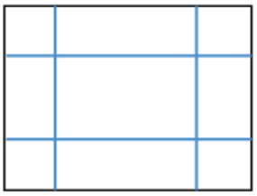
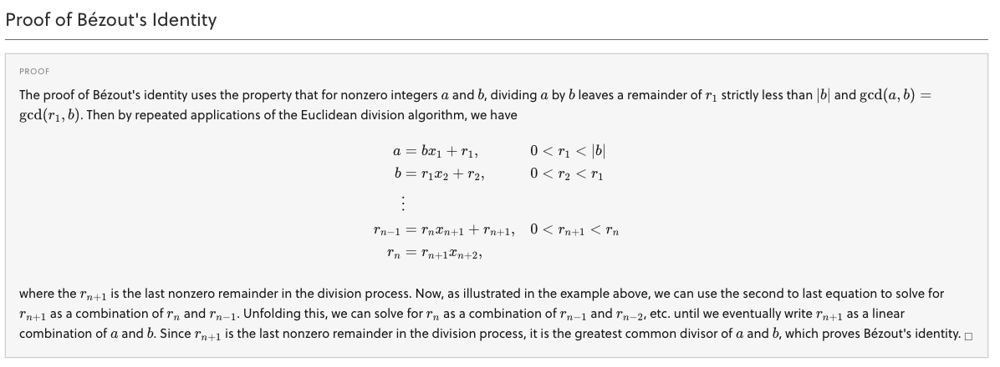
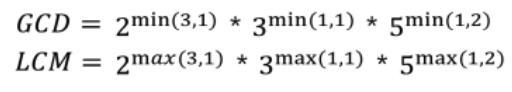

# 컴퓨팅 사고력

​           

## Why? Where?

* 1 단계: 직관(Greedy)
* 2 단계: 완전 탐색(Exhausted Search) - Recursion, Back Tracking, DFS, BFS
* 3 단계: 시간, 메모리 부족 발생 시 - Memoization, TP, Greedy(수학적 증명)

​           

### 사용하기 위한 조건?

* 다익스트라(Dijkstra)
* TSP (Combination Optimization)
* MST (간적Ku 간만 Pr - 간선이 적으면 크루스칼(+유니온 파인드), 간선이 많으면 프림)

​          

​                         

## 1. 명제와 논리

> 명제 참과 거짓을 명확히 판별할 수 있는 문장

* p → q 가 참이면 ~q → ~p 도 참이다. (**대우** = 발상의 전환)

  * 두 변의 길이가 같다면 이등변 삼각형이다 → 이등변 삼각형이 아니면 어느 두 변을 선택해도 두 변의 길이는 다르다.

  * 세 변의 길이가 같다면 정삼각형이다 → 정삼각형이 아니면 **적어도** 한 변의 길이가 다르다.

    ​            

* 마방진은 각 행의 합, 열의 합, 대각선들의 합이 모두 같다. → 각 행, 열, 대각선의 합 중 **적어도** 하나가 다르면 마방진이 아니다.

  * 2로 나누어 떨어지면 짝수다.

  * 2로 나누어 떨어지지 않으면 홀수다.

  * 유리수는 서로소(GCD가 1)인 두 정수의 나눗셈(p/q)으로 표현할 수 있다. (단 0은 0/1로 본다. q는 0이 아니다.)

  * 유리수가 아니면 무리수다.

  * 0을 제외한 어떤 수(A)를 다른 수(B)로 나누어 나머지가 0이면 A는 B의 배수가(A%B=0), B는 A의 약수다.

    ​             

* 멍청이(pseudo-proposition) 논리

  * 너가 경찰서장이면 난 대통령이다.
  * **틀린 명제를 참이라고 가정하면 어떤 명제도 참이 된다.** = **틀린 명제를 사용하지 않도록 주의한다.**
    * 2가 홀수면 5는 짝수다. = 참 

​          

## 2. 수와 표현(수치해석)

* IMVT 중간값 정리, SQR 제곱근 - SW1245 균형점

* x^2 = 5 를 이용해 루트 5의 값을 구해보자

  * 특정값 a와 b에 대해 `F(a)*F(b) < 0`을 만족하는 a, b를 구하고 그 사이의 F(c) = 0을 만족하는 c를 구한다.

  ```java
  
  public class RootFive {
  
  	public static void main(String[] args) {
  		double L = 0;
  		double R = 3;
  		double m = 0;
  		
  		while(Math.abs(L-R) > 0.000000001) {
  			
  			m = (L+R)/2;
  			
  			if( f(m)*f(R) < 0 ) {
  			
  				L = m;
  			
  			}else if( f(L)*f(m) < 0 ){
  				
  				R = m;
  				
  			}
  		}
  		
  		System.out.printf("%.9f \n", m);
  		System.out.println(Math.sqrt(5));
  	}
  	public static double f(double x) {
  		return x*x - 5.0;
  	}
  }
  ```

* 상자의 최대 부피

  

  >1. V = abh
  >
  >2. a + 2h = y
  >
  >3. b + 2h = x
  >4. V = ( y  - 2h )( x - 2h )*h 를 전개한 후 근의 공식

​             

### 관용 표현들

1. 짝수 2n (간혹 4n, 4n+2)
2. 홀수 2n + 1 (간혹 4n+1, 4n+3)
3. 정사각형 마방진 = 짝수 마방진 + 홀수 마방진 = 짝수(4n 마방진 + 4n+2 마방진) + 2n+1 ghftn akqkdwls
4. n(n+1)(n+2) 또는 (n-1)n(n+1), 연속인 세 수는 6의 배수이다.
5. [n] 가우스 n을 넘지 않는 최대 정수
6. 9%2 = 9-[9/2]*2 = 1
7. [log n] 자릿수 구할 때: [log 123] = 2
8. [9/2] → 9/2 프로그래밍 정수 연산, (int) 캐스팅 연산 (int) 루트 n
9. 완전수(자신을 제외한 약수의 합이 자신이 되는 수)
10. 친화수(A 자신을 제외한 약수의 총합이 B가 되고, B자신을 제외한 약수의 총합이 A가 되는 수)
11. 스미스 (각 자리의 합이 소인수 분해 했을 때의 각자리수의 합과 같은 수) : 22 = 2*11 → 2 + 2 = 2 + 1 + 1
12. 약수 - sw8567
13. 제곱
14. 소수: 에라토스테네스의 체
15. 배수, 진수 - 7193, 12369
16. 소인수 분해 - sw12005 서로소 XOR

​          

### 에라토스테네스의 체

```java
public class Prime {
	public static void main(String[] args) {
		for(int i= 10; i < 1000; i++) {
			System.out.println(i+" "+isPrime(i));
		}
	}
	
	public static boolean isPrime(int n) {
		boolean isP = true;
		for(int i = 2; i*i<= n; i++) {
			if(n%i==0) {
				isP = false;
				break;
			}
		}
		return isP;
	}
}
```

​          

### 약수

```java
public class YakSoo {
	public static void main(String[] args) {
		print(126);
	}
	
	public static void print(int n) {
		int i = 2;
		while(n/i != 0) {
			if(n%i==0) {
				System.out.print(i + " ");
				n/=i;
			}else {
				i++;
			}
		}
	}
}
```

​           

### 유클리드 호제

> A와 B의 GCD 를 구할 때 modulus를 이용해 구한다.

* BOJ 톰과 제리
* Ex) 120 과 150의 최대 공약수(GCD)
  * (120, 150) → (120, 30) → 30이 최대공약수
  * (40, 25) → (25, 15) → (15, 10) → (10, 5) → 5가 최대공약수



```java

public class BezouTest {
	public static void main(String args[]) {
		uc(40, 25);
	}
	
	public static void uc(int a, int b) {
		int r0 = a;
		int r1 = b;
		int s0 = 1;
		int t0 = 0;
		int s1 = 0;
		int t1 = 1;
		
		int temp = 0;
		int q = 0; 
		
		while(r1 > 0) {
			q = r0/r1;
			temp = r0;
			r0 = r1;
			r1 = temp - r1*q;
			temp = s0;
			s0 = s1;
			s1 = temp - s1*q;
			temp = t0;
			t0 = t1;
			t1 = temp - t1*q;
		}
		System.out.printf("(%d)*(%d)+(%d)*(%d) = (%d) \n", a, s0,b,t0,r0, a*s0+b+t0);
		System.out.printf("(%d)*(%d)+(%d)*(%d) = (%d) ", a, s1,b,t1,r0, a*s0+b+t0);
	}
}

```

* 지수승의 max, min으로 구하는 아이디어

  

​        

### 진수

* SW7985: 승현이의 수학공부: 진법의 성질을 이용해 모듈러 연산으로 빠르게 풀이한다.

  ```java
  import java.util.Scanner;
  
  class Solution
  {
  	public static void main(String args[]) throws Exception
  	{
  		Scanner sc = new Scanner(System.in);
  		int T = sc.nextInt();
  		for(int t=1; t<=T; t++) {
  			int N = sc.nextInt();
  			String X = sc.next();
  			int sum = 0;
  			for(int i=0; i<X.length(); i++) {
  				sum += Character.getNumericValue(X.charAt(i));
  			}
  			System.out.println("#"+t+" "+sum%(N-1));
  		}
  	}
  }
  ```

  ​       

​              

### 비트연산

* 페르마 소정리 sw5607, sw3238

> 2를 계속해서 곱하면 2 → 4 → 8 → 6 이 반복된다
>
> 3을 계속해서 곱하면 3 → 9 → 7 → 1 이 반복된다
>
> 즉 3의 제곱들의 끝자리가 반복되기 때문에 이 수들을 n으로 나눴을 때의 나머지도 반복된다.
>
> ​        
>
> 이 때 3의 곱들을 5로 나누어보면??
>
> * 3 → 3
> * 9 → 4
> * 27 → 2
> * 81 → 1
> * 243 → 3
> * 3^6 → 4
>
> ​        
>
> p가 소수일 때, a가 p의 배수가 아니면 
>
> a^p ≡ a(mod p) : a의 p승을 p로 나누면 a가 된다.
>
> * 3의 5승을 4로 나눈 나머지는 3이다.
>
> a^(p-1)  ≡ 1 (mod p)
>
> * 3의 (2-1)승을 2로 나눈 나머지는 1이다.
> * 3의 (5-1)승을 5로 나눈 나머지는 1이다.
>
> ​        
>
> [ 결론 ]
>
> 아래는 결과값이 전혀 같은 것이 아니라 중간 수식에 넣어서 사용하는 것이다.
>
> **a^(p-2) ≡ 1/a (mod p)**
>
> ​         
>
> [ 문제 예시 ]
>
> * 7C5 를 11로 나눈 나머지를 구하여라 (중간에 모듈러를 적용해서 식을 간단하게 만들 수 있다.)
>   * 7!/(2! * 5!) mod 11
>   * 7! / ( 2! 5 ! ) = 7! / (240) = 7! / (240 mod 11) = 7 ! / 9 = 7! * 9^(11-2) = 7! * 9^9
>   * 7! / ( 2! 5 ! ) = 7! / (2*120) = 7! / 2 * (120 mod 11) = 7 ! / 2*10 = 7! * 2^(11-2)*10^(11-2) = 7! * 2^9 * 10^9

* nCr 을 1234567891 로 나눈 나머지

  ```java
  import java.util.Scanner;
  
  class Solution {
      static long MOD = 1234567891;
  
      static long factorial(int N) {
          long res = 1;
          for (int i = 1; i <= N; i++) {
              res = (res * i) % MOD;
          }
          return res;
      }
  
      static long power(long p, long n) {
          if (n == 1)
              return p;
  
          long half = power(p, n / 2) % MOD;
          if (n % 2 == 0) {
              return half * half % MOD;
          } else {
              return ((half * half) % MOD * p) % MOD;
          }
      }
  
      public static void main(String args[]) throws Exception {
          Scanner sc = new Scanner(System.in);
          int T = sc.nextInt();
          for (int t = 1; t <= T; t++) {
              int N = sc.nextInt();
              int R = sc.nextInt();
              long child = factorial(N);
              long parent = factorial(R) * factorial(N - R) % MOD;
              System.out.println("#" + t + " " + (child * power(parent, MOD - 2)) % MOD);
          }
      }
  }
  ```

* 비트연산

```java
	static long p = 1234567891;
	static long nCr(int n, int r, int p) {
		if( r == 0 ) return 1L;
		
		long[] fac = new long[n+1];
		fac[0] = 1;
		
		for(int i=1; i<=n; i++) {
			fac[i] = fac[i-1] * i % p;
		}
		
		return (fac[n]*power(fac[r], p-2,p)%p * power(fac[n-r], p-2,p)%p)*p;
	}
	static long power(long x, long y, long p ) {
		long res = 1L;
		x = x % p;
		while( y > 0 ) {
			if(y % 2 == 1) {
				res = (res * x) % p;
			}
      y = y >> 1;
			x = (x * x) % p;
		}
		return res;
	}
```


* 행렬제곱 B10830

​          

### n!과 소인수분해

* 7! / (5! * 2!) 을 계산하는법
  * 7!, 5!, 2!에 대한 소인수 분해를 배열에 각각 저장한다.
  * 7!에서 나머지 두 배열의 값을 빼주면 소인수 분해가 된다.

​         

### 배열의 위치 이동

* 요세푸스 등 배열 안에서 회전해야할 때 모듈러 연산으로 돌려준다.

  ```java
  0 1 2 3 4
  ```

  * 이 경우 임의의 n에 대해 5로 나눈 나머지를 구하면 회전 후 인덱스가 나온다.

​            

### 배열의 차원 변환: 모듈러 연산을 활용

* 1차원으로 변경: 알칼제이 (i * col  + j)
  * b [ i*col+j ] = a [ i ] [ j ]

* 2차원으로 변경: 아나칼아모칼
  * A[ i/col ] [ i%col ] = B[ i ]

​            

### 1~8 배수의 특징

* 2의 배수: 짝수
* 5의 배수: 2, 5를 이용한 소인수 분해, 순환소수(SW3501)
* 6의 배수: (a-1)*a(a+1)
* 7의 배수: 요일, 달력, 13일의 금요일(sw5515)
* 8의 배수: 홀수의 제곱 % 8

​        

### RSA

1. 두 개의 서로 다른 (p,q) 소수를 고른다
2. 두 수를 곱한 N = pq 를 찾는다.
3. phi(N) = (p-1)(q-1)를 구한다.
4. phi(N)보다 작고 phi(N)와 서로소인 정수 e를 찾는다.
5. 확장된 유클리드 호제법을 이용하여 d*e를 phi(N)으로 나누었을 때 나머지가 1인 정수 d를 구한다.

> 암호화 c = m^e (mod N)
>
> 복호화 m = c^d (mod N)
>
> c^d = (m^d)^d = m^ed = m^R(p-1)(q-1)+1 = m (mod N)

​          

### 배열 - 식유도

> 대각선을 표현할 때는 (x, y)에서 x+y, x-y 를 통해 검사/지정할 수 있다.

* SW 2805, 2117(DFS)

* 모양을 절대값 함수를 이용해 구하기

  * j = | i - N/2 |, N이 5일 때 모양은?

  | i    | j    | k    |
  | ---- | ---- | ---- |
  | 0    | 2    | 1    |
  | 1    | 1    | 3    |
  | 2    | 0    | 5    |
  | 3    | 1    | 3    |
  | 4    | 2    | 1    |

  * K = 1, 3, 5, 3, 1 = 마름모 모양이 나온다.

​            

### 군

> (a, b)로 가는 경로를 생각했을 때 가장 가까운 x = y 점을 찾고 거기서 이동한다. 
>
> 가장 가까운 x = y 찾기: (a+b)/2 = x = y 로 두기
>
> * 이 방법으로 모두 풀리는 것은 아니다!!

* 수열-8382 방향전환(수학 or BFS), 8458 원점으로

​          

​           

## 기하

​          

### 백터

* **Convex Hull**
  1. 주어진 점들 중 y 좌표가 가장 작거나 혹은 가장 작은 점이 둘 이상이라면 x좌표가 가장 작은 점을 선택한다.
  2. 선택한 점을 기준으로 나머지 점들을 반시계 방향으로 정렬(각도+거리)
     * (a,b) (c, d) 두 점의 외적을 구하면 D = ad-bc 인데 이 값이 0보다 크면 (a, b) → (c, d)가 반시계 방향, 작으면 시계방향
  3. 그라함 스캔 알고리즘 적용: **Graham's Scan Algorithm**
     * 임의 모양의 도형의 넓이를 구할 수 있다. (외곽점들을 모두 집어넣고 슥삭 구함)
* 그라함 스캔 알고리즘
  1. 제일 처음 선택한 점을 스택에 먼저 넣고 정렬된 점들을 차례대로 스택에 넣는다.
  2. 새로운 점을 스택에 push할 때, 만약 스택에 두 개 이상의 점이 있다면 가장 최근에 push된 두 점을 이은 직선을 기준으로 새로운 점이 왼쪽에 있다면 push 오른쪽에 있다면 스택의 가장 위의 점을 pop

​        

* 삼각형의 넓이

  ```java
  | x1 x2 x3 x1 |
  | y1 y2 y3 y1 |
  삼각형의 넓이 = 1/2 [ [ x1 * y2 + x2 * y3 + x3 * y1 ] - [ x2 * y1 + x3 * y2 + x1 * y3 ] ]
  ```

* A 백터와 B 벡터의 사이의 백터 나타내기

  * OP = (1-t)OA + tOB

​        

* B4105 유클리드(삼각형의 넓이)