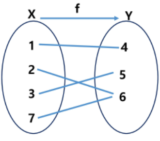

## 3. 순열과 조합

​          

### 1. 수열

* 피보나치 수열: F(n+2) = F(n+1) + F(n)

  * F(n+1)^2 = F(n)*F(n+2) +1
  * F(n+1) = F(n)  + F(n-1), F(n) = F(n) 을 이용해 행렬로 식을 만들기

* 카탈란 수열: 1 1 2 5... = 1/(n+1) * 2nCn

* 황금 비율: F(n)/F(n+1) = ( root(5) - 1 )/2

  ​    

### 2. 함수

> 일대일 = 단사: 왼쪽에서 다 하나씩 쐈다.
>
> 전사: 공역과 치역이 같은 함수

* 일대일 함수(단사): 서로 다른 정의역을 서로 다른 공역으로 대응시키는 함수
* 일대일 대응(전단사): 두 집합 사이를 중복없이 모두 일대일로 대응시키는 함수

* **X가 m개이고 Y가 n개일 때**

  

  * 함수의 개수: n^m
  * 단사: nPm (n>=m)
  * 전단사: nPm (n>=m)
  * **전사: n^m(전체) - (전사가 아닐 때)**
    * 만약 3개 → 4개라면?
      * 3^4 가 총 개수
      * 3^4 - (1개만 선택 + 2개만 선택)
        * 3^4 - (2^4-2)*3C2 - (1^4)\*3C1
          * 3개중 2개를 선택하고 (45 56 46) → 그 경우에 대해서 모든 원소(4개)가 2개에 대응(2^4)  → 1개로 모이는 경우를 빼주기(2) = 3^4 - (2^4-2)*3C2 - (1^4)\*3C1
          * 공식: 3^4 - (2^4)*3C2 + 1^4\*3C1

​            

### 3. 조합

> nCr

* sw5607, B11041, 11050, 11051,3651, 9942 순열, 카드놀이

1. nCr = n!/(n-r)!*r!
2. nCr-1 = r/(n-r+1) * nCr
3. nCr = (n-r+1)/r * nCr-1

​             

## 4. 재귀와 점화식

* B11726, B11727, SW1265, SW4530, SW5987

* 2 x n
* 기본수열과 특성방정식
  * 등차:
  * 등비:
  * 계차:
  * 특성방정식
  * 피보나치
  * 카탈란
* 수열 일반항
  1. 1 2 3 4 5 6...의 일반항을 구하시오
  2. 1 3 5 7 9...의 일반항을 구하시오
  3. 1 2 4 8 16...의 일반항을 구하시오
  4. F(n) = F(n-1) + 3F(1) = 1은 어떤 수들의 나열인가?
  5. F(n) = 4F(n-1) + 9F(1) = 1은 어떤 수들의 나열인가?
  6. 1 2 4 7 11 16 ...의 일반항을 구하시오
  7. 계단을 한 번에 1칸 또는 2칸 움직일 수 있을 때 10계단을 오르는 방법의 수는?
  8. 피보나치
     1. 태어난지 2 달 이후부터 한 쌍의 새끼를 낳을 수 있다. 1년 후 숫자는?
     2. 태어난지 2 달 이후부터 두 쌍의 새끼를 낳을 수 있다. 1년 후 숫자는?
  9. n + 1개의 단말 노드를 갖는 이진 트리의 트리의 개수는?
  10. 2xn 개의 직사각형이 있다. 2x1, 1x2, 2x2인 직사각형으로 2xn의 직사각형을 만들 수 있는 경우의 수를 구하여라

