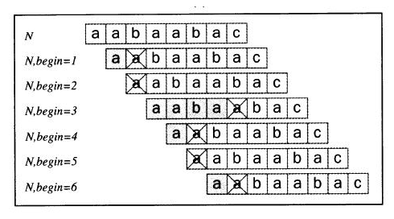

## 극한의 KMP 이해하기

> 극단적인 예시를 활용한다

​        

1. 이해할 것: 찾고싶은 문자열 내에 중복되는 부분이 있다면 중복 검사를 피하기 위해 사용한다.

2. 주의할 것: 접두사와 접미사의 개념: 접미사로 가져온 문자는 정방향인 것을 명심

3. 기본원리: 접두사와 접미사의 공통부분이 제일 길어야만 이동거리가 더 짧아진다. 그럼으로써 정답을 놓치지 않을 수 있다.

   ```
   AAAAA  [대상]
   AAAA   [찾고자 하는 문자열]
   ```

   * 일치하는 부분은 2곳이다.
   * 만약 위 경우 접두사와 접미사의 공통 부분 경우의 수는 [A, AA, AAA]로 나타낼 수 있다.
     * 하지만 A로 공통부분을 가정하면 KMP 방식을 적용할 때 답을 놓치게된다.
     * AAAAA 자기 자신은 공통 부분이 될 수 없다(무한루프)
     * 가장 긴 AAA로 해야 최소한으로 움직여 정답 2곳을 찾아낼 수 있다.

4. 테이블을 만들어야 하는데 어떻게?

   * AABAABAC 가 대상이라면?

     * [A, AA, AAB, AABA, AABAA, AABAAB...] 이렇게 하나하나 경우에 대해 뺀 다음 처음과 끝을 비교하는 방식

     * 하지만 위와 같은 경우 시간을 많이 잡아 먹으므로 이 방법에서 또한 최적화가 필요

5. 최적화 방식?

   * 위의 방식 처럼( [A, AA, AAB, AABA, AABAA, AABAAB...] ) 모든 경우를 살피는 것이 아님

     * AA부터 꺼낸다음 처음과 끝이 A로 일치하면? 
       * 뒤의 문자열을 각각 다시 붙여서 개이득을 본다.
         * 원래 문자열은 AABAABAC므로 AA 다음 문자길이를 늘려서 AAB로도 검사해보는 것이다.
           * 지금까지 공통부분의 최대수는 1이니 AAB(길이3)로 검사했을 때 2가 될 수도 있기 때문이다.
         * 지금까지 일치한 문자열 **A**A에서 일치한 부분 **A**다음은 A므로 그 다음은 AA로 검사해본다.

   * 위의 작업을 그림으로 나타내면?

     

   * 결론
     * 공통부분을 구하기 위해 모든 경우의 부분 문자열을 잘라서 계산하는 방식이 아니다. 
     * 한번씩 밀어가면서 한번 일치하면 불일치할 때까지 계속 검사해서 최대값을 얻어내는 것.

​          

### LPS(Longest proper prefix which is suffix)

> Pi 라고도 한다

#### - Python 구현

```python
def makeLPS(pattern): # 여기서 pattern은 str, lps는 리스트
    table = [0]*len(pattern)
    j = 0 # 현재까지 일치한 문자열, 틀릴 때마다 초기화 (보통 j, len 으로도 많이 둔다)

    i = 1 # 검사할 문자열의 시작 위치(0번 위치부터 검사하는 것은 의미가 없다.)

    while i < len(pattern): # 패턴의 길이까지만 검사

        # 위에 두고 비교하는 문자 vs 아래 대고 비교하는 문자
        if pattern[i] == pattern[j]: # i=1일 때 처음 들어가면 무조건 다름
            j += 1 # 일치하면 j를 늘려준다 = 개이득을 보기 위함
            table[i] = j
            i += 1
        else:
            if j != 0: # j번째에서 틀렸다면 j-1번째까지는 일치하는 것이므로 재활용한다.
                j = table[j-1] # KMP table Making의 꽃
                # j-1 = 이제까지 일치한 부분 = lps 테이블을 이용할 수 있다.
                # 현재까지 기록된 테이블을 재사용해서 중복되는 부분을 그대로 사용해서 다음 인덱스로 바로 넘긴다
                # 이전까지 i와 j가 1씩 같이 증가했고 맞지 않은 상태
                # i는 1 증가했고 j를 원래 0으로 검사해줘야하지만 재활용분 만큼 더해서 거기부터 시작하는 것
            else:
                # i와 j가 이번에 같지않았는데 j도 0이라면?
                table[i] = 0
                i += 1

    return table

def KMP(pattern, word):
    table = makeLPS(pattern)

    result = [] # 결과를 만족하는 시점을 기록

    i = 0 # word와 대조는 0번 인덱스부터 이루어진다
    j = 0 # pattern의 대조 또한 0번부터 해주어야한다.

    while i < len(word):

        if word[i] == pattern[j]:
            if j == len(pattern)-1: # 패턴과 전체가 일치할 때
                result.append(i-j)
                j = table[j] # j까지 일치하므로 그대로 사용
                i += 1
            else:
                j += 1
                i += 1
        else:
            if j != 0:
                j = table[j-1]
            else:
                i += 1

    return result

print(KMP('line'  , 'baekjoononlinejudge'))
```

