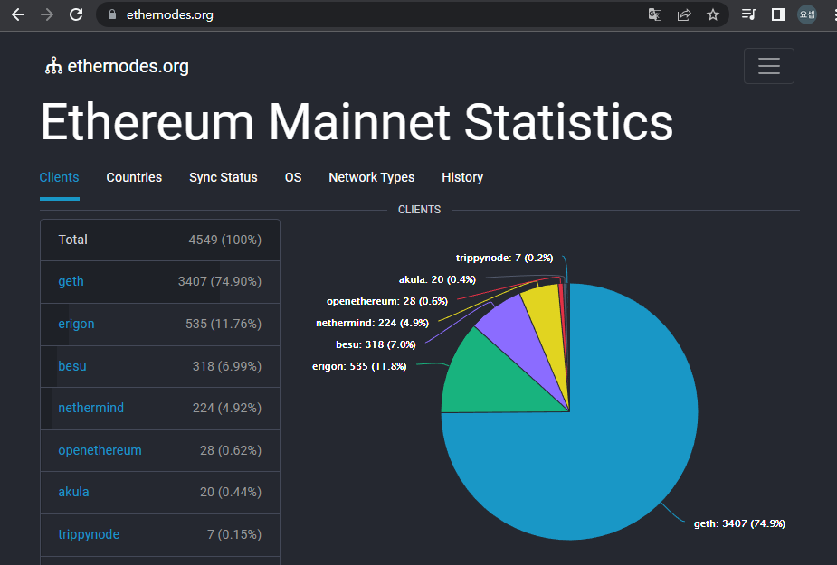
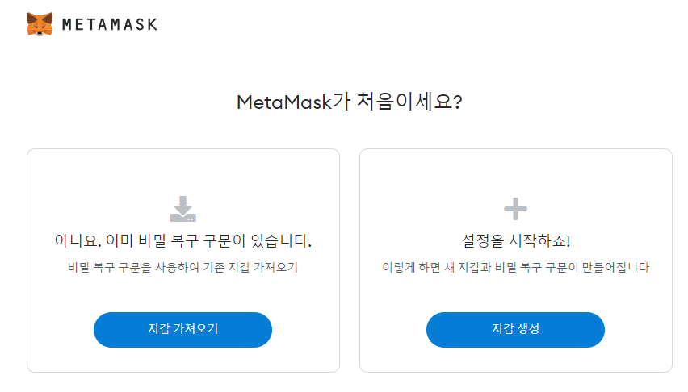

# 1. 블록체인의 시작

<br>

> 1. 블록체인 분류
> 
> 2. 이더리움 네트워크
> 
> 3. Ropsten 실습 환경 준비
> 
> 4. Ropsten 테스트넷 실습
> 
> 5. Day1 과제

<br>

### 1) 블록체인 분류

| 유형               | 특징                                                     | 관련 기술                                                          |
| ---------------- | ------------------------------------------------------ | -------------------------------------------------------------- |
| 퍼블릭(public)      | 누구나 네트워크 참여                                            | Bitcoin, Ethereum, Zcash, Litecoin                             |
| 프라이빗(private)    | 하나의 조직 혹은 기관이 관장하는 네트워크, 승인된 주체만 자료를 읽고, 지정 노드만 거래를 승인 | Quorum, MultiChain, Iroha, Monax                               |
| 컨소시엄(consortium) | 이해 관계자 간에 컨소시엄을 구성하여 네트워크를 구성, 네트워크 참여자에 의해 접근 허용      | Hyperledger Fabric, Tendermint, R3 Corda, Private Technologies |

<br>

#### - 퍼블릭 네트워크

> * 누구나 공개된 Client SW로 프라이빗 네트워크를 구축 가능
> 
> * besu는 엔터프라이즈 환경에 맞게 개량된 Hyperledger의 ethereum 프로젝트

1. 메인넷

2. 테스트넷

| Hex  | Decimal | Network                         |
| ---- | ------- | ------------------------------- |
| 0x1  | 1       | Ethereum Main Network (Mainnet) |
| 0x3  | 3       | Ropsten Test Network            |
| 0x4  | 4       | Rinkeby Test Network            |
| 0x5  | 5       | Goerli Test Network             |
| 0x2a | 42      | Kovan Test Network              |

```url
https://ethernodes.org/
```



<br>

#### - 클라이언트(Client)란?

* 네트워크에 노드로 참여하며, RPC(Remote Procedure Call) 요청을 수신하고, 결과를 반환하는 Endpoint

<br>

### 2) Ropsten 실습 환경 준비

<br>

#### [1] MetaMask 설치

* MetaMask 지갑
  
  * 지갑(Wallet)이란, 블록체인 네트워크를 사용할 수 있도록 계정의 개인키(private key)를 관리하는 프로그램
  
  * 개인키로 서명(sign)하여 트랜잭션을 보냄

* 계정 생성 절차
  
  1. 개인키 생성: 256bit의 무작위 숫자 → 64자리의 Hex값으로 인코딩
  
  2. 타원곡선전자서명 알고리즘(ECDSA, secp256k1)을 사용하여 공개키 생성
  
  3. Keccak-256 hashing 이후 마지막 20바이트를 가져옴
  
  4. 계정 주소로 사용



* 지갑 생성하기

* 니모닉(Mnemonic) 구문 생성 및 구문 백업 확인
  
  * 복구할 수 있는 구문

<br>

#### [2] Ropsten 네트워크 연결

* Show/hide test networks(보기/숨기기 테스트 네트워크) 클릭

* Show test networks ON (테스트 네트워크 보기)

* RopstenETH 선택

<br>

#### [3] Ropsten에서 사용할 이더 받기

* 이 외에도 여러 Faucet이 존재

```url
https://faucet.egorfine.com/
```

* Faucet(수도꼭지)
  
  * 테스트넷 환경을 사용할 수 있도록 가치없는 통화를 무료로 제공하는 자금원
  
  * rETH  또는 ROP으로 표기하기도 함

<br>

#### [4] Ropsten 테스트넷 실습

> MetaMask에서는 계정을 또 다시 생성할 수 있다.
> 
> 가스비에 따라 전송속도가 달라진다.

1. MetaMask에서 트랜잭션 보내기

2. MetaMask Provider 이용하기

<br>

#### [5] MetaMask Provider API 활용 실습

> Provider란?
> 
> 클라이언트를 통해 이더리움 네트워크에 접근할 수 있도록 제공된 Javascript 객체(Object)

* 검색창에 `metamask provider` 입력
  
  ```url
  https://docs.metamask.io/guide/ethereum-provider.html
  ```

<br>

#### [6] 명령어

* 기본 명령어
  
  ```
  etherium
  ethereum.isConnected()
  ```

* 계정 활성화
  
  ```
  ethereum.enable()
  ```

* 계정 주소
  
  ```
  ethereum.selectedAddress
  ```

* Ethereum Provider로 RPC API 보내기
  
  * HEX 숫자 얻기
  
  ```
  ethereum.request({
      method: 'eth_blockNumber',
      params: []
  }).then(result=> console.log(result));
  ```
  
  * 사용하기
  
  ```
  parseInt('0xc42cfe',16) //지금까지의 블럭개수 확인
  ```

<br>

#### [7] 연습

```url
https://metamask.github.io/api-playground/api-documentation/
```

```
const transactionParameters = {
  nonce: '0x00', 
  gasPrice: '0x09184e72a000',
  gas: '0x2710',
  to: '0xCee5c9115F38353421e63eCA7F1e1Cf6873226A6',
  from: ethereum.selectedAddress, 
  value: '0x00',
  data:
    'hello ethereum', 
  chainId: '0x3',
};

const txHash = await ethereum.request({
  method: 'eth_sendTransaction',
  params: [transactionParameters],
});
```

```solidity
ethereum.request({
    method: 'eth_decrypt',
    params: ["0x68656c6c6f 657468657265756d", ethereum.selectedAddress]
}).then(result=> console.log(result));
```

#### [--오류]

```
https://solveforum.com/forums/threads/solved-metamask-rpc-api-this-message-cannot-be-decrypted-using-eth_decrypt.573062/https://solveforum.com/forums/threads/solved-metamask-rpc-api-this-message-cannot-be-decrypted-using-eth_decrypt.573062/
```

```
https://medium.com/@ishwar.chandra/node-5417-unhandledpromiserejectionwarning-error-cannot-convert-string-to-buffer-d3329456186a
```

```
https://community.metamask.io/t/message-cannot-convert-string-to-buffer-tobuffer-only-supports-0x-prefixed-hex-strings-and-this-string-was-given-0x/3956/2
```

### [연습]

* 나의 이더리움 단위 표기
  
  ```solidity
  ethereum.request({method: 'eth_getBalance', params: [ window.ethereum.selectedAddress, 'latest']}).then(result => console.log(parseInt(result, 16)*(10**-18)));
  ```

* 데이터를 포함한 트랜잭션 보내기
  
  * 스니펫 활용
    
    ```solidity
    function String2Hex(tmp) {
        var str = '';
        for(var i = 0; i < tmp.length; i++) {
            str += tmp[i].charCodeAt(0).toString(16);
        }
        return str;
    }
    ```
  
  * API 활용
    
    ```jason
    {
        "jsonrpc": "2.0",
        "method": "eth_sendTransaction",
        "params": [
            {
                "gasPrice": "0x1E03694710",
                "gas": "0x76c0",
                "to": "0xCee5c9115F38353421e63eCA7F1e1Cf6873226A6",
                "from": "0x172aB7431BdBdE9E485b477bF0f434Ab7B219Bb6",
                "value": "0x00",
                "data": "0x68656c6c6f20657468657265756d"
            }
        ],
        "id": 0
    }
    ```
  
  * 결과 확인 
    
    * `eth_getTransactionReceipt` 를 활용해 트랜 잭션의 결과를 확인할 수 있다.
      
      * 위에서 트랜잭션 전송에 성공하면 `result` 값으로 해시값을 보내준다.
      
      * 그 값을 다시 API에 집어넣어 확인할 수 있다.
    
    * 크롬환경에서 테스트
      
      ```solidity
      ethereum.request({method: 'eth_getTransactionReceipt',
      params: ["0xbfcc2ce0dc9c301d86efe8ea8abe2c3fac3ccfa1699740dcdd540438d1d46715"]})
      .then(result => console.log(result));
      ```
    
    * 해시결과로 찾기
      
      ```solidity
      ethereum.request({
          method: 'eth_getTransactionByHash',
          params: ["0xbfcc2ce0dc9c301d86efe8ea8abe2c3fac3ccfa1699740dcdd540438d1d46715"]
      }).then(result => console.log(result));
      ```
  
  <br>
  
  * Transaction vs Transaction Receipt
    
    > Transaction은 변경될 수 없는 데이터로 트랜잭션이 성공하거나(successful) 실패한 Transaction의 결과가 Transaction Receipt으로 저장된다.
    > 즉 완결된 트랜잭션(finalized transactions)에 대해서만 Transaction Receipt이 생성된다.
    > 따라서 Transaction Receipt에는 추가로 status, logs (트랜잭션 실행 중 생성된 로그 목록), logsBloom (블룸 필터), cumulativeGasUsed(블록의 누적 가스 사용량), gasUsed(해당 트랜잭션의 가스 사용량) 정보를 포함한다.
  
  ### 

### <주의사항>

1. 트랜잭션을 보낼 때 data에 값을 넣어서 보낼 수 있지만 띄어쓰기 또한 해싱해야한다. 다시 말해 띄어쓰기가 있는 문자열은 사용하지 않도록 한다. 다음은 오류 값
   
   ```json
   "data": "0x68656c6c6f 657468657265756d"
   ```
   
   ```json
   "data": "0x68656c6c6f657468657265756d"
   ```

2. 트랜잭션을 보낼 때 "from"에 해당 하는 지갑이 켜져있어야 한다.
   
   * 다시 말해 MetaMask의 현재 계정에서 켜진 지갑이 보내는 계정과 일치해야한다.
