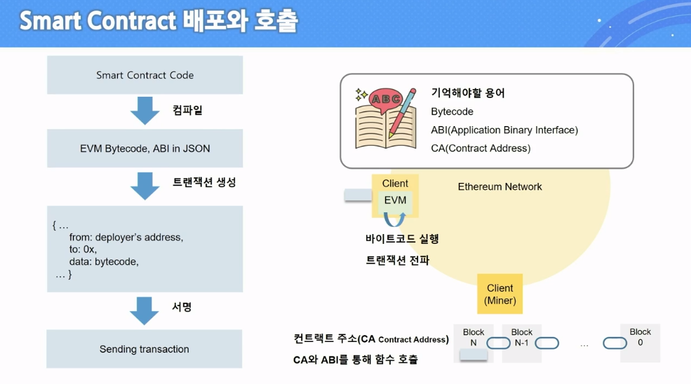
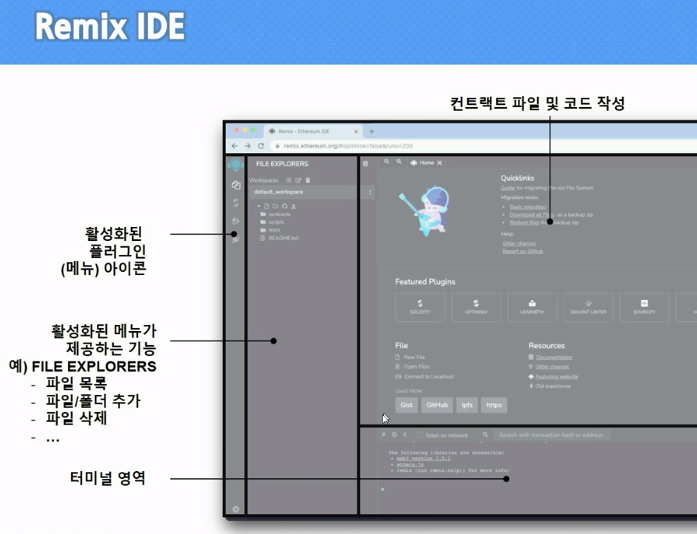
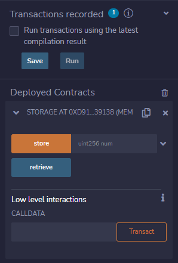
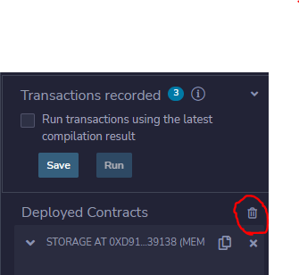

# 2. Smart Contract

> 1990년대에 Nick Szabo가 소개한 개념
> 
> 디지털 형식으로 명시된 서약(commitment)들의 집합
> 
> 결코 스마트하지 않은 단순 컴퓨터 프로그램
> 
> 법적 맥락 없음
> 
> 다소 잘못된 용어임에도 불구하고 자리잡음

<br>

## 1) Smart Contract란?

### [1] 블록체인에서의 정의: 불변의 컴퓨터 프로그램

* 컴퓨터 프로그램

* 불변(immutable) 한 번 배포되면 변경 불가

* 결정적(deterministic) 실행한 결과가 모두 같음

* EVM 위에서 동작

* 탈중앙화된 World Computer 동일한 상태를 유지

<br>

### [2] Smart Contract를 작성하는 언어

* Solidity

* LLL

* Viper

* Assembly

<br>

## 2) Smart Contract 배포와 호출



<br>

## 3) 실습 환경 준비

1. Remix IDE
   
   * 구글에 `remix` 검색
     
     ```url
     https://remix.ethereum.org/
     ```
     
     

<br>

## 4) Smart Contract 배포

1. 배포할 컨트랙트 준비
   
   * `FILE EXPLORERS > contracts 폴더 > 1_Storage.sol 선택`

2. 컴파일
   
   * 컴파일 관련 설정 후 버튼 클릭
   
   * ABI와 ByteCode 생성
     
     * 폴더구조에서 `build-info`에 정보들 생성

3. 배포
   
   * 다이아몬드 모양 메뉴 선택 후 Deploy 실행
   
   * VM으로 배포 전 모습 확인 가능
   
   * Deployed Contracts에 주소가 생성

<br>

## 5) Smart Contract 호출

1. 호출
   
   
   
   * API 처럼 함수들을 즉시 실행가능
     
     * store: 전세계 컴퓨터에게 값을 변경하는 것을 요청
   
   * 내부 값을 사용하기에 가스를 사용하지 않음
   
   * 실행할 때마다 콘솔창에 트랜잭션 내용을 확인 가능

2. Deployed Contract 삭제
   
   * 컨트랙트 주소 복사 후 삭제한다음
   
   * 가상 유저를 변경하고 주소를 입력한 후 `At Address`를 클릭하면 다시 접속 가능
   
   

3. CA로 컨트랙트 접근

4. 호출

<br>

## 6) Ballot.sol 배포

*  배포를 위한 컨트랙터
  
  ```solution-file
  pragma solidity >=0.7.0 <0.9.0;
  
  contract Converter {
      function stringToBytes32(string memory source) public pure returns (bytes32 result) {
          bytes memory bytesString = bytes(source);
          if (bytesString.length == 0){
              return 0x0;
          }
          assembly {
              result := mload(add(source, 32))
          }
    }
  }
  ```

* injected Web3
  
  * inject는 주입하다라는 뜻으로 "injected web3"를 선택하면 말그대로 브라우저 상에서 3rd party에 의해 주입된 web3 환경을 사용한다는 뜻이 된다.
  
  * 과제 4의 경우 해당 환경을 선택함으로써, MetaMask 지갑에 의해 주입된 환경인 Ropsten 네트워크와 MetaMask에 설정된 계정을 그대로 Remix 환경에서 사용할 수 있게 된다.
