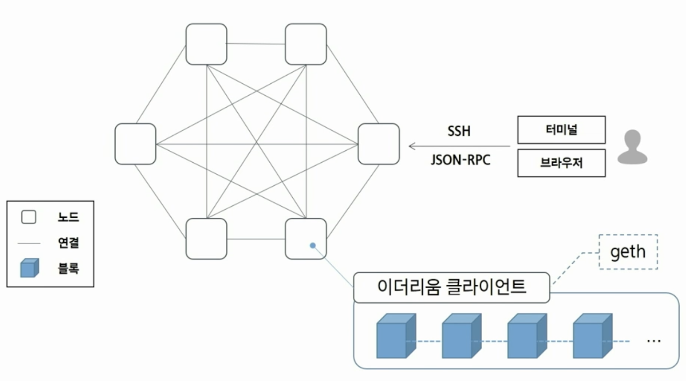
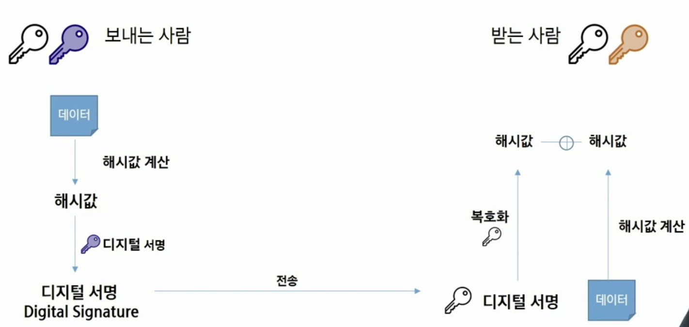
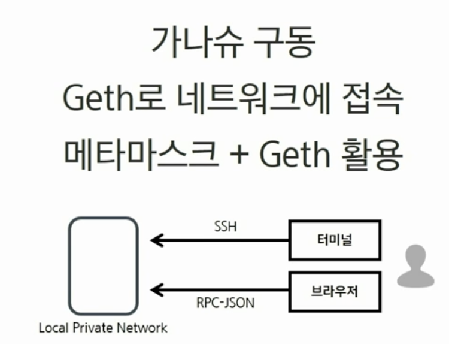
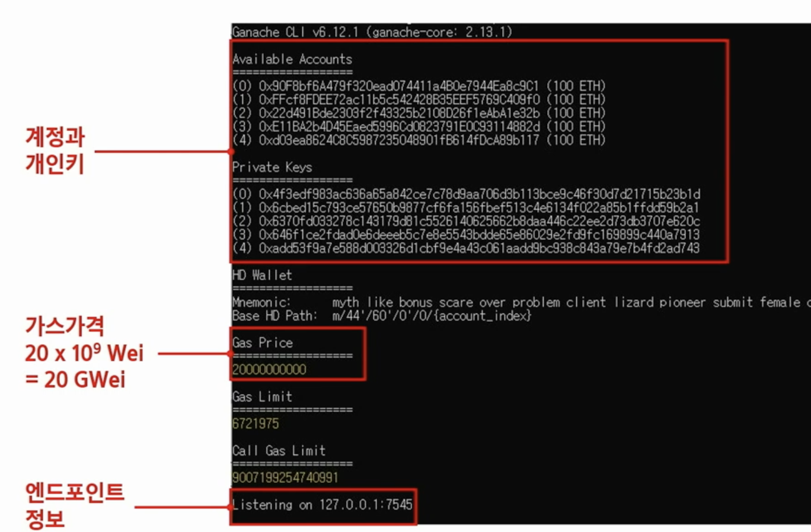
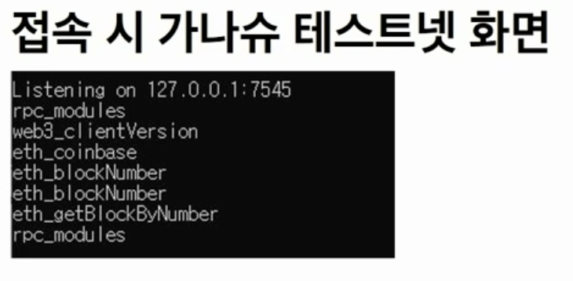
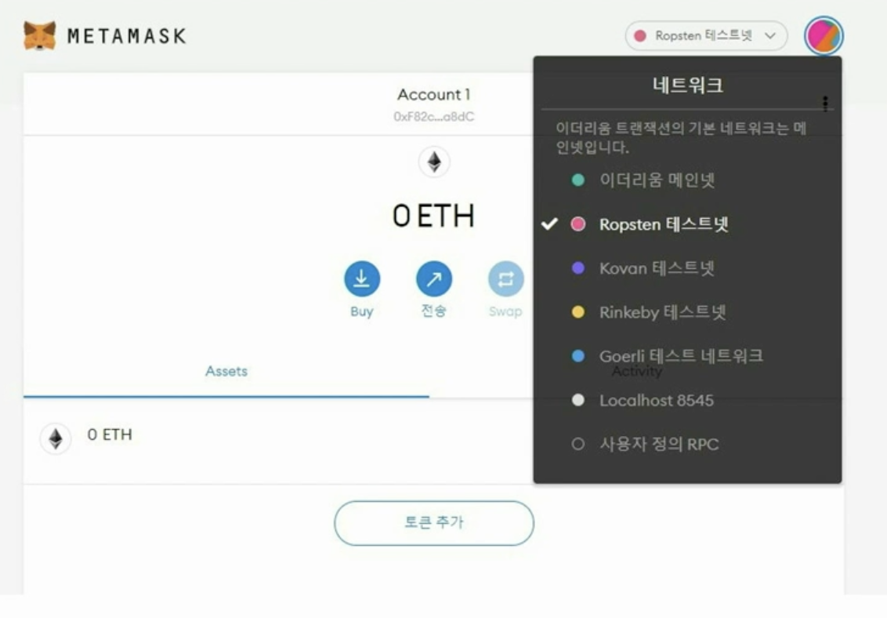
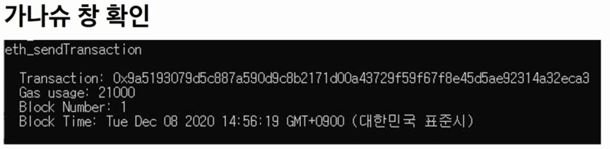
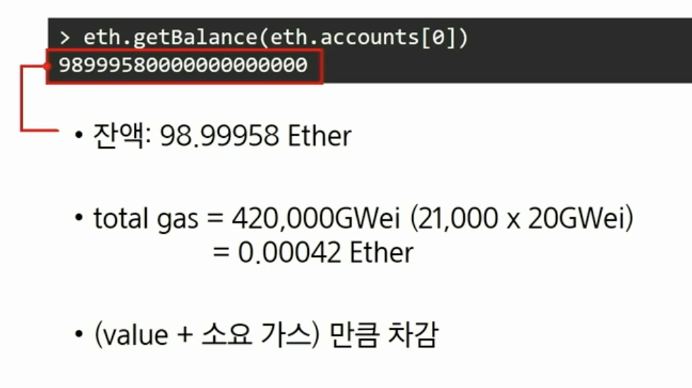

# 1. 블록체인 네트워크의 이해

> 프라이빗 네트워크 실습으로 이더리움 네트워크 시작하기

​                

### 0. Contents

1. 이더리움 블록체인 네트워크의 분류
2. 이더리움 네트워크 개념도
3. 환경설정
4. 로컬 네트워크 활용 및 실습

​               

### 1. 이더리움 블록체인 네트워크 분류

> 프라이빗 네트워크 vs 퍼블릭 네트워크


* **퍼블릭 네트워크**
  1. 메인넷
     * 거래하거나 배포하는 운영 네트워크
  2. 테스트넷
     * 메인넷 적용 전 테스트 서버
     * 롭슨(Ropsten), 코반(Kovan), 링키비(Rinkeby), 고얼리(Goerli)
* **프라이빗 네트워크**
  * PC에서 구동, 테스트용/실습용

​               

### 2. 이더리움 네트워크 개념도

* geth: 이더리움에 참여하기 위해서는 이더리움 클라이언트가 필요



​                 

### 3. 환경설정: Prerequisites

​                 

#### - Chocolatey 다운로드 설치

```
https://chocolatey.org/install
```

#### - Powershell을 통한 설치 명령어(다운로드 문서에 첨부)

```
Set-ExecutionPolicy Bypass -Scope Process -Force; [System.Net.ServicePointManager]::SecurityProtocol = [System.Net.ServicePointManager]::SecurityProtocol -bor 3072; iex ((New-Object System.Net.WebClient).DownloadString('https://community.chocolatey.org/install.ps1'))
```

​               

#### - 사전 필수 요소 설치

```bash
choco install git -y
choco install golang -y
choco install mingw -y
```

​              

#### - geth 설치

```bash
mkdir src\github.com\ethereum # 소스코드를 받기 위한 폴더 생성
git clone https://github.com/ethereum/go-ethereum --branch v1.9.24 src\github.com\ethereum\go-ethereum
cd src\github.com\ethereum\go-ethereum
go get -u -v golang.org/x/net/context
go install -v ./cmd/...
```

#### - 설치 확인

```bahs
geth version
```

* 1.9.24-stable 버전 확인

​               

#### - node.js 설치

```bash
choco install nodejs-lts
```

#### - ganache-cli 설치

```bash
npm install -g ganache-cli
```

#### - 설치 확인(가나슈)

```bash
ganache-cli --version
```

​                

#### - 지갑 프로그램 설치

* Metamask 설치

  ```
  https://metamask.io/
  ```

* 크롬 확장 프로그램으로 설치(Extension)

​               

​                   

### 4. 관련 이론

​              

### - 이더리움 계정

* 개인키 생성: 256bit의 무작위 숫자 → 64자리의 Hex값으로 인코딩
* 타원곡선전자서명 알고리즘(ECDSA, secp256k1)을 사용하여 공개키 생성
* Keccak-256 hashing
* 계정 주소
  * 위 코드의 마지막 20자리를 추출해 가져옴

​              

### - 비대칭키 암호화



​                

### 5. 로컬 네트워크 활용 및 실습

​              

### [터미널] → [Ganache-cli]

> 가나슈 구동
> Geth로 네트워크 접속
> 메타마스크 + Geth 활용



#### - 가나슈 구동

> 현재 컴퓨터가 마치 메인넷처럼 작동해 무리 없이 이더리움을 개발하도록 한다.

```bash
ganache-cli -d -m -p 7545 -a 5
```

* `-d -m`: (--deterministic --mnemonic) HD Wallet 생성시 니모닉 구문 사용
* `-p`: (--port) 포트 지정 (default 8545)
* `-a`: (--account) 구동 시 생성할 계정 수 (default 10)

​               

#### - 명령어 옵션 확인

```bash
ganache-cli --help
```

​             

#### - 가나슈 구동 결과 화면



​              

#### - Geth 명령어로 가나슈 테스트넷에 접속(새 명령 프롬프트)

* 현재 로컬에서 구동되고 있는 가나슈 테스트넷에 들어간다.

```
geth attach http://localhost:7545
```



#### - 연결성 확인: Connectivity Check

```bash
net.listening
net.peerCount
```

#### - 계정 목록 확인

```bash
eth.accounts
```

 #### - 계정 보유 잔액 확인

```bash
web3.fromWei(eth.getBalance(eth.accounts[0]))
```

* geth console에 적용된 web3 version은 0.20.x

​            

#### - 메타마스크로 네트워크에 접속

* 네트워크 추가: 사용자 정의 RPC > 네트워크 추가

  

​            

#### - 네트워크 정보 입력

* 네트워크 이름: `ganache-cli`
* RPC-URL: `http://localhost:7545`
* 체인 ID: `geth console`에서 `etc.chainId()` 로 확인 후 입력

​                 

### [브라우저] → [Ganache-cli]

> 메타마스크 계정으로 로컬의 이더를 전송

#### - geth consol로 진행

```bash
tx = { from: "가나슈_제공_계정_중_하나", to: "메타마스크 계정", value: 1e18}
```

* 이더리움 기본 단위는 Wei(웨이), 1 Ether = 10^18 Wei
* 계정은 16진수 문자열 형태로 따옴표로 묶어 작성합니다.

```
eth.sendTransaction(tx)
#transaction hash returned
```



​            

#### - 트랜잭션 상태 확인

* geth console

  ```bash
  eth.getTransaction(transactionHash)
  eth.getTransactionReceipt(transactionHash)
  ```

  * Status 0x1 확인

​             

#### - from 주소 잔액 확인

```
eth.getBalance(eth.accounts[0])
```

 

​              

### 해볼 것 1

> 트랜잭션을 보낼 주소와 받을 주소를 선택하고 잔고를 확인합니다.

1) sendTransaction을 사용해 트랜잭션을 보내기
2) "hello ethereum"이라는 메시지 포함
3) API 호출 후 트랜잭션 처리 결과를 확인

* 트랜잭션 상태 확인
* 트랜잭션 종결 후 "hello ethereum" 데이터 확인
* 보낸 주소의 잔고

​             

### 해볼 것 2

1. 많은 사람들이 블록체인의 정보는 신뢰할 수 있다고 하는데 그 근거는 무엇인가?
2. 블록체인이 산업계에 미치는 영향을 설명하고 이를 기반으로 응용한 사례를 제시하시오

​            

### 해볼 것 3

> 퍼블릭 네트워크인 Ropsten 테스트넷 활용
> 시간이 필요하므로 하루정도 동기화한다.

