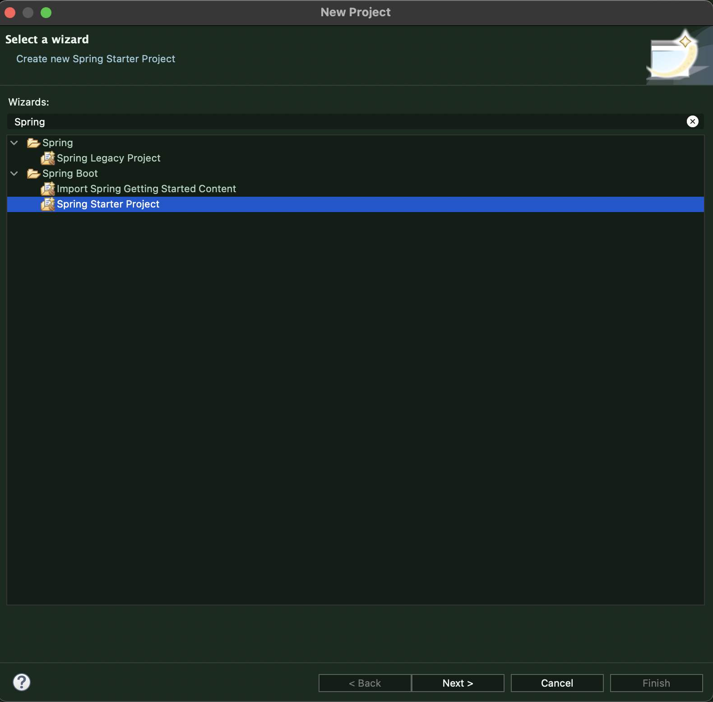
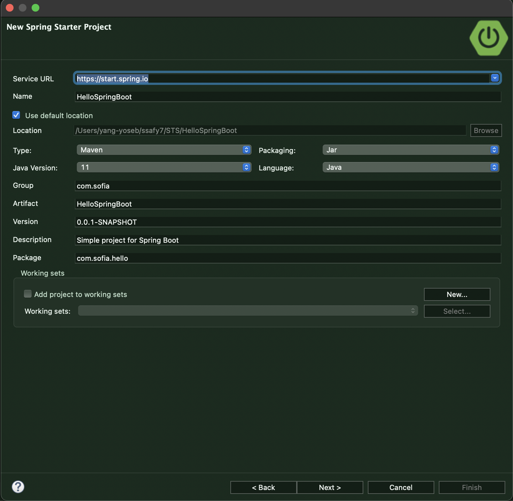
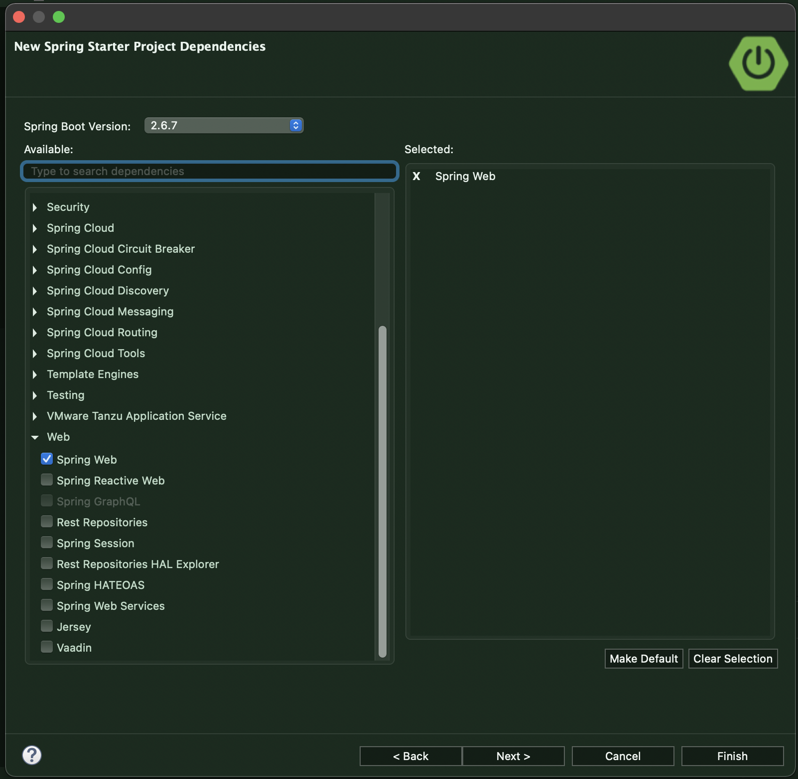
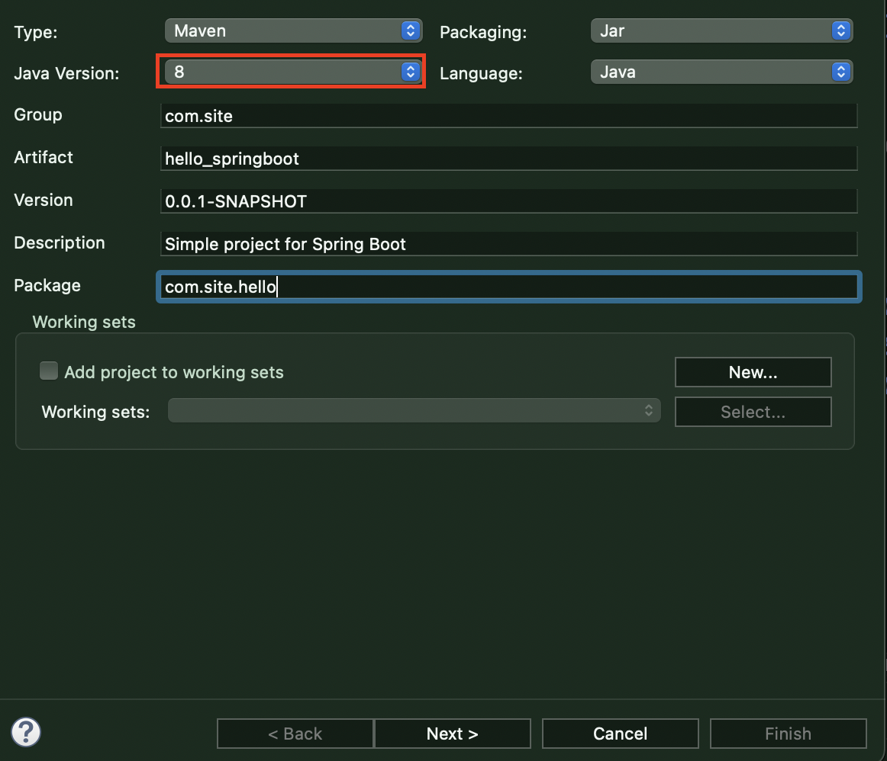
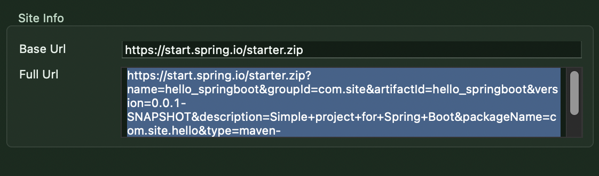
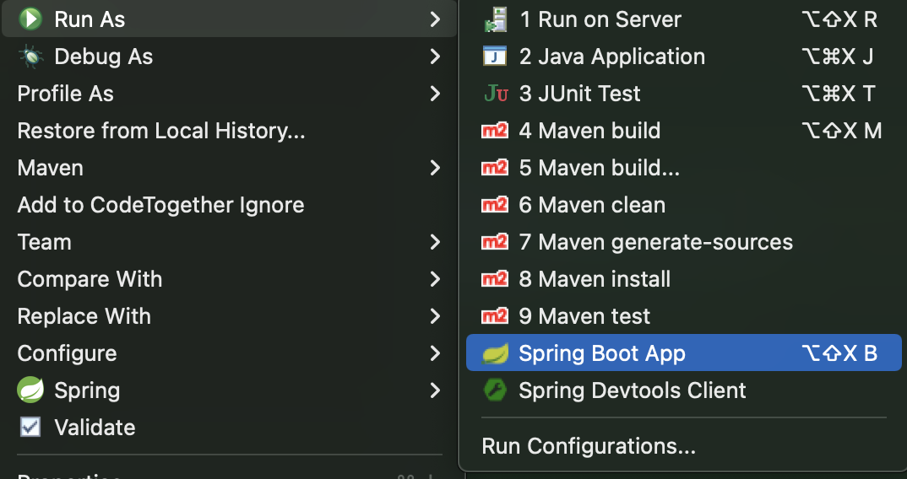
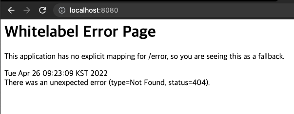

# SpringBoot

> * Spring의 경우 Application을 개발하려면 사전에 많은 작업(library 추가, dependency 설정, SpringFramework가 처리해야하는 여러가지 구성 및 설정파일 등)을 해야 했다.
> * SpringBoot의 장점
>   * projectt에 따라 자주 사용되는 library들이 미리 조합되어 있다.
>   * 복잡한 설정을 자동으로 처리
>   * 내장 서버를 포함해서 tomcat과 같은 WAS를 추가로 설정하지 않아도 개발 가능
>   * WAS에 배포하지 않고도 실행할 수 있는 JAR 파일로 Web Application을 개발할 수 있다. 

​                        

## SpringBoot Project 생성

> 기존의 Spring과는 다르게 SpringBoot는 Spring Starter Project를 이용하여 윈도의 Install Wizard와 같이 손쉽게 SpringBoot 기반의 프로젝트를 만들 수 있다.







#### 설정 참고

* 이클립스에 호환되는 자바 버전, web이라면 jar보다는 war지만 일단 jar로 패키징
* Gradle: Maven보다 직관적



​                 

#### - 링크 복사 후 url에 입력시

   

* 브라우저에서 자동 다운로드 해준다.

​              

​                   

### SpringBoot Project 생성

* Project 생성 구조 및 주요 구성 폴더/파일

| 프로젝트의 주요 파일            | 설명                                                         |
| ------------------------------- | ------------------------------------------------------------ |
| src/main/java                   | java source directory                                        |
| HelloSpringBootApplication.java | application을 시작할 수 있는 main method가 존재하는 스프링 구성 메인 클래스 |
| static                          | css, js, img 등의 정적 resource directory                    |
| templates                       | SpringBoot에서 사용 가능한 여러가지 View Template(Thymeleaf, Velocity, FreeMaker 등) 위치 |
| Application.properties          | application 및 스프링의 설정 등에서 사용할 여러가지 property를 정의한 file |
| src/main                        | jsp등의 리소스 directory                                     |

​              

### 실행

> Spring Boot App을 이용해 실행하고 http://localhost:8080 실행한다.
>
> Application.properties 에서 server.port=80을 적으면 localhost 만으로도 접근할 수 있다(디폴트 포트).





​                     

* index.html을 추가할 경우(src/main에 webapp 폴더 생성)

* 또는 src/main/resources/static에 index.html을 추가할 경우

* jsp는 webapp 안 WEN-INF 안 views에 만든다.

   


​                

​                    


### Controller 추가

> package에 controller를 추가하고 HelloController를 만든다.

```java
package com.sofia.hello.controller;

import org.springframework.stereotype.Controller;
import org.springframework.ui.Model;
import org.springframework.web.bind.annotation.RequestMapping;

@Controller
public class HelloController {
	
	@RequestMapping("/")
	public String hello(Model model) {
		model.addAttribute("msg", "안녕하세요 스프링 부트입니다.~~~");
		return "hello";
	}
}

```

​                 

### jsp 추가

> webapp/WEB-INF/views 폴더를 만들어 내부에 hello.jsp 를 만든다.


```jsp
<%@ page language="java" contentType="text/html; charset=UTF-8"
    pageEncoding="UTF-8"%>
<!DOCTYPE html>
<html>
<head>
<meta charset="UTF-8">
<title>Insert title here</title>
</head>
<body>
	<div align="center">
		<center>${msg }</center>
	</div>
</body>
</html>
```

​                

### application.properties file

> src/main/resources 에 있다.
>
> server.port= 를 이용해 포트번호를 바꿔서 띄울 수 있다.
>
> 부트부터는 jsp를 쓰는 것이 표준이 아니므로 사용하기 위한 설정을 해주어야 한다.

```
# Web ContextRootPath and PortNumber Settings
server.servlet.context-path=/sofia
server.port=80

# JSP Path (ViewResolver)
spring.mvc.view.prefix=/WEB-INF/views/
spring.mvc.view.suffix=.jsp
```

​               

#### pom.xml 에 추가

> 이 pom.xml을 적지 않으면 jsp를 사용할 수 없다.

```xml
<dependency>
  <groupId>javax.servlet</groupId>
  <artifactId>jstl</artifactId>
</dependency>
<dependency>
  <groupId>org.apache.tomcat.embed</groupId>
  <artifactId>tomcat-embed-jasper</artifactId>
</dependency>
```


​              

