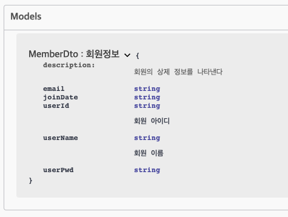

# Swagger

> * 간단한 설정으로 프로젝트의 API 목록을 웹에서 확인 및 테스트 할 수 있게 해주는 Library
> * Swagger를 사용하면 Controller에 정의되어 있는 모든 URL를 바로 확인할 수 있다.
> * API 목록 뿐 아니라 API의 명세 및 설명도 볼 수 있으며 또한 API를 직접 테스트해 볼 수도 있다.

* Depenency 추가: 하나만 추가하면 알아서 관련된 얘들을 끌어온다.

  ```xml
  <!-- swagger를 위한 의존성 추가 -->
  		<!-- https://mvnrepository.com/artifact/io.springfox/springfox-boot-starter -->
  		<dependency>
  			<groupId>io.springfox</groupId>
  			<artifactId>springfox-boot-starter</artifactId>
  			<version>3.0.0</version>
  		</dependency>
  ```

​                   


### Swagger를 이용한 REST API 문서화

* 프로젝트 개발 시 일반적으로 FrontEnd 개발자와 BackEnd 개발자가 분리
* FrontEnd 개발자의 경우 화면과 로직에 집중을 하고 BackEnd 개발자가 만든 문서 API를 보며 데이터 처리를 하게 된다.
* 이때 개발 상황의 변화에 따른 API의 추가 또는 변경할 때마다 문서에 적용하는 불편함 발생
* 이 문제를 해결하기 위해 Swagger 사용

​                


#### - Diagram

> FrontEnd와 BackEnd 개발자 사이에서 소통하기 위한 다이어그램.
> 하지만 매번 만날 수 없기 때문에 Swagger를 이용

* Class
* UseCase
* Index

​            

### Swagger 설정파일

> swagger를 이용하기 위해서 권한이 필요한 경우가 있다
> Admin 페이지 같은 경우 로그인을 한 뒤 swagger 페이지로 이동하거나
> WebMvcConfiguration.java 의 아래 경로들을 주석처리하고 사용한다.
>
> ```java
> private final List<String> patterns = Arrays.asList("/home/*","/admin/*", "/user/list" );
> ```
>
> ​            

* SwaggerConfiguration.java

  > http://localhost/swagger-ui/index.html 로 접속해 2 버전으로 접속할 수 있다.

  ```java
  @Configuration
  @EnableSwagger2
  public class SwaggerConfiguration {
  
  //	Swagger-UI 2.x 확인
  //	http://localhost:8080/{your-app-root}/swagger-ui.html
  //	Swagger-UI 3.x 확인
  //	http://localhost:8080/{your-app-root}/swagger-ui/index.html
  
  	private String version = "V1";
  	private String title = "site home API " + version;
  	
  	@Bean
  	public Docket api() {
  		return new Docket(DocumentationType.SWAGGER_2).consumes(getConsumeContentTypes()).produces(getProduceContentTypes())
  					.apiInfo(apiInfo()).groupName(version).select()
  					.apis(RequestHandlerSelectors.basePackage("com.site.home.controller"))
  					.paths(regex("/admin/.*")).build()
  					.useDefaultResponseMessages(false);
  	}
  	
  	private Set<String> getConsumeContentTypes() {
          Set<String> consumes = new HashSet<>();
          consumes.add("application/json;charset=UTF-8");
  //      consumes.add("application/xml;charset=UTF-8");
          consumes.add("application/x-www-form-urlencoded");
          return consumes;
      }
  
      private Set<String> getProduceContentTypes() {
          Set<String> produces = new HashSet<>();
          produces.add("application/json;charset=UTF-8");
          return produces;
      }
  
  	private ApiInfo apiInfo() {
  		return new ApiInfoBuilder().title(title)
  				.description("<h3>SSAFY API Reference for Developers</h3>Swagger를 이용한 home API<br>") 
  				.contact(new Contact("site", "https://edu.site.com", "site@ssafy.com"))
  				.license("site License")
  				.licenseUrl("https://www.site.com/ksp/jsp/swp/etc/swpPrivacy.jsp")
  				.version("1.0").build();
  	}
  
  }
  ```

  ​         

* Controller에 Annotation 적용

  ```java
  @RestController
  @RequestMapping("/admin")
  @CrossOrigin("*")
  @Api("어드민 컨트롤러 V1")
  public class AdminController {
  ```

  ​             

  

* Controller 내부 Mehod에 Annotation 적용

  > `@ApiOperation` 을 통해 Swagger에 나타낼 설명을 적어줌
  >
  > * <big>을 통해 강조가능
  >
  > `@ApiResponses({  })` 내부 `@ApiResponse(code= , message=" ")`
  >
  > * 전송 결과 값을 전달

  ```java
  	@ApiOperation(value = "회원목록", notes = "회원의 <big>전체 <big>목록을 리턴.")
  	@ApiResponses({
  		@ApiResponse(code=404, message = "주소 오류!!"),
  		@ApiResponse(code=500, message = "서버 에러!!"),
  		@ApiResponse(code=200, message = "회원 목록 정상")
  	})
  	@GetMapping(value = "/user")
  ```

  ​                 

  ​            

* Model 내부 Dto에 적용

  > `@ApiModel`로 객체를 설명해주고 `@ApiModelProperty`로 내부 값들을 설명해준다.

  ```java
  @ApiModel(value= "MemberDto : 회원정보", description = "사원의 상제 정보를 나타낸다")
  public class MemberDto {
  	@ApiModelProperty(value = "회원 이름")
  	private String userName;
  	@ApiModelProperty(value = "회원 아이디")
  ```

  

