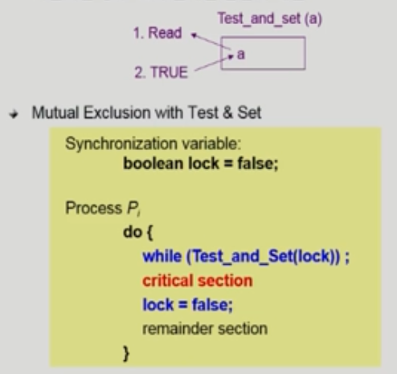
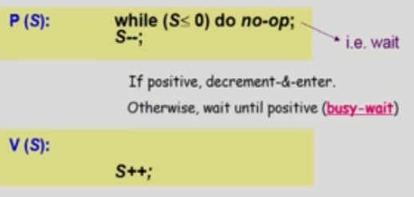
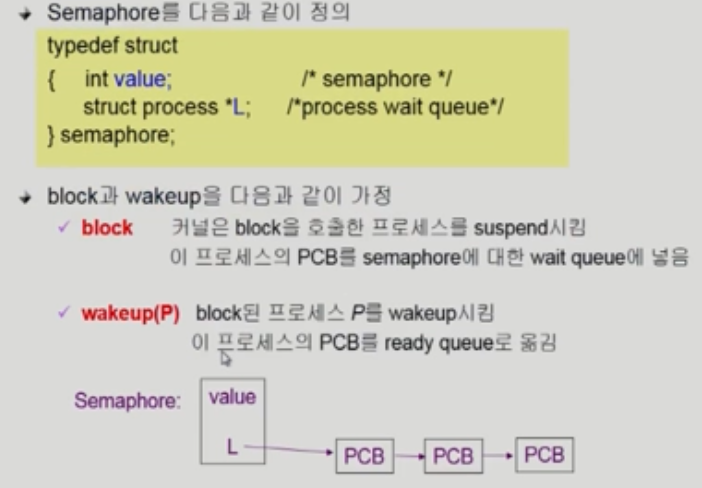
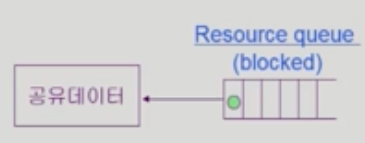
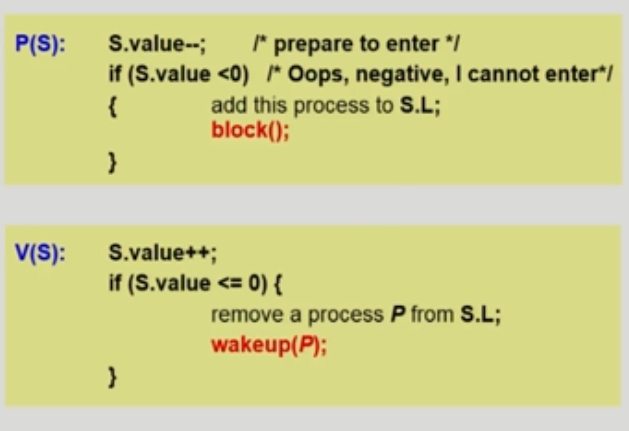

# 병행 제어

> 동시 접근의 문제를 해결해야한다.

​              

## 알고리즘 1

### Synchronization variable

* turn 변수를 활용

  > turn 값이 0이라면 현재 프로세스의 차례, 1이면 다른 프로세스 차례이다.
  >
  > 내 차례로 들어올 때는 0이지만 나갈 때 1로 바꿔줘서 상대방 차례로 넘겨준다.
  >
  > 만약 턴이 넘어오지 않으면 기다리고 있는 도중에 타이머가 CPU 주도권을 회수한다.

​        

#### - 상호 배제(Mutual Exclusion)

* 프로세스 Pi가 critical section 부분을 수행 중이면 다른 모든 프로세스들은 그들의 critical section에 들어가면 안된다.

#### \- 진행(Progress)

* 아무도 critical section에 있지 않은 상태에서 critical section에 들어가고자 하는 프로세스가 있으면 허가해준다.

#### \- Bound Waiting

*  프로세스가 critical section에 들어가려고 요청한 후부터 그 요청이 허용될 때까지 다른 프로세스들이 들어가는 횟수에 한계가 있어야 한다. = 기다리는 시간이 유한해야한다. (Starvation 문제)

​             

## 알고리즘 2

### Synchronization variable

* flag 변수 활용

  > flag 변수 값은 처음에 **들어가기 전**에  true로 바꿔줌. 나올 때 false로 바꿔줌.
  >
  > 동시에 상대방이 flag 변수를 true로 바꿨을 경우 무한 대기 현상이 발생한다

​             

## 알고리즘 3 : Peterson's Algorithm

* 알고리즘 1과 2의 합작

### Synchronization variable

> flag를 true로 바꿔서 미리 신호를 준 다음, turn을 상대방 차례로 만든다
>
> 상대방 차례이고 깃발이 올려져있다면 대기한다.
>
> turn을 폭탄에 비유한다면 깃발을 올리고 상대방에게 폭탄을 던져야 입장할 수 있는 것이다.
>
> 깃발은 입장권으로 동시에 들 수 있지만 턴이라는 폭탄을 가지고 입장할 수 없기에 순간적으로 폭탄을 던져주는 것이라 이해했다. 

* 문제점: Busy Waiting (자원 비효율적: CPU와 Memory 사용) = **spin lock** = while 문을 계속 사용

​             

## HardWare

>  하드웨어적으로 Test & Modify 를 atomic하게 수행할 수 있도록 지원하는 경우 문제가 간단히 해결

​              

## Semaphores

> 앞의 방식들을 추상화시킴

* #### Semaphore S

  * Integer variable = 세마포 변수 사용
    * 방식이 두 가지 존재: 자원의 개수를 나타내는 Counting Semaphore / flag처럼 사용하는 Binary Semaphore
  * 아래의 두 가지 atomic 연산에 의해서만 접근 가능 = P 연산(자원획득), V 연산(자원반납)

  

  * 자원이 있다면 P(S)를 통해 들어가고 S--; 를 통해 자원을 사용했다는 것을 알림

​    

* **문제점** [Critical Section of n Process]
  * while 문을 계속 돌리면서 CPU와 메모리를 사용하고 시간을 낭비
  * Busy wait문제가 계속 발생 = spin lock 발생 (돌면서 체크)

​          

## Block / Wakeup Implementation

* 그래서 공유 데이터에 접근하려는 프로세스는 while문에서 기다리지 않고 queue에 넣고 대기

* 이전과 다른점은 P(S)에 들어가서 0이든 무슨 수든지 0을 일단 빼고 본다. (Queue 자료구조의 방식)
  * 그리고 확인해서 0보다 작으면 Q에 집어넣는다
* 다른 프로세스가 자원을 반납하고 자원이 0보다 커질 때 큐에 대기하고 있던 프로세스를 하나 꺼낸다.

​            

# Which is Better?

* Busy-wait v.s Block/wakeup
* Critical Section이 **길수록 그리고 경쟁이 치열할수록** Block 방식이 유리, 너무 짧은 경우 오버헤드가 커질 수 있다.
* 일반적으로는 Block/wakeup이 유리

