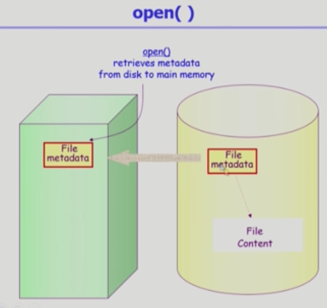
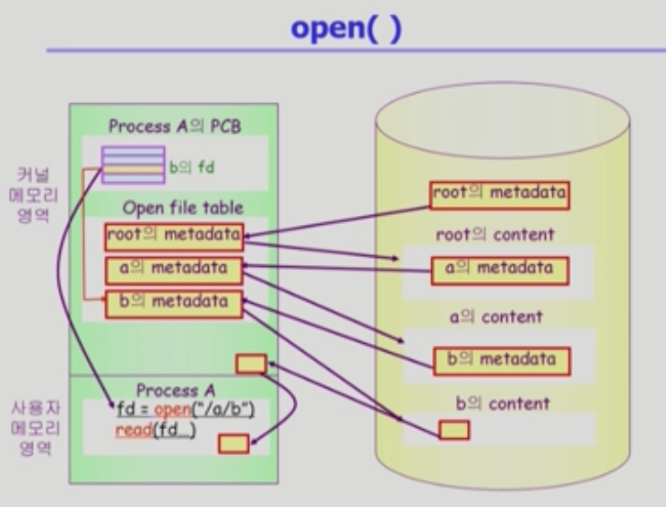
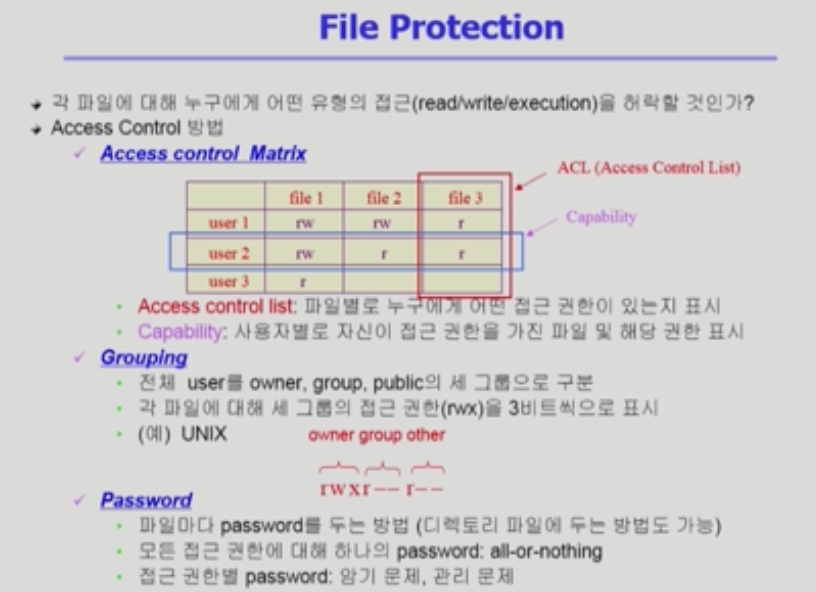
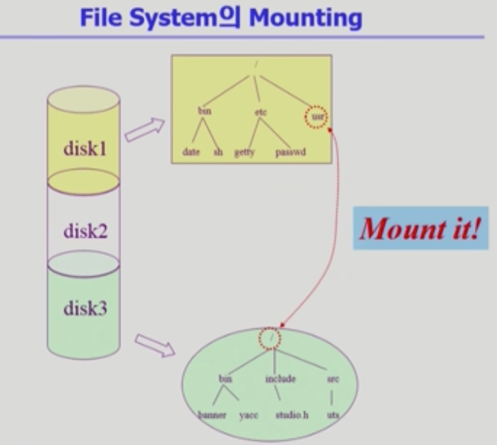

# 파일 시스템

> File : 일반적으로 비휘발성의 보조기억장치에 저장
>
> **운영체제** : 다양한 저장 장치를 file이라는 동일한 논리적 단위로 볼 수 있게 해 줌

* 파일의 연산(Operation)

  * create, read, write, reposition(현재 접근하는 위치를 수정), delete, open, close

* File attribute(혹은 파일의 metadata)

  * open 명령어를 통해 파일의 metadata를 메모리에 올려놓는다.

    

  * 파일 자체의 내용이 아니라 **파일을 관리하기 위한** 각종 정보들

    * 파일 이름, 유형, 저장 위치, 파일 사이즈
    * 접근 권한(읽기/쓰기/실행), 시간(생성/변경/사용), 소유자 등

* **File system**

  * 운영체제에서 파일을 관리하는 부분
  * 파일 및 파일의 metadata, 디렉토리 정보 등을 관리
  * 파일의 저장 방법 결정
  * 파일 보호 등

* Directory : 하나의 파일이다.

  * 파일의 메타데이터 중 일부를 보관하고 있는 일종의 특별한 파일
    * 그 디렉토리에 속한 파일 이름 및 파일 attribute 들
    * operation: search / create / delete / list / rename / traverse

* Partition(=Logical Disk)

  * 하나의 (물리적) 디스크 안에 여러 파티션을 두는게 일반적
  * 여러 개의 디스크를 하나의 파티션으로 구성하기도 함
  * 각각의 파티션에 file system을 깔거나 swapping 등 다른 용도로 사용 가능

​        

### open ( )

> 시스템 콜의 일종 : I/O 처리 후 - 결과값 리턴(찾고자하는 최종 파일의 위치 리턴) - 배열에 저장하기에 이미 있다면 재탐색X
>
> (=마치 DP와 같음)
>
> root directory의 메타데이터는 미리 알려져있다.

* open("/a/b/c")

  * 목표 : 디스크로부터 파일 c의 메타데이터를 메모리로 가져옴

  

  * open 과정 : 이를 위해 directory path를 search

    * 루트 디렉토리 "/"를 open하고 그 안에서 파일 "a"의 위치 획득
    * 파일 "a"를 open하고 read해서 그 안 파일 "b"의 위치 획득
    * 파일 "b"를 open하고 read해서 그 안 파일 "c"의 위치 획득
    * 파일 "c" open

  * read 과정 : 역시 시스템콜 (제어권 : 운영체제) - 메모리에 캐싱되어있는지 확인

    * 파일의 내용을 메모리에 copy한 후 그 복사한 내용을 read를 호출한 프로세스에 리턴

      * **buffer caching**

      ​      

​      

### File Protection

> 파일을 보호하기 위한 권한 접근 방법은 3개가 있다.(rwx = read, write, execution)

* Access control Matrix
  * 2차원 배열을 사용하면 정보량이 매우 많음 = 파일을 기준으로 리스트로 만들 수 있음

* Grouping (현대 체제)

  * 전체 user를 owner, group, public 의 세 그룹으로 구분
  * 각 파일에 대해 세 그룹의 접근 권한(rwx)을 3비트씩 표기
  * ex) [owner] rwx / [group] r__ / [other] r__

* Password

  * 파일마다 비밀번호를 둔다
  * 모든 접근 권한에 대해 하나의 password = all or nothing (모 아니면 도)

  * 접근 권한변 password : 암기 문제, 관리 문제

​         

### Mounting

* 서로 다른 파일 시스템에 접근할 수 있도록 하는 방식

​         

### 파일 접근 방법(Access Method)

1. 순차 접근(sequential access)
   1. 카세트 테이프 방식처럼 접근 (a - b - c 가 있을 때 b를 반드시 거쳐야 c로 가능)
   2. 읽거나 쓰면 offset이 자동적으로 증가
2. 직접 접근(direct access, random access = 임의 접근)
   1. LP 레코드 판 방식처럼 접근 (제한 조건없이 접근 가능)
   2. 파일을 구성하는 레코드를 임의의 순서로 접근 가능