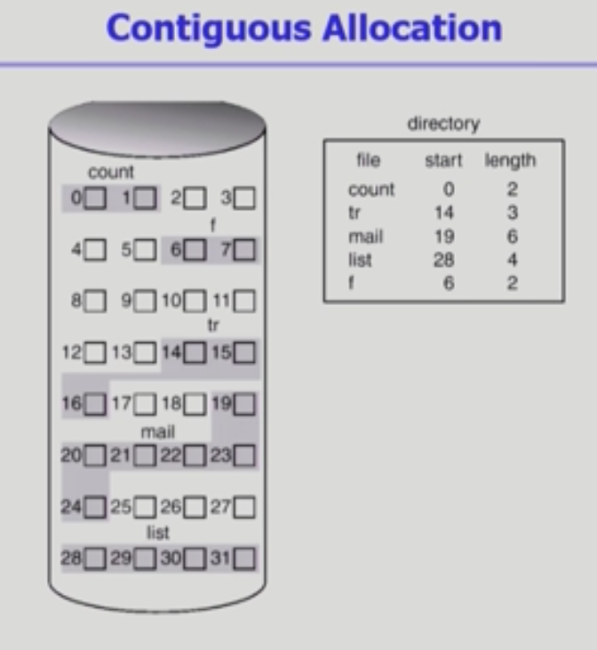
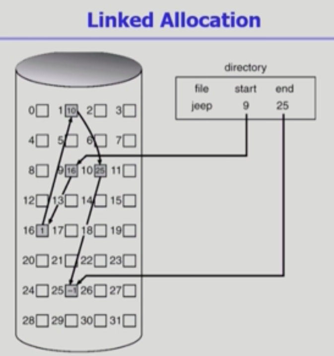
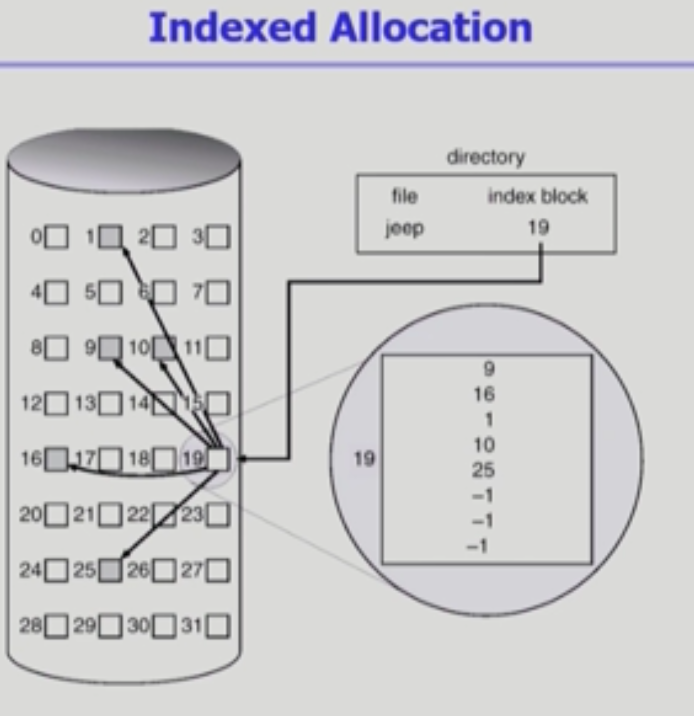
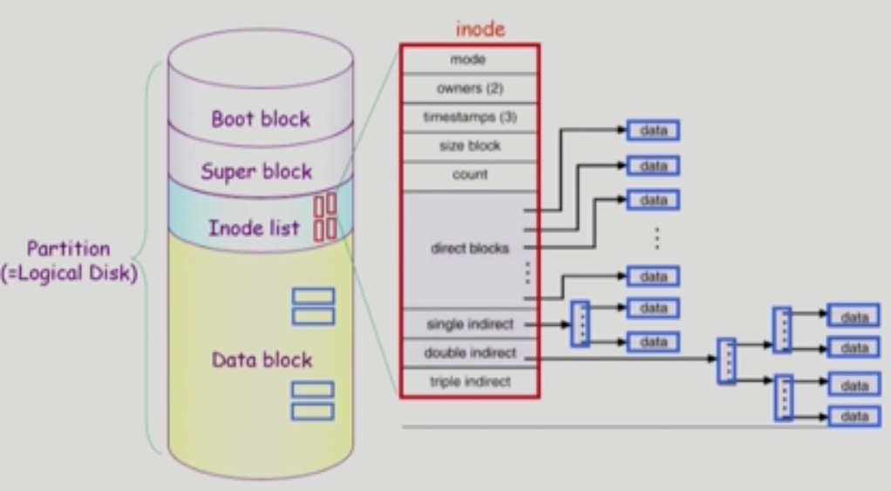
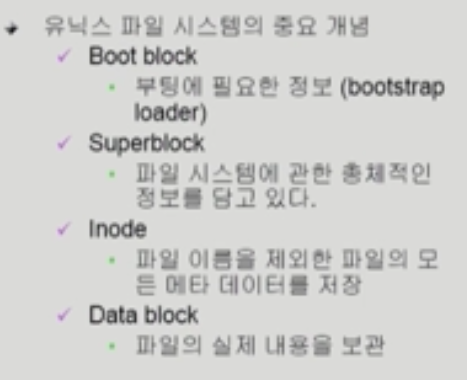
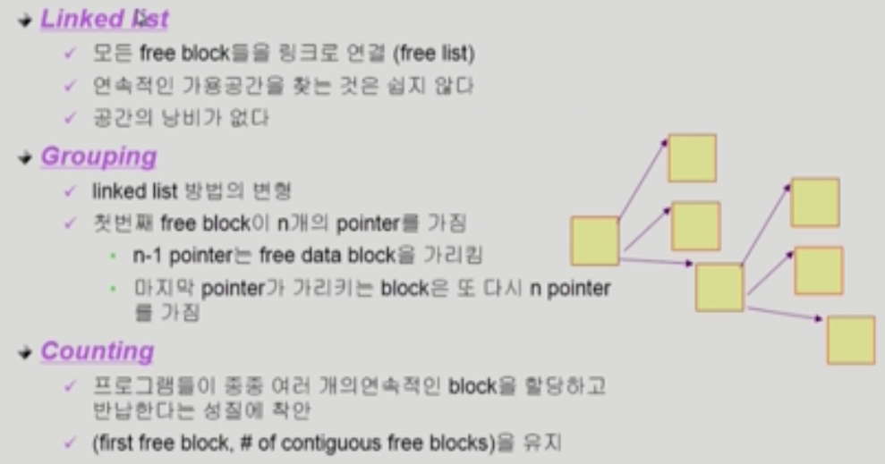
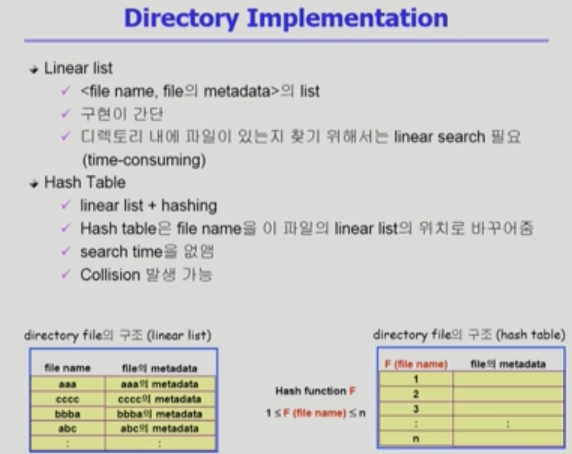
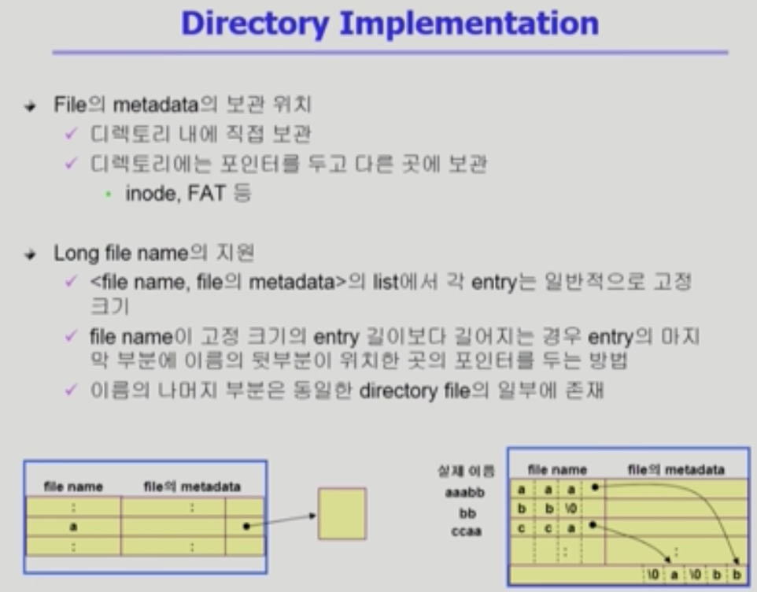
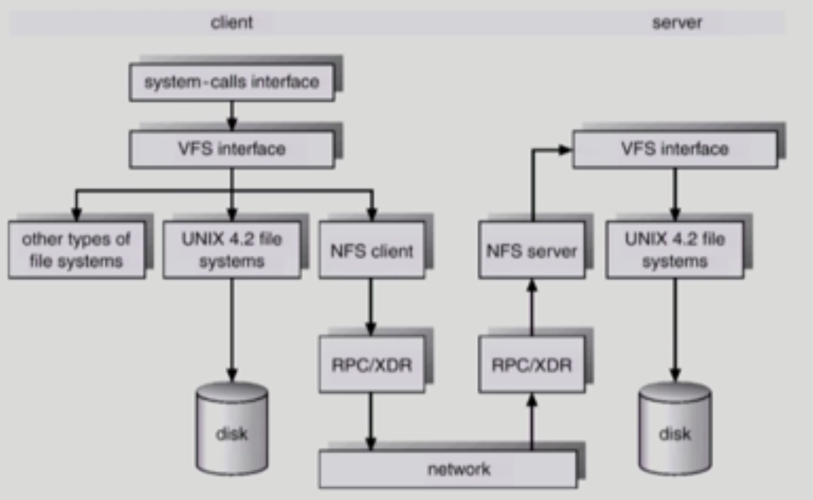
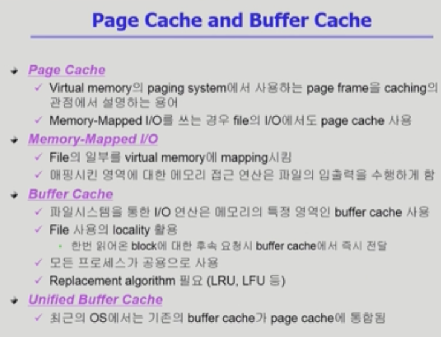

# 디스크 파일 할당 방법(3가지)

​           

## Contiguous Allocation(연속 할당)

> 하나의 파일이 디스크에 연속적으로 저장되는 방법

* 장점
  * Fast I/O
    * 데이터의 연속성: 한번의 seek/rotation으로 많은 바이트가 transfer
    * Realtime file용: 이미 run 중이던 process의 swapping용
      * swapping에서는 효율보단 속도가 중요하기 때문
  * Direct access(=random access) 가능
* 단점
  * 외부조각이 생길 수 있다.(할당되지 않은 메모리 공간의 크기가 제각각)
  * file grow(파일의 크기가 커지는 것)이 어려움
    *  hole 발생: file grow를 미리 예측해서 할당한다면 낭비가 발생함

​     

​       

## Linked Allocation

* 장점
  * 외부조각X
* 단점
  * No random access: 처음 위치부터 접근해서 순차적으로 접근해야 원하는 정보에 도달
  * Reliability: 한 sector이 고장나면 많은 부분이 유실
  * Pointer를 위한 공간이 block의 일부가 되어 공간 효율성을 저하
    * 다음 데이터를 가르키는 좌표 저장에 공간 낭비
* 변형
  * FAT: File Allocation Table
    * 포인터를 별도의 위치에 보관해 reliability와 공간 효율성 문제 해결

​      

​       

## Indexed Allocation

> 블록 하나에 파일의 자료가 들어있는 인덱스 정보를 저장

* 장점
  * 외부조각X
  * direct access
* 단점
  * 작은 파일인 경우 공간 낭비 (실제로 대부분이 작음)
  * 너무 큰 파일이면 하나의 블럭에 모두 저장X
    * linked scheme: 마지막 인덱스는 파일의 인덱스가 아닌 다음 인덱스 블록의 위치
    * Multilevel index: 하나의 인덱스가 또 다른 인덱스 블록을 가리킴 (paging에서 사용하던 기법과 비슷)

​         

​         

## UNIX 파일시스템의 구조

* Boot block : 파일 시스템의 공통적인 부분
* Super block : 현재 파일시스템을 관리하기 위한 블록, 어디가 빈 블록이고 데이터를 담고 있는지 등 저장
* Inode list : 파일 하나당 inode가 배분
  * indexed Allocation 방식: inode의 크기는 고정되어있다. 
    * 크기에 작은 순으로 direct blocks > single indirect > double indirect > triple indirect 

​         

## FAT File System

* directory file에는 해당 파일마다 시작점만
  * FAT부분에 그 다음 번호들이 저장 = 직접 접근 가능

​         

​           

# Free-Space Management

​      

​         

* Linked list: 직접 따라가봐야하기 때문에 연속적인 공간 찾기 어려움
* Grouping: 첫번째 블록이 인덱스 역할, 연속적인 공간 찾기 어려움
* Counting: 첫번째 빈블럭을 찾고 몇번째까지 빈블럭인지 표기

​        

​            

## Directory Implementation

* Linear List: 구현은 간단하지만 폴더 찾는데 시간이 오래 걸린다.
* Hash Table: 해시함수를 적용 = 이름을 숫자화해서 검색이 빨라짐

* 긴 이름의 파일
  * 어느정도 길이를 한정하고 마지막 부분에 포인터를 둬서 가리키는 부분을 적어주기

​       

### VFS, NFS

> 사용자가 파일에 접근하기 위해서 **시스템 콜**이 필수
>
> 바로 파일에 접근하는 것이 아니라 **VFS**에 접근 : 동일한 시스템콜 인터페이스를 통해 파일에 접근
>
> 어차피 파일에 접근하기 위해선 VFS에 접근해야하기 때문에 네트워크를 통해 다른 서버에 접근할 때에도 그 컴퓨터 내부에선 VFS 인터페이스로 접근해 파일을 가져온다.

​         

### Page Cache and Buffer Cache

> Page Cache는 page fault가 일어나지 않으면 (BLT의 작용은 99퍼센트 적중률) 기록이 남지 않기 때문에 clock 알고리즘을 사용해 하드웨어가 관여하도록 하고, Buffer Cache는 시스템 콜이 무조건 일어나기 때문에 기록이 무조건 남음으로 clock 알고리즘 말고도 LRU나 LFU의 사용이 자유롭다.

* 최근에는 Unified Buffer Cache
  * 버퍼 캐시를 페이지 단위로 관리하고 같이 관리한다.
* Memory Mapped I/O
  * 파일 일정부분을 메모리 영역에 매핑: 메모리에 명령하는 것이 마치 파일에 명령하는 것으로 인식되게 함