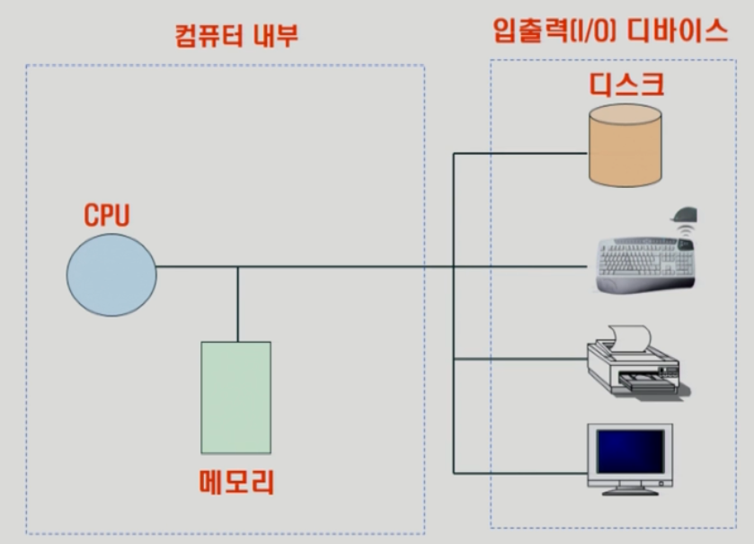
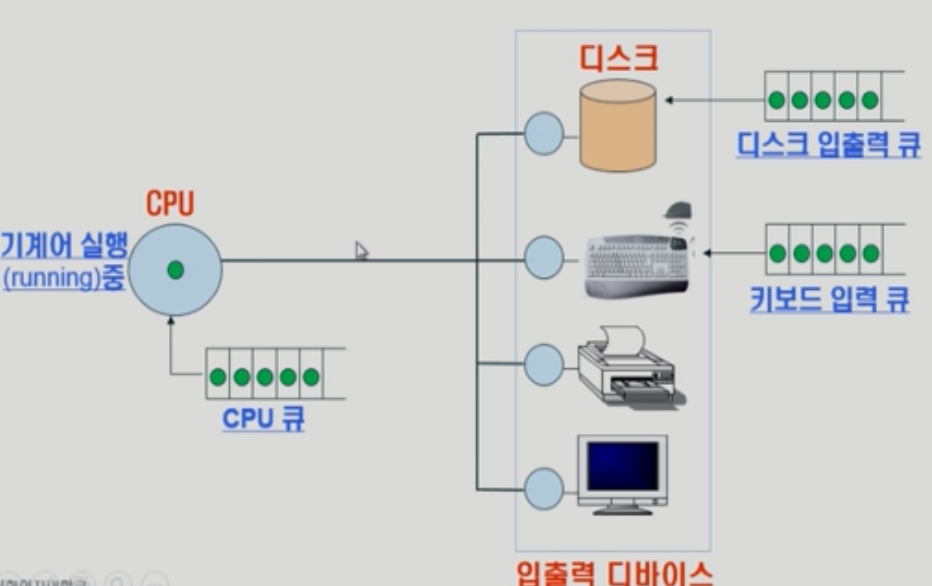

# 운영체제 (Operating Systems, OS)

* ### 개념

> 운영체제는 컴퓨터 하드웨어 바로 위에 설치되는 소프트웨어 계층으로 모든 컴퓨터 시스템의 필수적인 부분이다.
>
> **[ 하드웨어 ] - [ 운영체제 ] - [ 각종 소프트웨어 ]**

​    

* ### 목적

  > \- 컴퓨터 시스템의 **자원을 효율적으로 관리**
  >
  > > CPU, **메모리(=CPU의 작업 공간)**, I/O 장치 등의 효율적인 관리
  > >
  > > * 효율성: 주어진 자원으로 최대한의 효율을 내도록 함
  > > * 형평성: 특정 사용자/프로그램의 지나친 불이익이 발생하지 않도록 함
  >
  > \- 프로그램들이 독자적인 컴퓨터에서 실행되는 것 같은 환상(illusion) 제공
  >
  > \- 하드웨어를 직접 다루는 복잡한 부분을 운영체제가 대행

  ​    

* ### 컴퓨터 시스템의 구조

  > [ 컴퓨터 내부 ]  CPU → 메모리(**운영체제 부분이 늘 할당**)
  >
  > ​                     ↓
  >
  > [ 입출력(I/0) 디바이스 ] 디스크, 키보드, 프린트 , 모니터 등

     

   

* ### 운영체제의 기능

  > CPU 스케쥴링: CPU의 사용권, 프로세스가 생성되고 종료될 때까지 모든 상태 변화를 조정하는 일
  >
  > ​    \- CPU의 디바이스 컨트롤: CPU가 직접 디바이스를 통제하지 않고 디바이스에 있는 CPU 컨트롤러를 통해 명령한다
  >
  > ​    \- 인터럽트, 캐싱: 빠른 CPU와 느린 I/O 장치간 속도차 극복(느린 장치가 CPU에게 알리는 방식)
  >
  > 
  >
  > 메모리 관리: 한정된 메모리를 효율적으로 쪼개어 사용
  >
  > 디스크 스케쥴링
  >
  > ​    \- 속도차이 = CPU → 메모리(100배) → 디스크(100만배)
  >
  > ​    \- 메모리에 할당된 여러 프로그램으로부터 요청을 받지만 물리적 공간을 고려해 순서에 상관없이 효율적으로 배치한다.

​      

* ### 프로세스의 상태

  > CPU 큐: CPU의 일부분이 기계어를 실행 중일 때 *운영체제*는 큐(Queue)를 만들어 CPU 스케줄을 관리
  >
  > 디스크 입출력 큐, 키보드 입력 큐 모두 비슷한 원리

