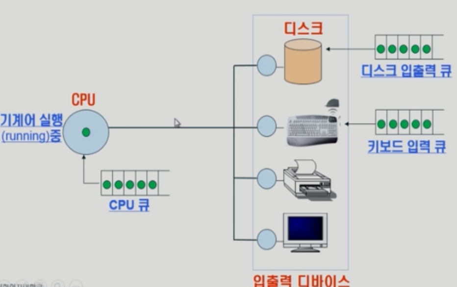
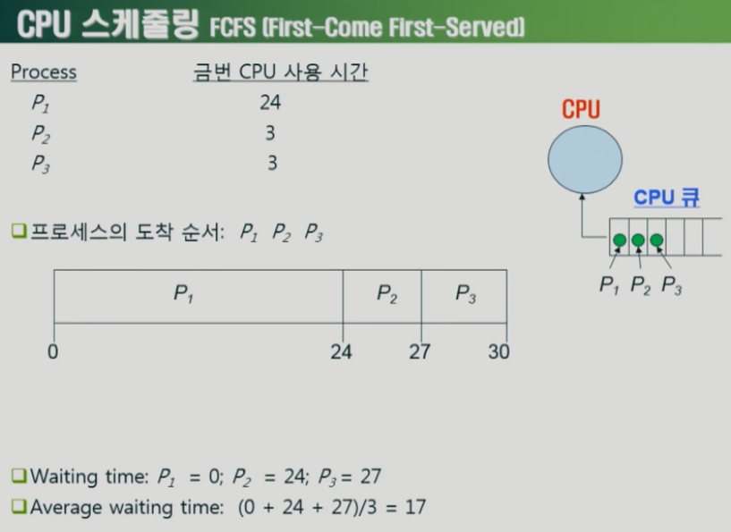
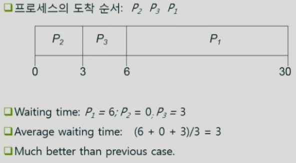
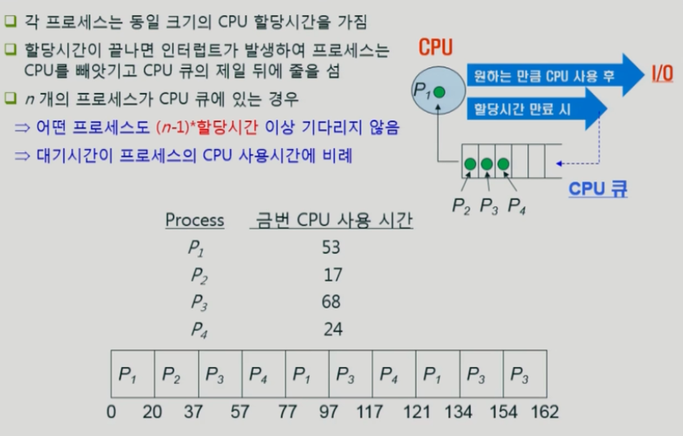
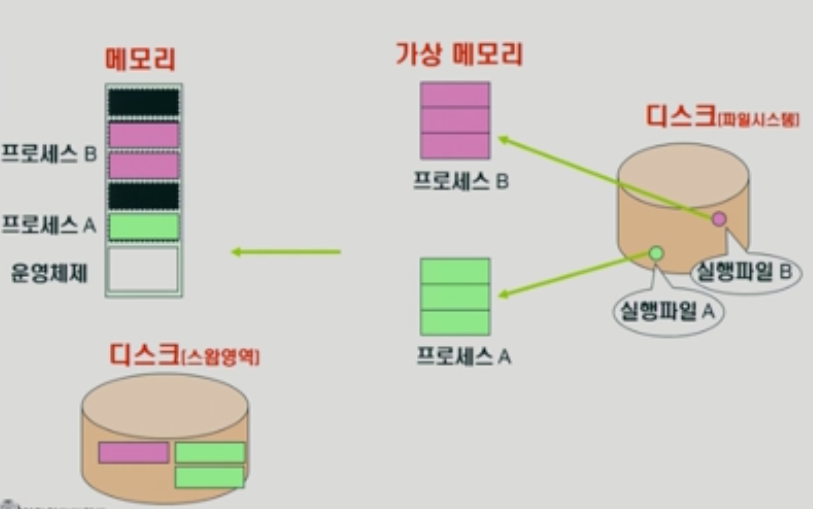
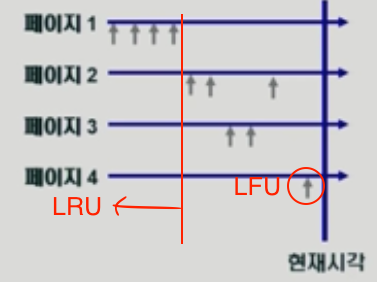
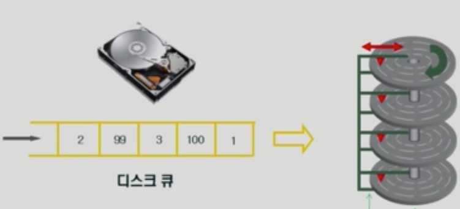
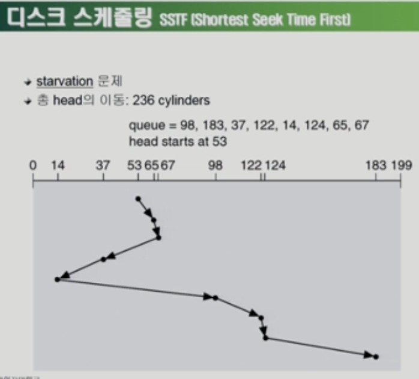
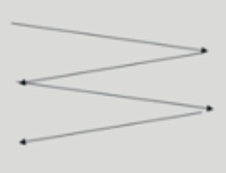
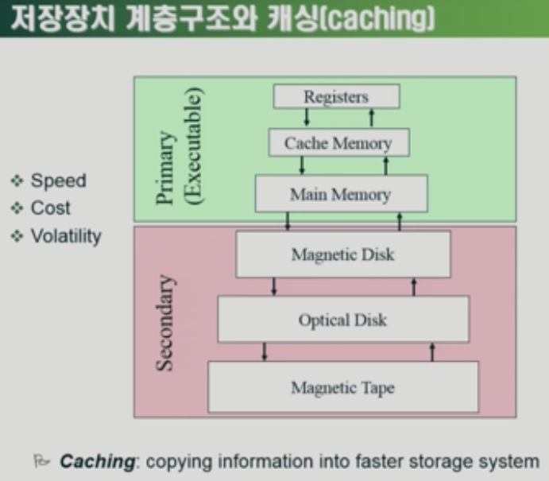

# 운영체제 - 개요 (Operating Systems, OS)

* ### 개념

> 운영체제는 컴퓨터 하드웨어 바로 위에 설치되는 소프트웨어 계층으로 모든 컴퓨터 시스템의 필수적인 부분이다.
>
> **[ 하드웨어 ] - [ 운영체제 ] - [ 각종 소프트웨어 ]**

​    

* ### 목적

  > \- 컴퓨터 시스템의 **자원을 효율적으로 관리**
  >
  > > CPU, **메모리(=CPU의 작업 공간)**, I/O 장치 등의 효율적인 관리
  > >
  > > * 효율성: 주어진 자원으로 최대한의 효율을 내도록 함
  > > * 형평성: 특정 사용자/프로그램의 지나친 불이익이 발생하지 않도록 함
  >
  > \- 프로그램들이 독자적인 컴퓨터에서 실행되는 것 같은 환상(illusion) 제공
  >
  > \- 하드웨어를 직접 다루는 복잡한 부분을 운영체제가 대행

  ​    

* ### 컴퓨터 시스템의 구조

  > [ 컴퓨터 내부 ]  CPU → 메모리(**운영체제 부분이 늘 할당**)
  >
  > ​                     ↓
  >
  > [ 입출력(I/0) 디바이스 ] 디스크, 키보드, 프린트 , 모니터 등

     

   

* ### 운영체제의 기능

  > CPU 스케쥴링: CPU의 사용권, 프로세스가 생성되고 종료될 때까지 모든 상태 변화를 조정하는 일
  >
  > ​    \- CPU의 디바이스 컨트롤러: CPU가 직접 디바이스를 통제하지 않고 디바이스에 있는 CPU 컨트롤러를 통해 명령한다
  >
  > ​    \- 인터럽트, 캐싱: 빠른 CPU와 느린 I/O 장치간 속도차 극복(느린 장치가 CPU에게 알리는 방식)
  >
  > 
  >
  > 메모리 관리: 한정된 메모리를 효율적으로 쪼개어 사용
  >
  > 디스크 스케쥴링
  >
  > ​    \- 속도차이 = CPU → 메모리(100배) → 디스크(100만배)
  >
  > ​    \- 메모리에 할당된 여러 프로그램으로부터 요청을 받지만 물리적 공간을 고려해 순서에 상관없이 효율적으로 배치한다.

​      

* ### 프로세스의 상태

  > CPU 큐: CPU의 일부분이 기계어를 실행 중일 때 *운영체제*는 큐(Queue)를 만들어 CPU 스케줄을 관리
  >
  > 디스크 입출력 큐, 키보드 입력 큐 모두 비슷한 원리

   

   

## CPU 스케줄링(FCFS: First-Come First-Served)

### - SJF(Shortest Job First) 방식



> 가장 긴 시간을 사용하는 프로세스```P1```이 맨 앞에 있다면 ```P1```을 제외한 모든 ```Pn```에 긴 대기 시간이 추가되고 평균 대기 시간은 커진다. 



> 금번 CPU 사용시간이 가장 짧은 프로세스를 제일 먼저 스케줄한다(=Shortest Job First, **SJF**). 이를 통해 **minimim average waiting time**을 보장한다.

* SJF로 인해 발생할 수 있는 문제점

  > Starvation(기아 현상) 발생 가능: 사용 시간이 긴 프로세스가 무한정 기다릴 수 있다.

​    

### - RR(Round Robin) 방식



> 모든 프로세스가 동일한 할당시간동안 CPU를 사용하는 방식, 할당시간이 끝나면 **인터럽트(CPU를 빼앗음)**가 발생해 프로세스는 CPU를 빼앗기고 큐 맨 뒤로 이동
>
> - 어떤 프로세스도 (n-1)*할당시간(맨 뒤의 프로세스) 이상 기다리지 않는다
> - 대기시간은 할당시간에 비례한다

   

   

## 메모리 관리

```
메모리: 휘발성
디스크: 비휘발성
```



> **< 프로그램 실행 >**
>
> 1) **디스크**(파일시스템)에서 프로그램을 실행하면
> 2) 프로세스에게 독자적인 **가상메모리** 배분
> 3) 당장 필요한 부분을 쪼개서 **메모리**에 올린다
>
> - 메모리에 올라간 프로세스가 밀려나면?
>
>   > 용도가 다른 **디스크**(스왑영역)에 들어간다.
>
> * 전원이 갑자기 꺼지면?
>
>   > **파일시스템**은 남아있으나 **메모리**의 데이터는 날아가며 **스왑영역**의 데이터도 중요도가 떨어진다.

   

#### LRU vs LFU

메모리 공간은 무한이 아니기 때문에 꽉찬다면 현재 할당하고 있는 메모리 공간을 비우고 새로 채워넣어야 한다. 과거의 통계를 보고 **미래에 가장 덜 사용할 것으로 보이는 공간**을 비운다.

> LRU: 가장 오래 전에 참조 페이지 삭제
>
> LFU: 참조횟수가 가장 적은 페이지 삭제



​    

## 디스크 스케줄링



> 디스크 헤드의 이동을 최소화하는 방식으로 스케줄링해야한다.

* 디스크 접근 시간(Access time)의 구성

  \- 탐색 시간(Seek time)

  * 헤드를 해당 트랙(실린더)으로 움직이는데 걸리는 시간

  \- 회전지연(Rotational latency)

  * 헤드가 원하는 섹터에 도달하기까지 걸리는 시간

  \- 전송시간(Transfer time)

  * 실제 데이터의 전송 시간

   

* 디스크 스케줄링(Disk Scheduling)

  \- **SSTF**(Shortest Seek Time First): seek time을 최소화하는 것이 목표(starvation 문제)

  \- seek time = seek distance

  

  * **SCAN** 방식: 헤드가 디스크의 한쪽 끝에서 다른쪽 끝으로 이동하며 가는 골목에 있는 모든 요청을 처리한다. 다른 한쪽 끝에 도달하면 역방향으로 이동하며 오는 길목에 있는 모든 요청을 처리하며 다시 반대쪽 끝으로 이동한다.(엘레베이터)

    

   

## 저장장치 계층구조와 캐싱(Caching)

> 빠른 속도의 CPU+메모리와 느린 저장장치 디스크 사이를 어떻게 조율하는지 알아본다



```
*위쪽으로 갈수록 빠르고 비싸다, 초록색 부분은 휘발성이며 Executable(CPU 접근가능)하다.
*단계적 구성: 속도 차이를 완충
```

Register: CPU 내부 매우 작은 명령어가 저장된 부분

***Caching**: 동일한 데이터를 재사용하는 경우 중간 계층에서 잠시 저장해놓고 필요시 바로 올려보낸다.

   

### 플래시 메모리

* 종류: 반도체 장치(하드디스크: 마그네틱), NAND형(스토리지), NOR형(임베디드 코드저장용)

* 특징

  > Nonvolatile: 전력이 나가도 유지
  >
  > Low power consumption
  >
  > Shock resistance
  >
  > Small size
  >
  > Light Weight
  >
  > **쓰기 횟수 제약**, **데이터 변질 가능**(0과 1을 전하량으로 판단)

* 사용형태

  > \- 휴대폰, PDA 등 임베디드 시스템 구성용
  >
  > \- USB용 메모리 스틱
  >
  > \- 디지털 카메라 등의 SD 카드, CompactFlash, Smart Media card
  >
  > \- 모바일 장치 뿐 아니라 대용량 시스템에서 SSD(Solid State Drive)란 이름으로 하드디스크 대체시도

## 운영체제의 종류

* 서버용, PC용, 스마트디바이스용 운영체제

* 공개 소프트웨어 (Open Source Software)

  ​	\- Linux, Android

   