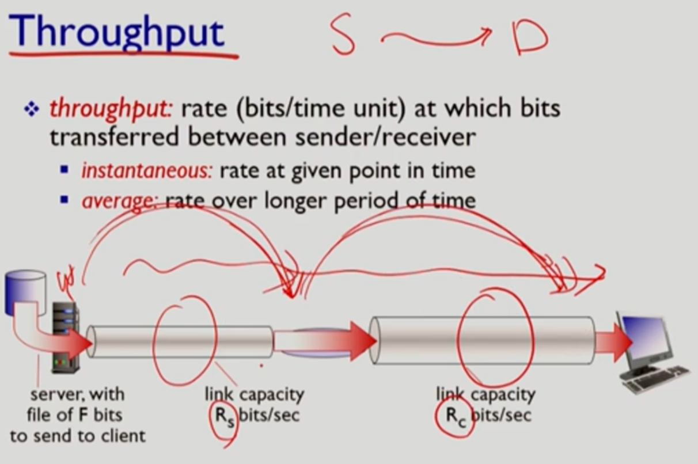
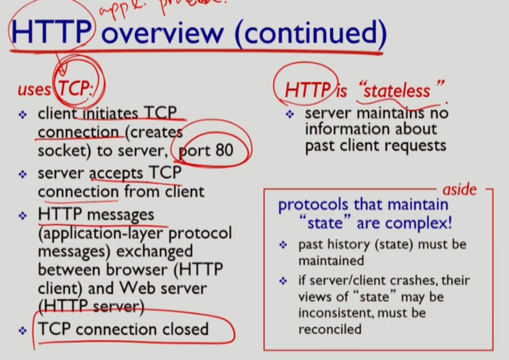

# 네트워크 키워드 정리

## RoadMap

> RoadMap
>
> 1. network
>    1. edge
>    2. core
>    3. delay, loss
> 2. protocol

### 1. packet delay가 어느 과정에 발생하는지 각각 설명하시오

| 단계 | delay                                                        | 설명                                                         |
| ---- | ------------------------------------------------------------ | ------------------------------------------------------------ |
| 0    | packet이 node에 전달되면 다음 노드 전송까지 delay가 발생한다 |                                                              |
| 1    | processing delay                                             | 1. bit error check 2. output link 결정                  |
| 2    | queueing delay                                               | 대기하는 packet이 있을 때 queue에 대기 **가변성**: 현재 congestion에 따라 달라짐 |
| 3    | transmission delay                                           | link에 전송할 차례일 때 전송하는 시간 L(bits)/R(bps) = 전송 속도 La(average packet arrival rate)/R = traffic intensity |
| 4    | propagation delay                                            | 물리적인 link 길이 / 전파속도 = d/s                          |

​                 

### 2. Throughput

* 처리량(Throughput): 단위시간 당 보낸 데이터양(bits/time unit)
* packet은 하나씩 전송되지만 연속적으로 보내기 때문에 흐름으로 생각할 수 있고 그 속도를 나타낼 수 있다.

​        

### 3. protocol은 어떤 형태의 구조며 이에 따른 장점과 단점은 무엇인가?

* complex system: layer system
  * 장점
    * identification, relationship 파악 용이
    * maitenance, updating 용이
  * 단점
    * 기능의 중복성이 발생 가능하다

​        

### 4. 5계층에 대해 설명하세요

* 5 계층

  | 계층        | 설명                                                         | 요약                                                      |
  | ----------- | ------------------------------------------------------------ | --------------------------------------------------------- |
  | application | 네트워크 어플리케이션 지원 오직 endsystem, host에서 적용 ex) FTP, SMTP, HTTP | 메시지 생성 Message                                  |
  | transport   | process(source)-process(destination) data transfer ex) TCP, UDP | host to host 헤더를 붙인 Segment 생성                |
  | network     | routing of datagrams from source to destination ex) IP, routing protocols | source to destination 다시 헤더를 붙인 Datagram 생성 |
  | link        | Data transfer between neighboring network elements ex) Ethernet, 802, PPP | node to node 헤더를 붙인 Frames 생성                 |
  | physical    | bits "on the wire"                                           | 물리적으로 비트를 싣는다                                  |

  ​             

### 5. application 계층

> Message를 만드는 계층이다.
> 통신하는 주체는 host(컴퓨터)가 아니라 그 내부에서 실행되는 program(process)이다.
> socket을 통해서 계층의 이동이 가능하다.

* application의 구조
  * client-server
    * server: 언제나 켜져있고(always-on), 영구적인 IP 주소를 가지며 data centers for scaling
    * clients: server와 통신하며 intermittentily(간헐적) 하게 연결하며 dynamic address를 갖는다.
  * peer-to-peer (P2P)
    * no always-on server, intermittentily connected, change IP address = 관리가 복잡하다
    * peer: self-scalability, 서로가 service를 provide할 수도 있고 request할 수도 있다.
* process
  * 종류: client-server에는 각각 역할에 맞는 프로세스가 있지만 P2P에는 두 프로세스 모두 존재한다.
    * client-process: communication을 시작하는 프로세스
    * server process: 접속을 기다리는 process
  * 프로세스 간 통신
    * Host의 주소는 IP로 나타낸다: 32비트 = 8비트 * 4, 최대수 255.255.255.255
    * Host의 IP 뿐만 아니라 어떤 프로세스인지 나타내기 위해 **port numbers**로 나타낸다.
      * ex) HTTP server: 80, mail server: 25
* app need services
  * data integrity: no loss, reliable transport
  * timing: low delay
  * throughput
  * security

​        

### 6. TCP가 UDP의 차이점을 말하고 이를 통해 어떤 종류의 통신에서 사용되는지 설명하시오

### Internet transport protocols services

* TCP

  > 전송속도가 가변적이기 때문에 streaming 에서는 오히려 약점이 되어 사용되지 않는다.
  > 단순 전송인 경우 서로의 정보를 유지하는 connection-oriented의 overhead 비중이 매우 커지므로 사용하지 않는다.
  > Apps: e-mail, remote terminal access, Web, file transfer

  * reliable transport
  * flow control: sending TCP 에서 receiving TCP로 보낼 때 queue에 빠르게 차는 경우 전송 속도를 줄이도록 요청
  * **connection-oriented**: 서로간 신원을 확인 (setup이 필요하며 관리하기 위한 overhead가 크다)
  * congestion control: network overloaded 시 sender에게 속도 줄이도록 요청

* UDP

  > Streaming에서 많이 사용: 데이터의 정확한 일치가 중요하지 않기 때문

  * unreliable data transfer
  * connection-oriented가 필요하지 않은 전송에서 사용된다.(단순 전송)

​         

### Application protocol

* TCP IP의 통신 순서

* Web

  * HTTP(HyperText Transfer Protocol)

    * web page는 objects로 구성되며 base HTML-file(several referenced objects = URL 형태)로 이루어짐

    * client-server model

    * use **TCP**: web은 data integrity가 중요하다. 

    * HTTP is stateless: server는 client의 이전 요청을 보관하지 않는다(보관시 overhead가 매우 큼 = 일치성 유지가 힘듦).

    * non-persistent HTTP: 여러 object가 있는 경우 TCP를 여러번 통신해야한다

      >1. HTTP client가 server에 TCP 연결을 요청
      >2. server는 (always-on이기 때문에) port 80번에서 TCP 연결을 "accepts"하고 client 확인
      >3. HTTP client는 (유저가 원하는 URL이 담겨진) request message은 TCP 연결에 생기는 TCP connection socket으로 들어간다.
      >4. client쪽의 socket의 정보는 server쪽의 socket으로 이동하고 server는 request Message에 따른 response Message를 socket으로 보낸다.
      >5. 전송 후 Server는 TCP Connection을 close
      >6. HTTP client는 response message를 바탕으로 html 파일을 구성해 보여준다.

    * persistent HTTP: 여러 object를 보내기 위한 접속 유지

| 키워드       | 단원           | 설명                                                         | 관련 키워드                        |
| ------------ | -------------- | ------------------------------------------------------------ | ---------------------------------- |
| packet delay | 1. RoadMap     | **d**node =  **d**process + **d**queue + **d**trans + **d**prop | loss                               |
| Packet loss  | 1. RoadMap     | packet 양이 queue 크기의 한계를 초과하면 packet이 소실된다   | delay                              |
| Throughput   | 1. RoadMap     | packet은 하나씩 전달되지만 연속적으로 전송하기 때문에 단위 시간으로 묶는 경우 전송 속도를 나타낼 수 있습니다. |                                    |
| protocol     | 1. RoadMap     | protocol 은 layer system으로 구성되어 있다.                  |                                    |
| 5 계층       | 1. RoadMap     | application, transport, network, link, physical              |                                    |
| malware      | 1. RoadMap     | virus: executing시 활성화 warm: receiving시 자동 실행   |                                    |
| Dos          | 1. RoadMap     | Denial of Service의 약자 Host 주변을 malware을 통해 감염시킨뒤 botnet으로 만들어 garbage traffic을 계속 생성해 처리량을 넘는 traffic 발생 |                                    |
| sniffing     | 1. RoadMap     | Broadcasting(WIFI, shared ethernet) 환경에서 promiscuous(관리자) 모드로 전송되는 데이터를 조사 | NIC                                |
| IP spoofing  | 1. RoadMap     | 자신의 IP 주소를 속여 데이터를 받는 방식                     |                                    |
| process      | 2. Application | host에서 실행되는 프로그램                                   | client-process server process |
| socket       | 2. Application | 계층 간 정보 이동은 socket을 통해 이루어진다. TCP 통신에서 양쪽에 TCP connection socket이 생긴다 | TCP                                |
|              |                |                                                              |                                    |
|              |                |                                                              |                                    |
|              |                |                                                              |                                    |
|              |                |                                                              |                                    |
|              |                |                                                              |                                    |
|              |                |                                                              |                                    |
|              |                |                                                              |                                    |
|              |                |                                                              |                                    |

