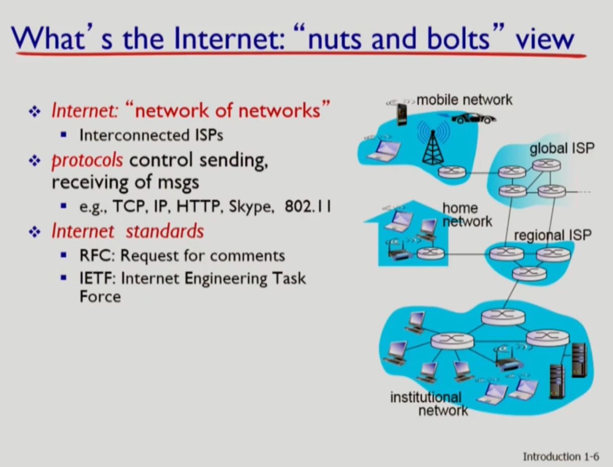

# 컴퓨터 네트워크

>### 교과목 목표
>
>* 컴퓨터 네트워크의 계층적인 프로토콜 구조 이해
>* 인터넷에서 사용되는 응용 프로그램, 프로토콜 / 트랜스포트 프로토콜, 라우팅 알고리즘 집중 학습
>* 네트워크 자원 활용율을 높이고 사용자에 대한 서비스를 향상시킬 수 있는 네트워크 프로토콜 설계 및 분석 능력 배양
>* 약어가 매우 많지만 상식적으로 사용하는 약어는 정리한다(HFC 등)
>
>​          
>
>### 교재
>
>Kurose - Computer Networking
>
>* Top-Down 방식으로 사용자와 밀접한 윗단부터 개념을 설명
>
>​       
>
>### 설계
>
>* 코드는 아니지만 구체적인 정의를 통한 설계 
>
>  ​             

​             

## 0. 소개(Introduction)

### 인터넷과 프로토콜(protocol)의 개념

*  인터넷

  

  >수 많은 컴퓨터 장치의 연결: 
  >
  >* 이러한 장치들을 hosts = end systems 라고 부른다
  >
  >* 그러한 연결을 links라고 한다
  >* router / switch로 연결
  >
  >​        
  >
  >**연상해서 기억한다**
  >
  >* **network edge**(가장자리)에는 hosts(end systems)
  >
  >  * 이들은 access network를 통해 연결한다(유선, 무선)
  >
  >    * 중요한 키워드: **band width**(transmit rate) = 단위 시간당 전송할 수 있는 비트 수(bits for second)
  >
  >    * shared / dedicated 분류
  >
  >      **- 가정용 네트워크**
  >
  >      * DSL(가정용) = 전화(telephone line) / 인터넷(phone line) 을 모두 처리 = **dedicated**
  >      * Cable 통신(HFC) = Broadcasting 위주로 하나의 대역폭이 큰 회선 사용 = **shared**
  >        * 이 둘의 공통점: **asymmetric**
  >      * **Home network**: 집 안 각 장치들을 라우터로 연결 - DSL 모뎀으로 전송-전화회사/케이블회사-ISP 연결
  >
  >      **- 기업용 네트워크**
  >
  >      * 이더넷(Etherenet): switch로 연결하고 하나의 **대표 라우터**로 몰아보냄(**dedicated**) 그 후 **ISP**로 송신
  >        * 가정용은 모뎀을 거쳐서 DSL 분류까지 해야하지만 **이더넷은 라우터에서 직통으로 연결**
  >
  >* 중앙에는 그들을 연결하는 router / switches
  >
  >* 서로 protocol 형식으로 메시지를 주고 받는다

>프로토콜: 통신을 위한 규약, 네트워크로 연결된 장치들 사이에서 메세지를 보내는 방식
>
>* Ex) TCP, IP, HTTP, Skype 등
>* 정의하는 내용
>  * 보내고 받는 메시지의 **format(형식), order(순서), action(어떠한 행동을 할지)을 규정**
>
>인터넷 표준
>
>* RFC: Requests for comments (최초의 표준안: 대학생들이 시작)
>* IETF: Internet Engineering Task Force

​            

## 1. Roadmap

> network의 edge와 core를 살펴본다

* Access network: network edge 들의 인터넷 접속 방법

  > KT, SKT 등 통신사들이 Access network를 제공한다. splitter에서 전화선과 DSL모뎀으로 나뉜다.

  * DSL(digital subscriber line)

    > 전화회사에서 제공하는 것은 개인용 네트워크 = dedicated 

    

    * DSLAM: 각 집에서 오는 DSL신호를 분류: 전화신호와 인터넷 신호

  * cable: Cable 모뎀 사용

    

    * DSL과 비슷하게 splitter에서 각 신호로 나뉨
      * DSL과 달리 CMTS(cable modem termination system, cable headend)에서 일괄 처리
      * 아파트 동이 모두 Cable 모뎀을 사용하는 경우 대역폭이 큰 하나의 회선으로 연결 가능하다.
        * Cable 통신의 대부분은 Broadcasting이기 때문 = **shared**
        * HFC(hybrid fiber coax: 아파트 동의 회선은 coax, 다시 그것들을 묶은 회선을 fiber로 만들기에 생긴 별칭

  * DSL과 HFC의 공통점

    * **asymmetric**
      * Downstream transmission 과 upstreamtransmission의 차이가 존재: 소비자가 많기 때문에 down이 더 큼
        * HFC는 shared이므로 시시각각 달라질 수 있음에 주의한다.

  * home network

    * 집 안에 home network가 존재
      * home network - DSL 모뎀 - 회사 network - internet 로 연결되는 시작점
      * Home network 중심에는 라우터가 존재 = 묶어주는 역할
        * WIFI / 컴퓨터 등 연결

  * Ethernet

    * 학교나 기관들은 이더넷 switch를 두어서 특정 공간의 end systems들을 연결함
      * 다시 그 switch들을 하나의 라우터로 보내고 그 라우터는 ISP 업체에 보낸다.

  * Wireless

    > WIFI가 없으면 cellular network를 사용한다.
    >
    > * WIFI: 대역폭 높음, 주로 어느 공간 한정(wireless **LANS**)
    > * cellular network: 많은 지역에서 사용 가능(**wide-area** wireless access)
    >
    > 둘의 공통점: **wireless, shared**

    

​       

* 키워드 정리

>Head End(HE): 여러 전송에서 최초로 모아지는 끝단
>
>BandWidth: 전송폭

### 지난 시간 요약

> 요약 그림 불러오기

>Hosts(End Systems)
>
>Router / Switch
>
>Links
>
>* Home Network: Access Network
>  * 내부: Access Point / D? - Router - Modem
>    * 종류: DSL / HFC(Cable)
>* 기업/학교
>  * Ethernet Switch: Desktop이나 Access Point(노트북, 핸드폰) - Router - ISP

​        

## Host

> Sends packets of data

* 시간 계산: 비트의 길이 L / R(비트당 전송 시간)

* Guided Media: 물리적인 wire 사용

  * copper: Ethernet
  * coax, fiber: HFC(Cable: Hybrid fiber coax)
    * Coax < Fiber의 bandWidth 크기를 가진다
  * fiber optic cable
    * glass fiber: light pulses를 전달
    * error 율도 낮고 속도도 빠름

  

* Unguided Media: 물리적인 wire 사용X

  * Ex) Radio

    * 단점

      >1. reflection
      >2. obstruction by objects
      >
      >3. interference

  * Radio link types

    * terrestrial microwave
    * LAN (ex. WIFI)
    * Wide-area
    * Satellite: coverage가 더 넓음
      * Geostationary 면적 > LEO(low-earth-orbiting) 면적

* TP(Twisted pair) = copper

  * 2 insulated Copper wires = 이더넷을 지원하는데 사용 (Category가 높으면 전송량이 많다)

​              

​              