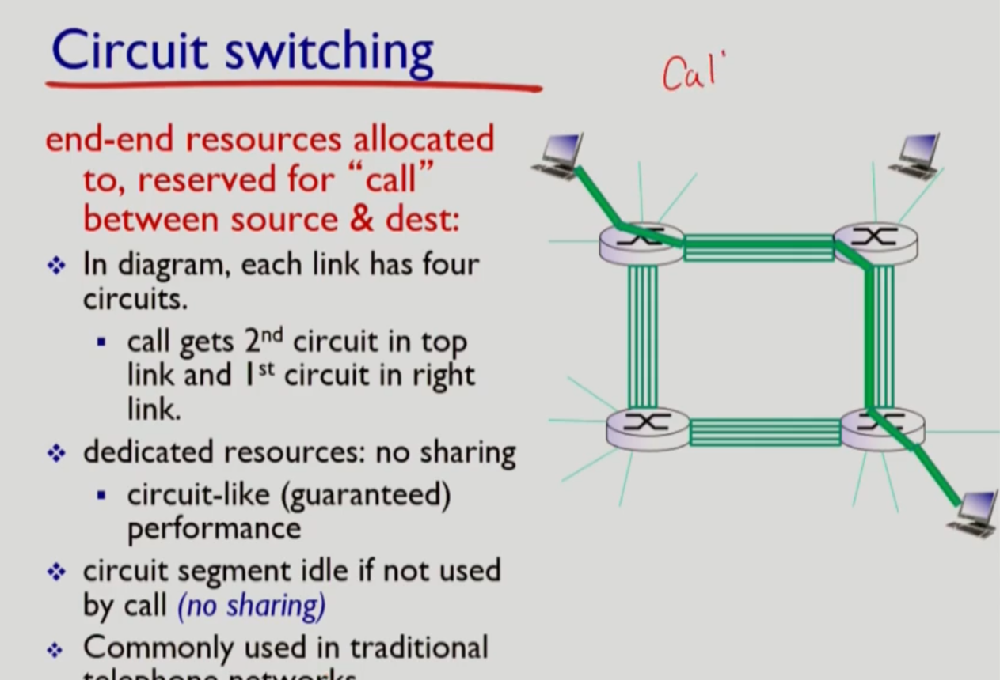
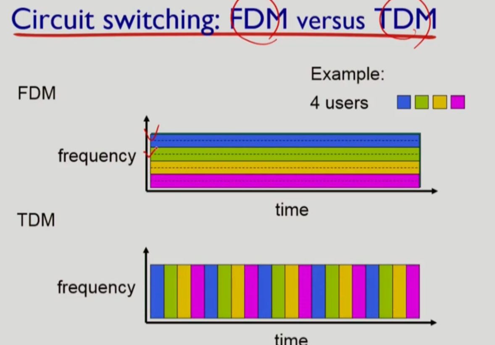
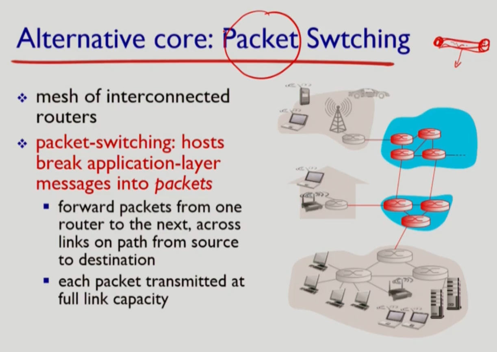
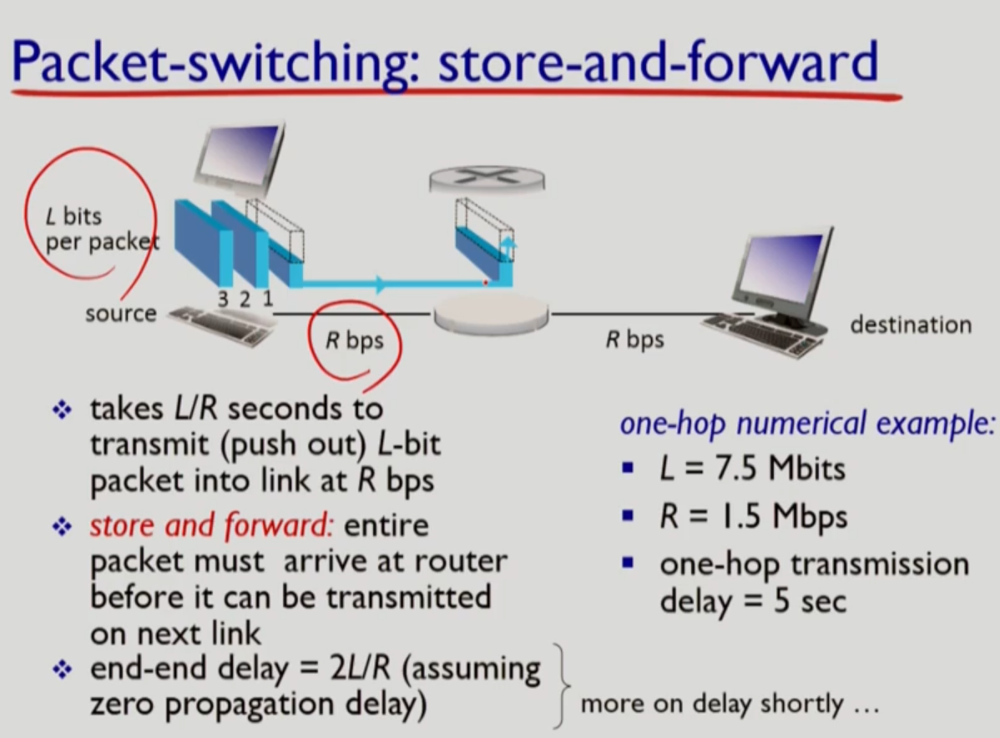
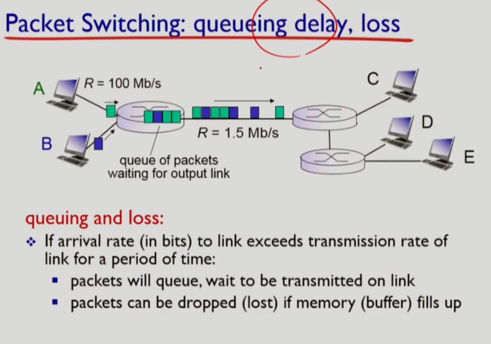
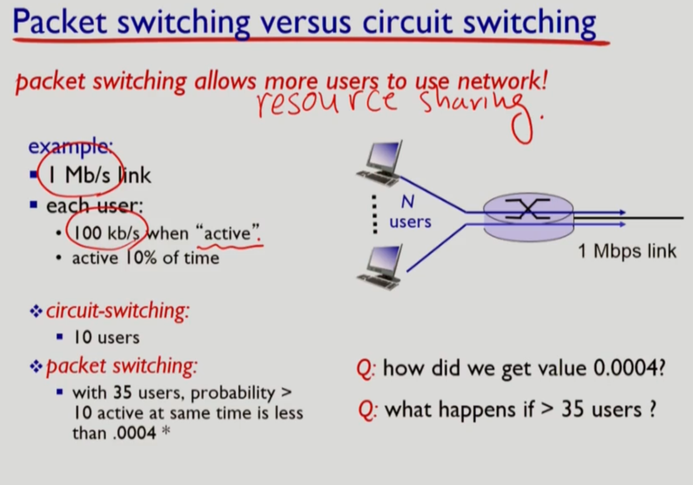
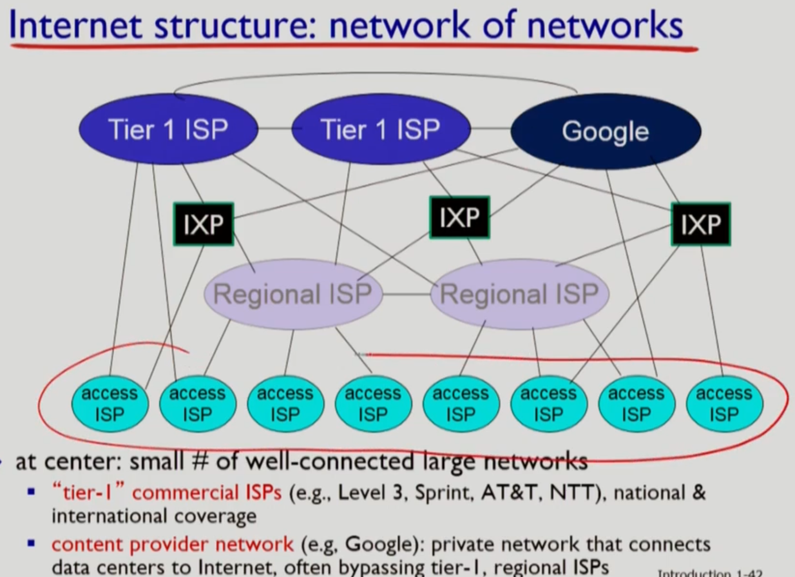
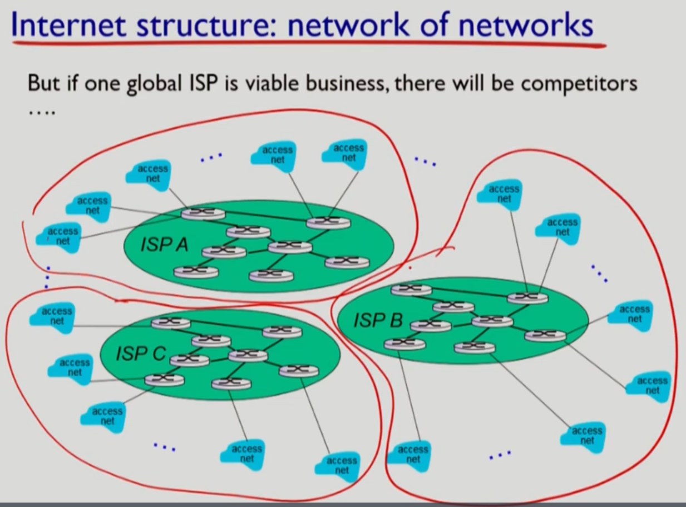
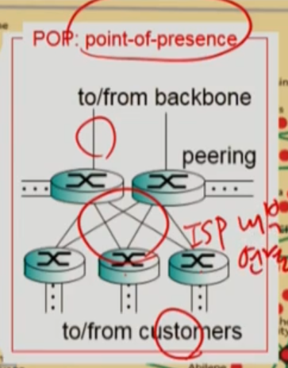
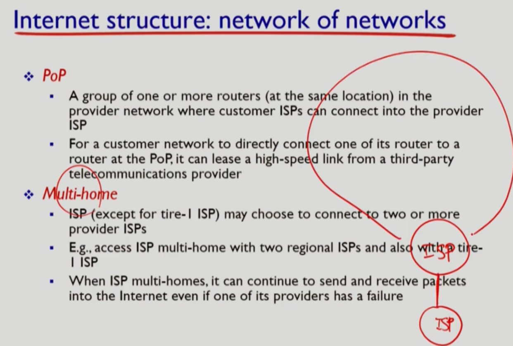

## RoadMap2         

> 키워드: Circuit-Switching, Packet-Switching, Call, Resource Reservation, Store and forward, queueing delay 
>
> ISP, IXP(EXCHANGE) , Peering(Settlement free, cost 하락 목적), Multi-home, CPN(Content Provider Network)

# Network Core

> 전달 방식에는 크게 두가지가 있다. Packet switching, circuit switching

### Circuit Switching

> 주로 전화 네트워크에서 사용했다.
>
> 하지만 인터넷 신호는 요청이 있을 때 데이터를 많이 전송하는 방식이기 때문에 Circuit Switching이 적절하지 않다.

* 반드시 Call이 존재하고 Resource Reservation이 생김
  * 자원을 분할해놓고 사용되지 않은 자원 중 하나를 배분

* 분할종류에 따라: FDM / TDM(Time division)

  * FDM: Frequency 분할 (동시간)
  * TDM: Time 분할

  

​         

### Packet Switching

> 주요개념 3가지: no call set up, no resource reservation, store-and-forward
>
> 각 데이터가 full link를 차지해 전송한다. 만약 그 link를 동시에 요청한 경우 먼저 온 데이터를 전송하는 방식으로 순서대로 보낸다.
>
> ​       
>
> **메시지가 매우 길다면?**
>
> 다른 사용자가 기다려야만하고 비효율성이 높아진다.
>
> 메시지를 **packets 단위로 잘라서** 보낸다.
>
> **각 패킷에 목적지를 명시**한다. 
>
> **라우터에서 모든 패킷이 도착한 다음** 다음 링크로 전송한다.
>
> 근데 이미 링크가 사용중이라면 **대기**해야한다(queueing delay).

* Queueing delay, loss
  * store and forward로 인해 패킷이 쌓임 & 자원을 reserve하지 않기 때문(애초에 예측 불가)
    * 버퍼가 꽉차는 경우: **packet loss** 발생 가능 = **Congestion** 이라고 한다.

#### 둘의 차이점 비교

* 최대 사용자의 수 차이: Circuit < Packet
* Packet switching의 문제점: Congestion으로 packet loss 발생가능

​                

​                

## Network Structure

> Network of networks
>
> 어떤 방식으로 evolve 되어왔는지 확인해보자

* **IXP**: global ISP 또한 서로 연결해서 hosts끼리 연결되도록 한다.

  * 건물하나를 사서 Switch만 넣어놓는다.
  * 그러나 모든 곳을 진출할 수는 없다.

* Regional ISP(net)

  * **Point-of-presence**: ISP가 운영하는 라우터가 밀집된 지역

    * Peering: 같은 레벨의 다른 ISP와 연결
      * Settlement free: 둘을 연결해놓으면 최소경로로 연결할 수 있게되고 비용이 적어짐

    

* PISP - CISP: 티어가 높은(전세계 연결 가능) ISP는 Provider, 그 자원을 소모하는 ISP는 Consumer이다.

* Multi-home
  * 어떤 ISP에 문제가 발생해도 대처할 수 있다.
* **Content Provider network**(CPN): 구글, 마이크로소프트
  * 컨텐츠를 제공하며 그 양이 방대하기 때문에 전송량이 많아 ISP에 많은 돈을 지불해야함
    * 자기들의 Own Network 설치함으로 비용절감
    * 이를 통해 부분적으로 ISP와 연결함
    * 자신들만의 서비스를 더 손쉽게 제어가능 