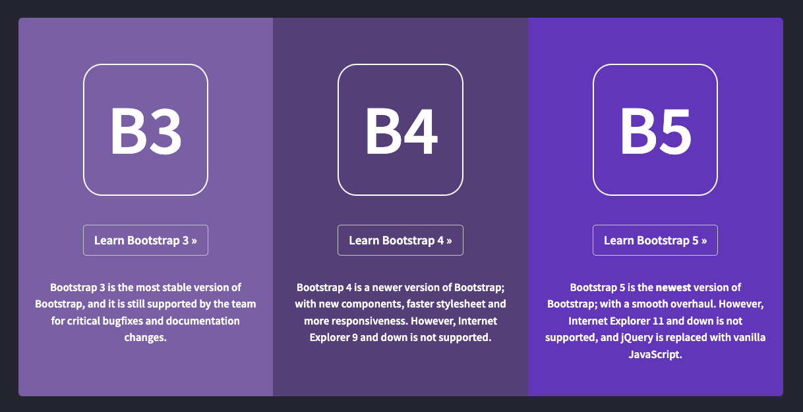
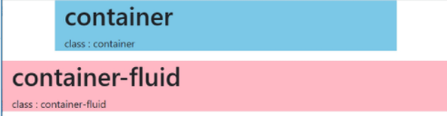
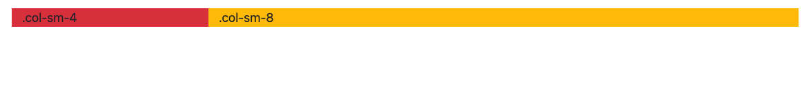

## Bootstrap

> 사용하기 쉬운 무료 프론트 엔드 프레임 워크이다.
>
> B3, B4는 jQuery 기반, B5는 자바스크립트 기반이다. 이는 jQuery의 사용이 점차 줄어들고 있음을 시사한다.



* 여기서는 제이쿼리 사용을 위해 B4를 다루며 B5와 큰 차이가 없다.

​       

### 사용법

> 부트스트랩 4는 모바일 장치에 반응하도록 설계

* CDN을 이용: `<head>`에 추가

  ```html
  <!-- Latest compiled and minified CSS -->
  <link rel="stylesheet" href="https://cdn.jsdelivr.net/npm/bootstrap@4.6.1/dist/css/bootstrap.min.css">
  
  <!-- jQuery library -->
  <script src="https://cdn.jsdelivr.net/npm/jquery@3.5.1/dist/jquery.slim.min.js"></script>
  
  <!-- Popper JS -->
  <script src="https://cdn.jsdelivr.net/npm/popper.js@1.16.1/dist/umd/popper.min.js"></script>
  
  <!-- Latest compiled JavaScript -->
  <script src="https://cdn.jsdelivr.net/npm/bootstrap@4.6.1/dist/js/bootstrap.bundle.min.js"></script>
  ```

* Download

​          

### Container



* `.container` 클래스는 반응 형 고정 너비 컨테이너를 제공
* `.container-fluid` 클래스는 뷰포트 전체 너비에 걸쳐 있는 전체 너비 컨테이너를 제공

```html
    <div class="container-fluid bg-secondary">
        <h1>My First Bootstrap Page</h1>
        <p>This is some text.</p>
    </div>
    
    <div class="container">
      <h1>My First Bootstrap Page</h1>
      <p>This is some text.</p>
    </div>
```

​         

### ROW

> Container 내부에 태그들을 넣으면 자동으로 같은 줄에 올라오는 것이 아니다.
>
> row 클래스를 가지는 `div` 태그 안에 넣어주어야 같은 줄에 뜬다.

```html
<div class="row">
  <div class="container">
    <div style="height: 130px;"></div>
    <div class="row">
      <div class="col-sm-3 bg-danger">.col-sm-4</div>
      <div class="col-sm-9 bg-warning">.col-sm-8</div>
    </div>
  </div>
</div>
```

​                 

### Grid System

* 최대 12 개의 열을 허용한다
* 클래스의 결합: 열을 그룹화해서 더 넓은 열로 만들 수 있다.

| class       | device      | 설명(screen width 대비) |
| ----------- | ----------- | ----------------------- |
| .col-num    | Extra small | < 576px                 |
| .col-sm-num | Small       | >= 576px                |
| .col-md-num | meduim      | >= 768px                |
| .col-lg-num | large       | >= 992px                |
| .col-xl-num | Extra large | >= 1200px               |



```html
    <div class="container">
        <div style="height: 130px;"></div>
        <div class="row">
            <div class="col-sm-3 bg-danger">.col-sm-4</div>
            <div class="col-sm-9 bg-warning">.col-sm-8</div>
        </div>
      </div>
```

* 왼쪽 부분 작성
  * `img`태그의 클래스로 `thumbnail` 를 사용할 수 있다.
  * **thumbnail** : 원래 이미지를 그냥 넣으면 겹치거나 크기 조절이 안되는데 그리드로 구성하기 위해 **`row`클래스 아래 `col`로 만들고 속성을 `thumbnail img`로 주면 자동크기 조절을 한 후 배치해준다**.

```html
<div class="col-sm-3">
                <div>
                    
                </div>

                <div class="mt-2">
                    <button type="button" class="btn-outline-primary p-3">투표 만들기</button>
                </div>

                <div class="border border-dark mt-2">
                    <div class="text-center">진행중인 투표가 없습니다</div>
                </div>
</div>
```

* 오른쪽 부분 작성
  * `jumbotron` 클래스를 이용해 내용을 강조할 수 있다.

```html
<div class="col-sm-9 bg-warning">
  <div class="jumbotron">
    <h1>광고주 모심!!</h1>
    <p>확실하게 광고해드림</p>
  </div>

                <div class="font-weight-bold">프로그래밍 언어</div>
                
                <div class="row" mt-2>
                    <div class="col-sm-3">
                        
                    </div>
                    <div class="col-sm-3">
                        
                    </div>
                    <div class="col-sm-3">
                        
                    </div>
                </div>

                <div class="row">
                    <div class="col-sm-6">

                    </div>
                </div>

</div>
```


​          

### Navigation Bars

* 상단 고정 옵션: `fixed-top`
  * 컨텐츠가 `absolute`의 개념이기 때문에 뒤에 요소가 들어가 안보일 수 있다.
    * 이를 방지하기 위해 빈 `<div>`공간을 높이만큼 부여하고 그 다음부터 내용을 작성한다. 
* 그림자 부여: `shadow`

​        

### 클래스로 CSS 속성 부여

> https://www.w3schools.com/bootstrap4/bootstrap_ref_all_classes.asp 를 참고한다.

* `mt`: 마진값을 클래스로 부여할 수 있다.
* `p`: 패딩값을 클래스로 부여할 수 있다.

```html
 <div class="mt-2 p-2">
 </div>
```

* 이외에도 justify-content 등 속성을 사용할 수 있다.

​             

### 모달창 만들기

* 버튼의 형식이 중요하다

```html
<!-- Button to Open the Modal -->
<button type="button" class="btn btn-primary" data-toggle="modal" data-target="#myModal">
  Open modal
</button>
```

* 그리고 이 다음 코드를 복사해서 <body>의 후미에 복사해 넣는다

```html
<!-- The Modal -->
<div class="modal" id="myModal">
  <div class="modal-dialog">
    <div class="modal-content">

      <!-- Modal Header -->
      <div class="modal-header">
        <h4 class="modal-title">Modal Heading</h4>
        <button type="button" class="close" data-dismiss="modal">&times;</button>
      </div>

      <!-- Modal body -->
      <div class="modal-body">
        Modal body..
      </div>

      <!-- Modal footer -->
      <div class="modal-footer">
        <button type="button" class="btn btn-danger" data-dismiss="modal">Close</button>
      </div>

    </div>
  </div>
</div>
```

​       