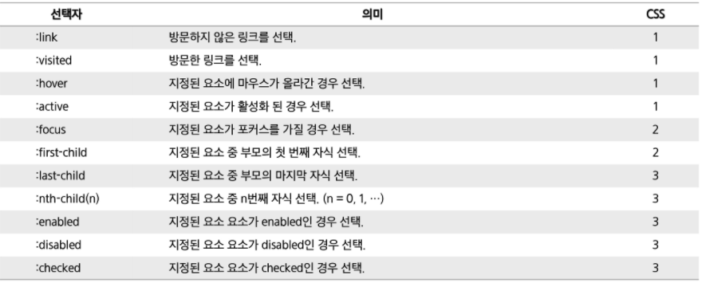
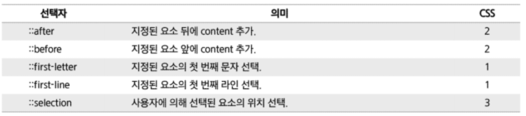

# CSS

> Cascading Style Sheets의 약자

* 선택자(selector)와 선언(declaration) 두 부분

  * 선언은 속성(property)와 값(value)로 이루어짐

  ```css
  .css { /* 선택자(Selector) */
  	margin: 30px; /* 선언 = 속성 : 값 */
    color: #000;
  }
  ```

* **link** : 외부 스타일 시트 적용 = head 안에 작성

  ```html
  <link rel="stylesheet" href="./style.css">
  ```

* style 태그 내부에 import

  * 장점: 내부 스타일 시트 적용 혼용 가능 : 필요한 CSS 수정 부분을 바로바로 HTML에서 추가할 수 있다.

  ```html
  <style>
    @import url(./style.css);
    h2 {background-color: orange;}
  </style>
  ```

* 인라인 스타일 적용

  * 직접 적용하는 방식

​        

### 스타일 우선 순위

* 인라인 스타일 > 내부 스타일 시트 > 외부 스타일
* !important > id 선택자 > class 선택자 > 타입 선택자 > 전체 선택자

​       

### 선택자

1. 여러 개 요소 선택 (, 사용)

```css
h1, h2, h3{ }
```

2. 하위 요소 선택

```CSS
E1 E2{} /*E1에 포함된 E2*/
```

3. 직속 하위 요소

```CSS
E1>E2{}
```

4. 인접 형제

```CSS
E1+E2{}
```

5. 일반 형제

```CSS
E1~E2{}
```

​        

### 가상 클래스 선택자 요소 ( : )

> 가상 클래스 선택자(Pseudo-Classes Selector) 는 User Agent가 제공하는 가상의 클래스 지정



​        

### 가상 엘리먼트 선택자 요소 ( :: )

