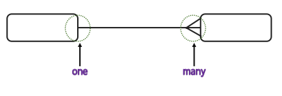
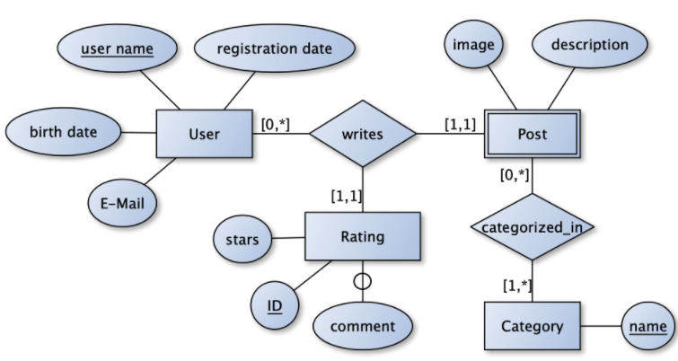

# 데이터베이스 모델링

* 정보화 시스템을 구축하기 위해 어떤 데이터가 존재 하는지 또는 업무에 필요한 정보는 무엇인지 분석하는 방법
* 관계형 데이터베이스는 이 표의 개념을 사용해 데이터를 구성하는 방법을 사용

>### 순환 구조
>
>업무 프로세스 → 개념적 구조 → 데이터 모델 → 물리적 데이터베이스
>
>1. 개념적 모델링: 업무 프로세스 → 개념적 구조
>   * 실제 업무에서 필요한 데이터베이스를 논리적 구조로 짠다
>2. 논리적 모델링: 개념적 구조 → 데이터 모델
>   * 위에 설계한 내용을 데이터 베이스 모델로 구현해본다
>3. 물리적 모델링: 데이터 모델 → 물리적 데이터베이스
>   * 논리적으로 설계한 데이터베이스를 물리적으로 구현한다.
>4. 일치성 검토: 물리적 데이터베이스 → 업무 프로세스
>   * 만들어낸 데이터베이스를 실제 업무에 다시 대입하고 피드백
>
>​             

## 1. 개념적 데이터베이스 모델링 [ER-Diagram]

* 업무 분석 단계에서 얻어진 내용을 토대로 **Entity** 추출하고 Entity 내 **속성(Attribute)**을 구성하며 Entity간의 관계를 정의해서 ER-Diagram을 정의하는 단계
* 결국 **업무에 필요한 정보들을 목록화**하는 작업

​          

### Entity & Attribute

> Entity(개체): 사용자와 관계가 있는 주요 객체, 데이터로 관리되어야할 정보들
>
> Attribute(속성): 저장할 필요가 있는 실체에 관한 정보(성질, 분류, 수량, 상태)

* Entity 찾는법 (ex. 학생 등)

  * 영속적으로 존재하는 것
  * 새로 식별이 가능한 데이터 요소를 가짐
  * Entity는 반드시 속성(칼럼명이 될 값)을 가진다
  * 명사적 표현

* Relationship(관계)

  * 두 Entity간 업무적 연관성 또는 관련 사실
  * 각 Entity 간 특정한 존재여부 결정
  * 현재의 관계 뿐만 아니라 장래에 사용될 경우도 고려

* Attirbute (ex. 학번 등)

  * 숫자 데이터는 10개 내외로 하는 것이 바람직
  * 최종으로 테이블 컬럼으로 사용

* 속성의 유형

  * 기초속성: 원래 갖고 있는 속성으로 현업에서 기본적으로 사용
  * 추출속성: 기초 속성으로부터 계산에 의해 얻어질 수 있는 특성
  * 설계속성: 실제로 존재하지 않으나 시스템의 효율성을 도모하기 위해 의도적으로 부여하는 속성

* 식별자: Entity 내에서 **인스턴스를 유일하게 구분할 수 있는 단일 속성 또는 속성 그룹**

  > 프로그램 단계에서 남는 것: 기본키, 복합키

  * 후보키(Candidate Key): 기본키가 될 수 있는 후보 속성
  * 기본키(Primary Key): Entity에서 인스턴스를 유일하게 식별하는데 적합한 Key (ER-D에서 _로 표기)
  * 대체키(Alternative Key): 후보키 중 기본키로 선정되지 않은 속성
  * 복합키(Composite Key): 하나의 속성으로 기본키가 될 수 없는 경우 둘 이상의 칼럼을 묶어서 식별자로 정의하는 경우
  * 대리키(Surrogate Key): 식별자가 너무 길거나 여러 개의 속성으로 구성되어있는 경우 인위적으로 추가할 식별자

  ​        

### E-R(Entity Relationship) Diagram 기호

* 네모: 개체
* 동그라미: 속성
* 마름모: 관계 = 나중에 개체가 되거나 속성이 되거나 사라질 수도 있음
  * 관계차수 표현(cardinality, 차수성): 하나의 인스턴스가 다른 Entity의 몇 개의 인스턴스와 관련될 수 있는가 조사
  * 
    * 1:1 관계
      * 학과(Entity) - 학과장(Relationship) - 교수(Entity)
      * 보통 한쪽의 테이블로 합쳐짐
    * 1:N 관계
    * N:N 관계
      * 중간에 있는 관계가 테이블로 빠져버림
* _: Primary Key
* 선택성: 선택적/의무적

​    

​                  

## 2. 논리적 모델링 [Mapping Rule, 정규화]

> 개념적 모델링 단계에서 정의된 ER-Diagram을 Mapping Rule을 적용해 관계형 데이터베이스 이론에 입각한 스키마를 설계하는 단계와 필요하다면 정규화하는 단계로 구성

​        

### 기본키(Primary Key)와 참조키(Foreign Key)

* 기본키
  * 후보키 중에서 선택한 주 키
  * 널(Null)값을 가질 수 없다(Not Null)
  * 동일한 값이 중복해서 저장될 수 없다(Unique)
* 참조키, 아웃키
  * 관계를 맺는 두 엔티티에서 서로 참조하는 테이블(Relation)의 속성(Attribute)으로 지정되는 키

​          

### Mapping Rule

* 개념적 데이터베이스 모델링에서 도출된 개체 타입과 관계 타입의 테이블 정의
  * Mapping Rule을 적용해 관계 스키마로 변환(Entity >> 테이블)
* 단계
  * 1 단계: 엔티티 → 테이블
  * 2 단계: 속성 → 컬럼
  * 3단계: 식별자 → 기본키

​              

## 정규화

* Attribute 간 존재하는 함수적 종속성을 분석해 관계형 스키마를 더 좋은 구조로 정제해 나가는 과정
* 데이터 중복을 제거하고 속성을 본래 제자리에 위치시키는 것
  * 제 1 정규화
    * 반복되는 그룹 속성 제거
    * 기본 테이블의 기본키를 추가해 새로운 테이블을 형성하고 기존 테이블과 1:N 관계 형성
      * 둘을 나중에 JOIN하기 위해 연결점(외래키)를 만들어두어야함 
  * 제 2 정규화
    * 복합키에 전체적으로 의존하지 않는 속성 제거
    * 제 2정규화의 대상이 되는 테이블은 키가 여러 칼럼으로 구성된 경우
    * 복합키의 일부분에 의해 종속되는 것을 부분적 함수 종속관계라고 하며 이를 제거하는 작업
  * 제 3 정규화
    * 기본키에 의존하지 않고 일반 컬럼에 의존하는 컬럼들을 제거
    * 이행적 함수 종속관계를 갖는 컬럼을 제거하는 과정

​              

​                     

## 물리적 모델링

* 논리적 데이터베이스 모델링 단계에서 얻어진 데이터베이스 스키마를 좀 더 효율적으로 구현하기 위한 작업
* DBMS 특성에 맞게 실제 데이터베이스내 개체들을 정의하는 단계
* 데이터 사용량 분석과 업무 프로세스 분석을 통해서 보다 효율적인 데이터베이스가 될 수 있도록 효과적인 인덱스를 정의
* 상황에 따라 역정규화 작업을 수행

​        

### 역정규화(Denomalization)

* 시스템 성능을 고려해 기존 설계를 재구성하는 것
* 정규화에 위배되는 행위
* 테이블의 재구성

​         

#### 방법

* 데이터 중복(컬럼 역정규화)
  * 조인 프로세스가 많아 시스템 성능저하를 가져오는 경우
  * 조인 프로세스를 줄이기 위해 해당 컬럼을 중복함으로써 성능을 향상시키는 방법
* 파생 컬럼의 생성
  * 기본적으로 테이블에 없는 컬럼을 숫자 연산이나 데이터 조작 등을 통해 조회할 때 새로운 정보를 보여주는 경우
  * 판매테이블의 판매금액 컬럼이나 성적 테이블의 총점과 평균
* 테이블 분리
  * 컬럼 기준으로 분리(컬럼수)
  * 레코드 기준으로 분리(레코드 양)
* 요약 테이블 생성(Summary Table)
  * 조회의 프로세스를 줄이기 위해 요약된 정보만을 저장하는 테이블 생성
* 테이블 통합
  * 분리된 두 테이블이 시스템 성능에 영향을 끼칠 경우 고려