# 01 서버를 관리한다는 것

> **서버의 상태를 관리하기 위한 발전**
> 자체 서버 운영 → 설정 관리 도구 등장 → 가상머신 등장 → 클라우드 등장 → PaaS 등장 → 도커 등장 → 쿠버네티스 등장 → 서비스메시 등장

​                    

## 자체서버

* Node.js

  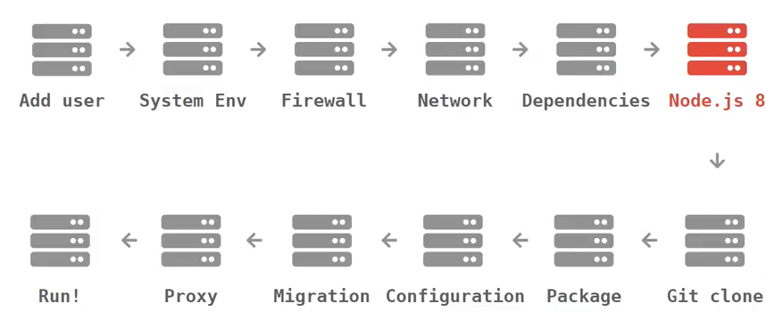

  * 만약 Node 버전을 바꾼다면 위 포인트 이후 모두를 신경써주어야 한다.

​                  

## 시도

> 1. PPT등으로 공유 업데이트한 경우 공유가 안되고 신뢰성이 떨어짐
> 2. 상태관리툴을 사용: CHEF, puppet, ANSIBLE → 코드로 서로 공유, 하지만 어려움
> 3. Jenkins, Wordpress, Chat 등 가상머신 사용 → 느리다, 설정 변경이 어렵다
> 4. 클라우드: AWS, Google Cloud, Azure
> 5. PaaS: Heroku, Netlify, AWS Elastic Beanstalk 등

#### - PaaS

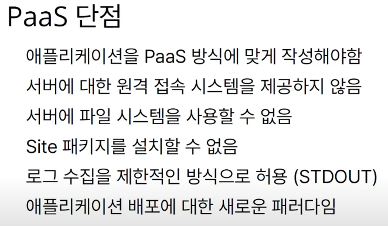

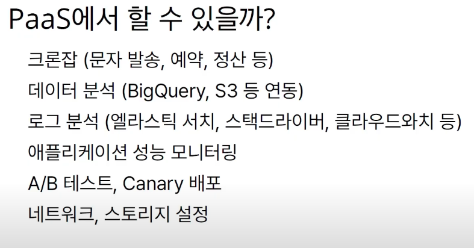

​                       

## 도커의 등장

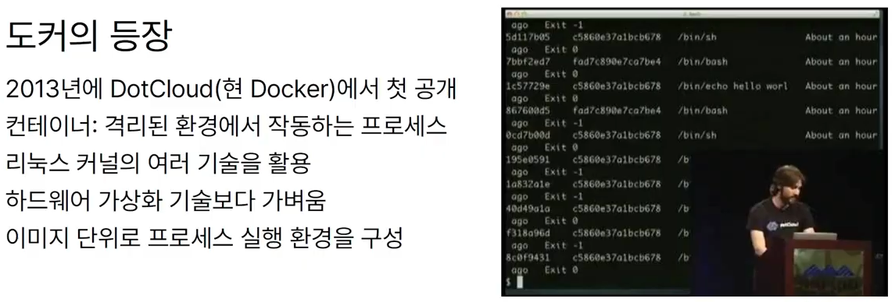

* 가상머신 같은 것인가? = 반은 맞고 반은 틀리다
  * 가상머신처럼 독립적으로 실행되지만
  * 가상머신보다 빠르고
  * 가상머신보다 쉽고
  * 가상머신보다 효율적

​                

### - 자원격리

> 리눅스 기능을 이용한 빠르고 효율적인 서버 관리

* 프로세스를 가상으로 분리
* 파일, 디렉토리를 가상으로 분리
* CPU, Memory, I/O 그룹별로 제한

​              

## VM vs Docker

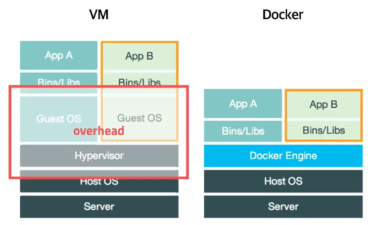

​                     

## 도커가 가져온 변화

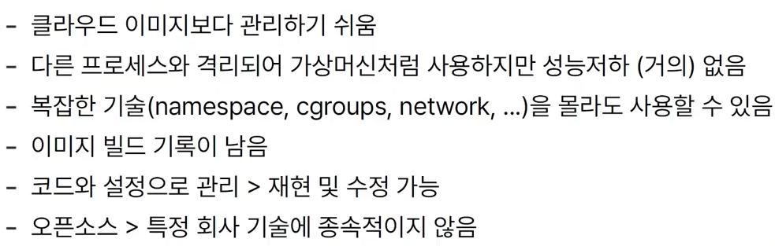

​                   

## 도커의 사용

* 한 두개의 컨테이너를 관리하는 것 쉽지만 컨테이너가 많아지면 얘기가 다르다.

  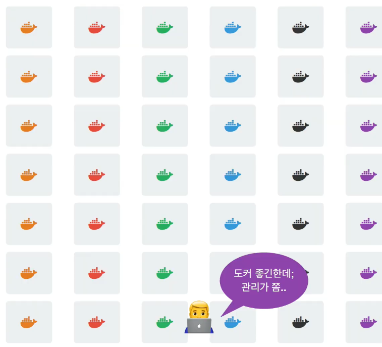

​                    

### - 쿠버네티스의 등장

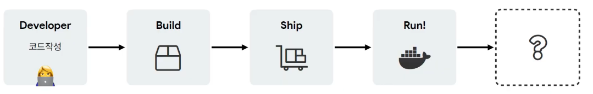

​                      

* 여유있는 서버 찾아주기

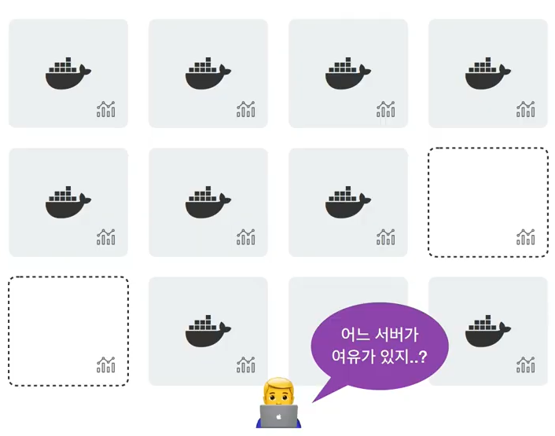

* 버전 배포

  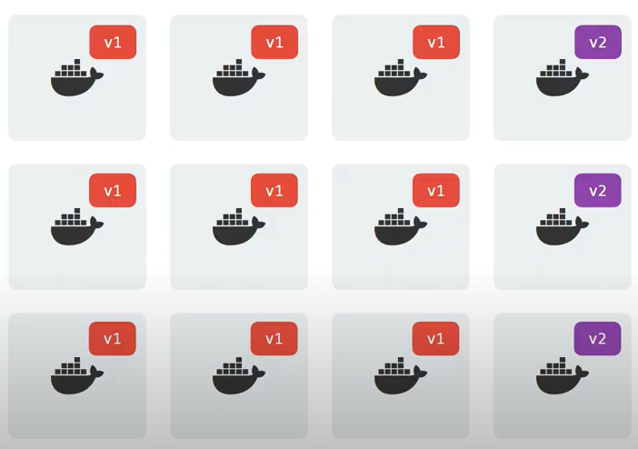

* ip를 추가하고 삭제해주는 작업

  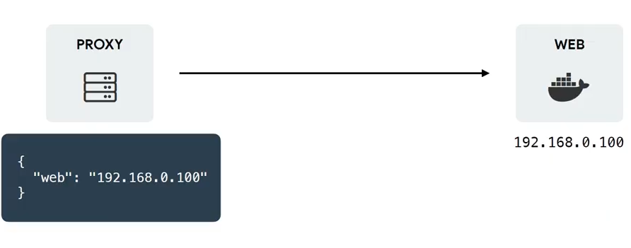

* 같은 서버에서 분기

  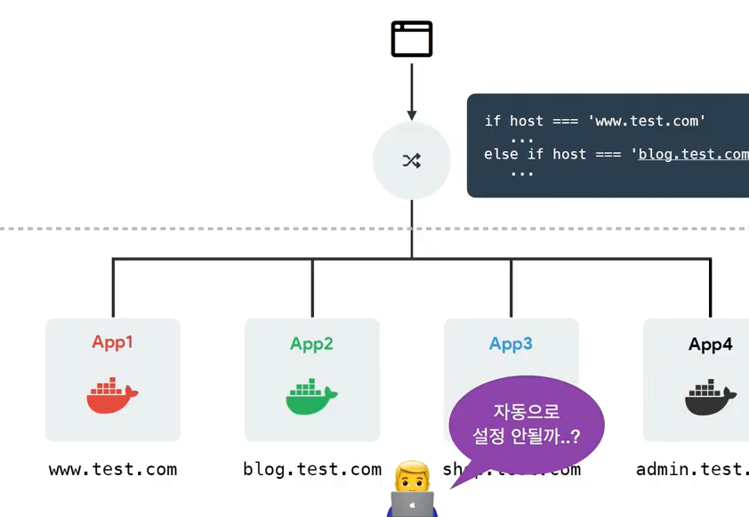

* 서버에 문제가 발생한 경우

  * 24시간 대응 가능한 자동화 기술

  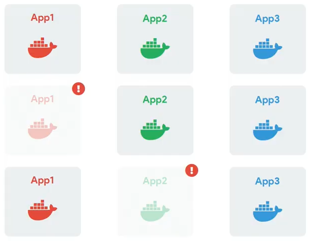

  ​                   

  ## Container Orchestration

  > 복잡한 컨테이너 환경을 효과적으로 관리하기 위한 도구

  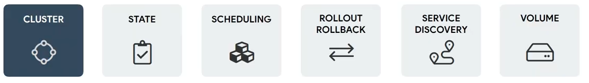

  ​                

  ### 1) 중앙제어(master-node)

  * 스케일(scale)이 늘어나도 잘 작동해야한다.

  ​               

  ### 2) 상태관리

  * App1을 복제해서 띄워주라고 명령

  ​            

  ### 3) 스케줄링

  * 여유 있는 공간에 알아서 띄워준다.

  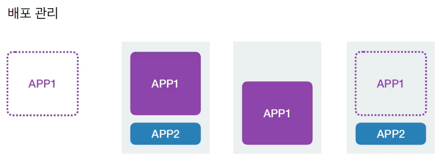

  ​               

  ### 4) ROLLOUT/ROLLBACK

  * 버전 배포 관리: RollBack을 통해 이전 버전 적용 가능

  ​              

  ### 5) SERVICE DISCOVERY

  * Watch를 통해 프로세스를 감시하고 문제 발생 시 재시작해줌

  ​               

  ### 6) VOLUME

  * mount가 은근히 복잡하다.
  * 설정만 추가하면 VOLUME 추가 등을 자동으로 해준다.

  ​                   

  ​                  

  ​                            

  ## kubernetes

  * 컨테이너를 쉽고 빠르게 배포/확장하고 관리를 자동화해주는 오픈소스 플랫폼

  ​             

  #### - 본래의 방식

  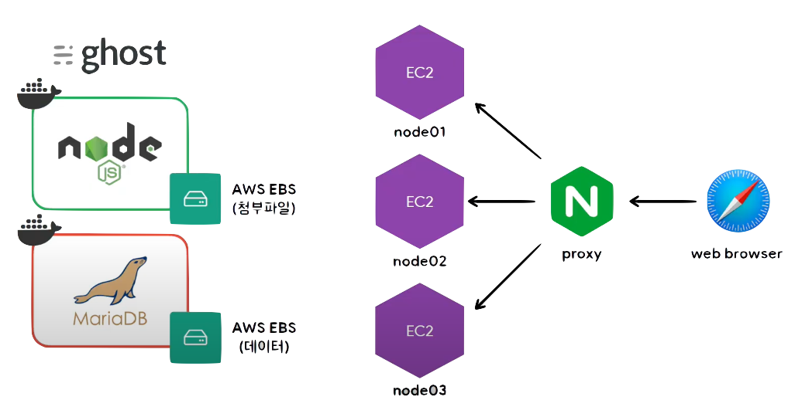

  

  