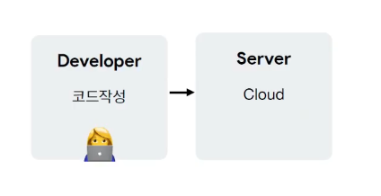
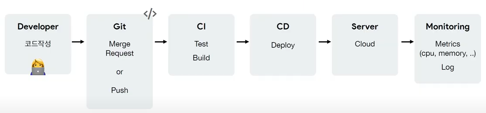

# DevOps를 해야하는 이유

>### DevOps
>
>데브옵스(DevOps)는 소프트웨어의 개발(Development)과 운영(Operations)의 합성어로서, 소프트웨어 개발자와 정보기술 전문가 간의 소통, 협업 및 통합을 강조하는 개발 환경이나 문화를 말한다.
>
>데브옵스는 소프트웨어 개발조직과 운영조직간의 상호 의존적 대응이며
>**조직이 소프트웨어 제품과 서비스를 빠른 시간에 개발 및 배포하는 것을 목적으로 한다.**
>
>* 새로운 기술을 배우는 이유는 개발과 배포를 개선하기 위함
>* 새로운 도구를 도입했는데 개발과 배포가 개선되지 않는다면 재검토
>* 도입하는게 좋을지 안좋을지 알아보자

​                        

## 개발 프로세스 v1

* 개발과 배포

​                  

## 개발 프로세스 v2

* 소스 관리

​                  

## 개발 프로세스 v3

* CI/CD
* 자동 빌드 / 자동 배포

​                 

## 개발 프로세스 v4

* 여러개의 배포 스테이징

​                   

## 개발 프로세스 v5

* 모니터링

​                    

​                   

## DevOps가 등장한다면?

> ### 도커 / 쿠버네티스를 도입하면 더 빨라진다?
>
> * DevOps = 철학 & 방법론 = 문화 = 우리팀이 자연스럽게 신경쓰는 것
> * 서비스의 빠른 개발 & 배포가 중요하고 여러가지 방법을 사용해서 개선하고 싶다.

​                  

### 자동화, 측정, 공유

* 자동화 = 빠른 분석 = 효율 증가
* 좋은 도구를 사용해 측정

>로그를 남기고 검색할 수 있다면?
>특정 시점에 부하가 늘어난 걸 확인할 수 있다면?

* 공유 = 팀원 지식 습득 = 효율 증가
* 축적 = 패시브 스킬 = 효율 증가

​                    

​                       

