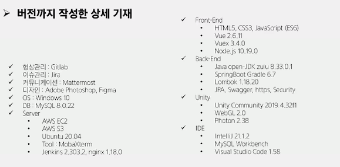
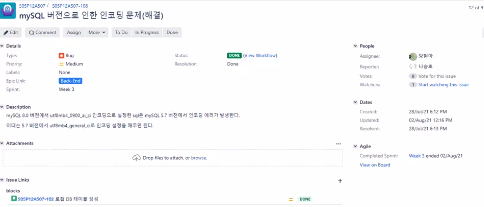
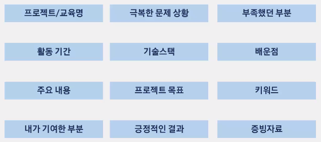

# 개발환경 뿌수기

> 개발환경에서 정답은 없다. 가이드라인으로 참고만 하자

*  기획 - 설계 - 개발 - 테스트

​              

## 1. 기획

* 브레인 스토밍

* 서비스 확정

* 개발 컨벤션

* 기능구체화

* 서비스 계획서

* 요구 분석표(문서)

* 기술 스택 선정

  * 단순 나열 X
  * 버전까지 작성한 상세 기재

  

​              

## 2. 설계

* 서비스 아이콘
  * 상업적으로 사용가능한 이미지, 폰트 등 사용
* 컬러 팔렛트
  * 프론트엔드 개발에서 중요
* 와이어프레임/스토리보드
  * 와이어프레임: 디자인하기, FE 통일
  * 위에서 설명을 붙이면 스토리보드
* 프로젝트 흐름
  * 사용자 Flow 확인
  * 화면전환 및 UX 고려
* ERD
  * ERD Cloud 추천
  * 동시편집, 메모, Export 가능
* API Docs
  * url, request, response, error code/message
  * BE/FE 담당자 표기 추천
  * 개발 완료/우선 순위 표기도 좋아요
  * Swagger 추천!
* 아키텍쳐

​               

## 3. 개발

* 프로젝트 구조도
* Front 진행 상황
* Back 진행 상황
* Database Metadata

​                

## 4. 테스트

* API 테스트

* 시나리오 테스트

* 버그 리포트

  * 오류 내용 및 재현 방법 기재(Jira 활용 추천)
  * 해결 시 해결 방법 기재

  

​                   

## 5. 오픈/운영

* 오류 수집
* 피드백 수집
* 차기 업데이트 문서

​                

## # 프로젝트 회고

