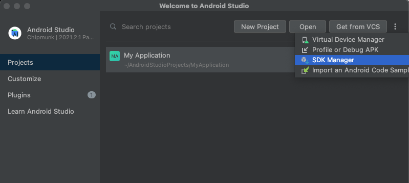

# Flutter

> * 구글의 오픈소스 모바일 앱 개발 프레임워크
> * iOS와 Android 모두를 위한 고품질 기본 인터페이스를 제작하는데 도움을 주는 크로스 플랫폼 프레임워크
> * 개발 언어로 Dart를 사용하므로 자바나 C# 같은 객체지향 개념을 이용하여 앱을 개발할 수 있음
> * Flutter는 크게 프레임워크, 엔진, 임베더 계층으로 구성됨

​                  

## Flutter 장점

* 낮은 진입장벽
  * 네이티브 개발에 비해 배워야 할 개념이 상대적으로 적어서 더 쉽게 앱을 개발할 수 있음
* 높은 네이티브 성능
  * 플러터로 작성된 코드는 네이티브 코드로 변환되기 때문에 성능이 네이티브 코드와 동일함
  * 초당 60프레임의 애니메이션을 보장
* 유연한 사용자 인터페이스
  * 다양한 위젯을 제공하므로 사용자 맞춤형 앱을 만들 수 있음
  * 강력한 애니메이션 기능 제공

​              

## Flutter 단점

* 플러그인
  * Flutter 프레임워크 개발이 활발하여 플러그인이 이를 못따라 가는 경우가 있음(잦은 업데이트)
* 아키텍처와 같은 레퍼런스가 적음
  * 개발 컨밴션적인 부분이나 규칙들이 미약
  * 개발자가 아키텍처와 규칙들을 신중하게 골라서 개발할 필요가 있음

​            

## 0. 개발환경 구성

* 안드로이드 스튜디오 설치하기

  * 개발자 사이트에서 해당 안드로이드 스튜디오 설치

    * 모두 Next 로 적용

    

    ​                   

    ```bash
    https://developer.android.com/studio?hl=ko  # 안드로이드 스튜디오 앱 설치
    https://developer.android.com/studio#downloads # 패키지 설치
    ```

    ```bash
    https://flutter-ko.dev/docs/get-started/install # 플러터 설치
    ```

    

  * 메뉴얼에 맞게 압축파일 풀어주기

    ```bash
    cd ~ # home 이동
    ```

    ```bash
    mkdir development # 폴더 생성
    ```

    ```bash
    cd ~/development # 만든 폴더로 들어가서
    ```

    ```bash
    unzip ~/Downloads/flutter_macos_2.2.1-stable.zip # 다운로드한 압축 해제
    ```

    ```bash
    export PATH="$PATH:`pwd`/flutter/bin" # pwd(현재 경로 기준)으로 flutter의 bin 등록 
    ```

    ````bash
    flutter precache # 플랫폼별 개발 바이너리 다운로드
    ````

    ```bash
    flutter doctor # 플랫폼 의존성 확인
    ```

    ````bash
    flutter doctor --android-licenses # Android sdkmanager tool not found 오류 발생
    ````

    ​           

                           

    

    * 위와 같은 설정 진행

    * 다시 의존성 확인

      ```bash
      flutter doctor # Android toolchain - develop for Android devices (Android SDK version 32.1.0-rc1)
      ```

    ​             

    * 버전 확인

      ```bash
      flutter --version              
      ```

​                

* Flutter 플러그인 설치

  

​                            

​                     

## 1. Flutter 프로젝트 생성하기

* 안드로이드 스튜디오 실행

  * 시작화면 상단 우측 New Flutter Project 선택 (플러그인 설치 필수)

    

  * 아까 설치해준 Flutter 파일을 임포트 해주어야 한다.

    

  * Run 버튼을 클릭하면 다음과 같이 기본 페이지가 시작된다.

    