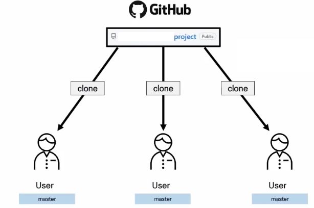
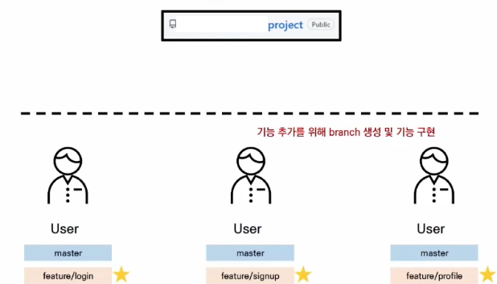
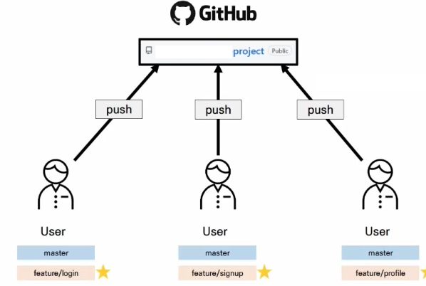
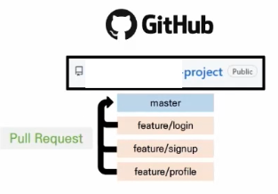
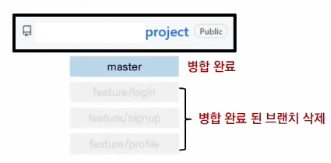
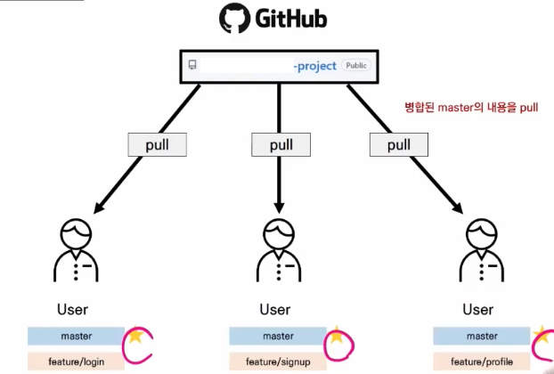
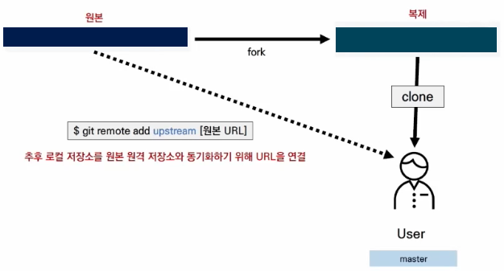

# Git-Flow

1) Feature Branch Workflow
   * Shared repository model(저장소의 소유권이 있는 경우)
2) Forking Workflow
   * Fork & Pull model(저장소의 소유권이 없는 경우)


​                

## 참고자료

* 우아한 형제들

  ```
  https://techblog.woowahan.com/2553/
  ```

* 누구나 쉽게 이해할 수 있는 Git

  ```
  https://backlog.com/git-tutorial/kr/stepup/stepup1_1.html
  ```

  

​                       

​                  

​             

## 1) Feature Branch Workflow

* 각각의 팀원들을 일단 등록한다.



* 각각의 팀원은 자신이 담당한 주제로 branch를 생성

  ```bash
  $ git switch -c feature/login
  ```

  

* 작업 완료 후 branch에 계속 업로드 해야한다.

  * 본래 master branch에 통일했다.

    ```bash
    $ git push origin master
    ```

  * 하지만 본인이 담당한 브랜치에 업데이트를 하도록 한다.

    ```bash
    $ git commit -m "약속한 git 커밋 형식"
    ```

    ```bash
    $ git push origin feature/login
    ```

  

* 자신이 담당한 부분이 끝나면 master로 pull request를 한다.

  * Git 플랫폼 홈페이지로 들어가 pull request 진행

  

* 병합완료되면 그동안의 branch를 모두 삭제한다.

  

* merge 이후 팀원들은 master branch로 switch 하고 git pull을 받는다.

  ```bash
  $ git switch master
  ```

  ```bash
  $ git pull origin master
  ```

  ```bash
  $ git branch -d feature/login
  ```

  

  ​              

​                 

## 2) Forking Workflow

> Fork & Pull model(저장소의 소유권이 없는 경우)

​                 

* 소유권이 없는 원격 저장소를 fork를 통해 복제

  

​                

* 추후 로컬 저장소를 원본 원격 저장소와 동기화하기 위해 URL 연결

  * 일반적으로 `upstream`이라는 이름을 사용

    ```bash
    $ git remote -v
    ```

    ```bash
    $ git remote add upstream [URL]
    ```

  

  ​                 

* branch에서 개발 후 fork한 곳에 push

​                       

* fork한 곳에서 원본(upstream)으로 pull & request를 보냄

  ```bash
  $ git pull upstream master
  ```

​                

* 원본에서 다시 pull 받기

  ```bash
  $ git pull upstream master
  ```

  

