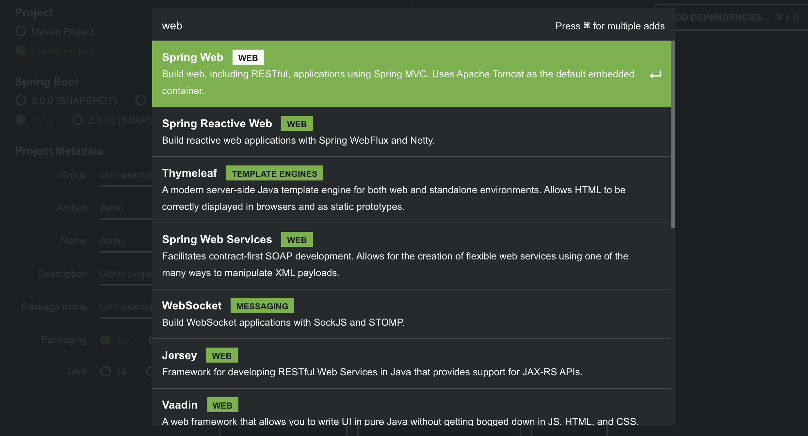
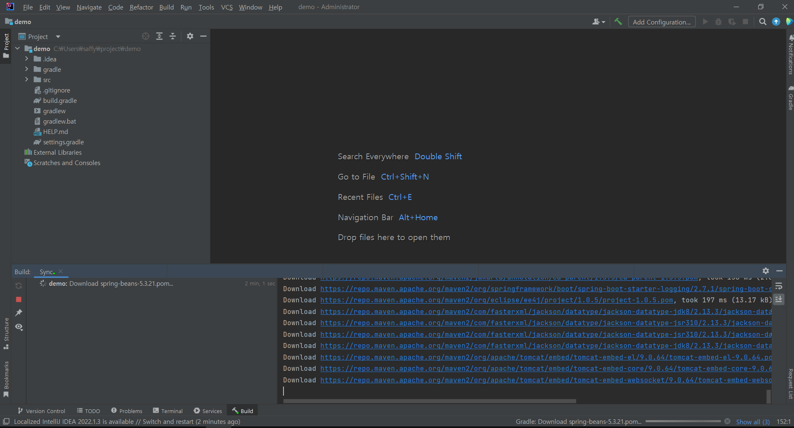
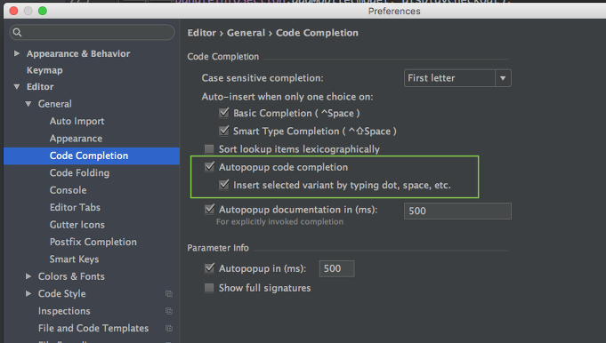
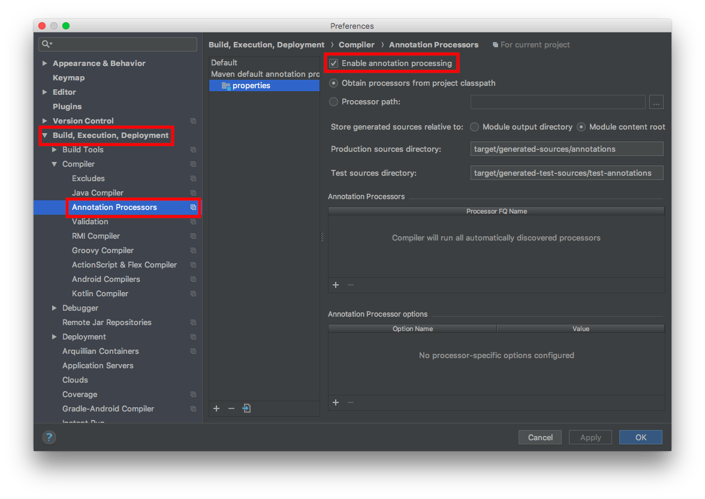

# IntelliJ Community

* 커뮤니티 버전을 사용해 Spring Boot 프로젝트를 진행한다.
* **주의점**: Spring 프로젝트 연결 전에 Julu11 등 사용할 JDK버전이 깔려있어야 한다.

​                  

## 설치

```
https://www.jetbrains.com/ko-kr/idea/download/#section=mac
```


## 스프링 프로젝트 생성

```
https://start.spring.io/
```

​          

### - Web 추가

* 여러 의존성을 주입하면 IntelliJ에서 자동완성 기능이 동작하지 않을 수도 있다.



​                  

## Build

* 위에서 다운받은 프로젝트의 압축을 푼다.
* IntelliJ를 열고 Open 항목을 이용해 압축해제한 프로젝트를 연결한다.
* Gradle 다운로드를 진행하면 완성되어있다.



​                 

## PlugIn

* Spring 검색 후 관련 플러그인 다운
  * spring assistant 등
* 이후 인텔리제이 재실행

​            

## Setting



