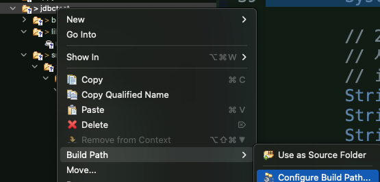
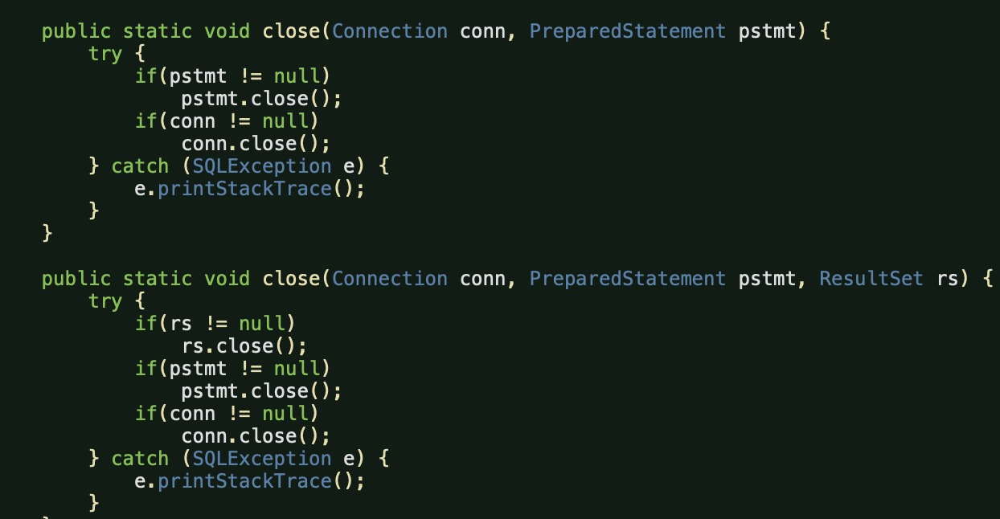

# JDBC

> Java DataBase Connection

​          

## JDBC 작업 순서

>* Driver download : https://dev.mysql.com/downloads/connector/j/
>
>* DB 정보
>
>  * driver ==> com.mysql.cj.jdbc.Driver
>
>  * url
>
>    ```
>    jdbc:mysql://127.0.0.1:3306/[사용할 DB명]?serverTimezone=UTC&useUniCode=yes&characterEncoding=UTF-8
>    ```

​             

### 0. 사전준비

> 이클립스 - Other - project 생성
>
> src - 패키지생성 - `.com.단체명.jdbctest` 
>
> 패키지 안에 Class 생성 `JDBCTest.java`


### 1. Driver Loading

> 패키지 별로 라이브러리를 관리하도록 한다. 이후 Maven을 사용해 다룰 것이다.

```java
/* java ==> mysql접속 및 sql 관리
		 다른 패키지의 클래스를 불러와서 사용
		 java.sql.c 패키지
		
		 [ java.sql 패키지 ]
		 표준은 지원되지만 mysql, oracle 버전까지 호환은 안된다
		 그래서 회사마다 지원하는 JAVA 파일을 따로 받아야 한다.
		 Driver download : https://dev.mysql.com/downloads/connector/j/ 
		 혹은 https://mvnrepository.com/ 에서 'mysql' 검색
		 jar파일 다운: libs 폴더를 만들고 jar파일 그대로 집어넣는다 
		
		 1. 대표 클래스를 동적 로딩한다. (생성X)
		 A a; 은 정적 로딩, ==> 컴파일 단계에서
		 로딩할 클래스 이름: driver ==> com.mysql.cj.jdbc.Driver
		 정적 로딩: com.mysql.cj.jdbc.Driver driver; */
		
		// 동적 로딩: Class의 forName 메서드 이용: throws 내장하므로 try~catch로 받아준다.
		try {
			Class.forName("com.mysql.cj.jdbc.Driver"); // 풀네임 활용
		} catch (ClassNotFoundException e) {
			e.printStackTrace();
		}
		System.out.println("클래스 로딩 성공");
		System.out.println("end");
```

* Java는 표준 sql문을 지원하지만 모든 DBMS의 버전을 지원할 수는 없다.

  * 이에 각 DBMS 회사에서 지원하는 Java 클래스를 **다운로드한 다음 로드**해 사용한다.

    * `jdbctest` 프로젝트 src에 폴더를 만들고 `libs` 폴더를 만들어 `.jar`파일을 넣어준다.

    

  * Configuration

    

    * `jdbctest` 우클릭 - `Build Path` - `Configure BuildPath` - `Library` 탭에서 추가
    * `Referenced Libraries`에서 확인 가능

​        

### 2. DB 연결 (Connection 생성)

> mysql 서버에 접속해주어야한다.
>
> 이 때 mysql 접속에 필요한 정보를 입력해서 전송해주어야 한다.
>
> `DriverManager` 클래스를 이용해 정보를 가지고 mysql에 접속한다.

```java
/* 2. mysql에 접속하기
	 서버주소
	 id, pw
*/
String jdbcURL ="jdbc:mysql://127.0.0.1:3306/[사용할 DB명]?serverTimezone=UTC&useUniCode=yes&characterEncoding=UTF-8";
String jdbcid = "접속 id";
String jdbcpw = "비밀번호";

Connection conn = null; // 현관문
Statement stmt = null; // 안방문: 임포트 주의할 것(여러 개가 있으니 mysql 것 잘 선택)


//DriverManager.getConnection() 의 인스턴스를 만들면서 접속한다. 
try {
			conn = DriverManager.getConnection(jdbcURL,jdbcid,jdbcpw);
			System.out.println("접속 성공");
  
  		stmt = conn.createStatement(); // 인자가 없다. 실행할 때 따로 넣어준다.
} catch (SQLException e) {
			e.printStackTrace();
} 
```

​       

### 3. SQL 구문 작성과 실행

* `.createStatement()` 보다는 `.prepareStatement(sql)`을 사용한다.

```java
			// 3. sql구문 실행: createStatement / prepareStatement = 둘의 실행 메소드는 같다

			/* 3.1 객체 생성, 변경, 삭제
				stmt.execute(sql);    // create, alter, drop, truncate
			  반환값: boolean
			*/
			
			/* 3.2 select 구문
				stmt.executeQuery(sql);    select 구문일 때
			  반환값: ResultSet
			*/

			/* 3.3 insert, update, delete
				stmt.executeUpdate(sql); // insert, update, delete
				반환값: int (영향받은 레코드 수)
			*/

			stmt = conn.createStatement(); // 인자가 없다. 실행할 때 따로 넣어준다.
			stmt2 = conn.prepareStatement(sql); // 바로 넣어주고 돌려준다.
			
			rst = stmt.executeQuery(sql); //rst는 iterator랑 비슷하며 next()로 조회
			while(rst.next()) {
				System.out.print(rst.getInt("idx") + " ");
				System.out.print(rst.getString(2) + " "); //2번째 칼럼값을 가져오시오
				System.out.println(rst.getString("pname") + " "); //alias 를 포함한 칼럼의 값을 가져옵니다.
			}
			
			int cnt = stmt.executeUpdate(sql2);
			System.out.println(cnt == 1? "성공": "실패");
```


### 4. 구문 종료 / 시작

* 불러왔던 Connection, Statement, ResultSet 모두 접속을 종료시켜야 한다.

```java
			//종료 구문이 너무 길기 때문에 아예 클래스를 만들어 import한다 
			try {
				stmt.close();
				stmt3.close();
			} catch (SQLException e) {
				e.printStackTrace();
			}
```

* 이를 간단하게 하기 위해 클래스를 만들고 종료 메소드를 만들어 패키지에 집어넣는다

  

 * 클래스 내부 모습

   * 여러 인스턴스들을 인자로 받아 try catch문으로 종료해줌

   

   

### 전체 코드

* Import 제외 

```java
public class JDBCTest {
	
	public JDBCTest() {
		// java ==> mysql접속 및 sql 관리
		// 다른 패키지의 클래스를 불러와서 사용
		// java.sql.c 패키지
		
		/* java.sql 패키지
		 표준은 지원되지만 mysql, oracle 버전까지 호환은 안된다
		 그래서 회사마다 지원하는 JAVA 파일을 따로 받아야 한다.
		 Driver download : https://dev.mysql.com/downloads/connector/j/ 
		 혹은 https://mvnrepository.com/ 에서 'mysql' 검색
		 jar파일 다운: libs 폴더를 만들고 jar파일 그대로 집어넣는다 */
		
		// 1. 대표 클래스를 동적 로딩한다. (생성X)
		// A a; 은 정적 로딩, ==> 컴파일 단계에서
		// 로딩할 클래스 이름: driver ==> com.mysql.cj.jdbc.Driver
		// 정적 로딩: com.mysql.cj.jdbc.Driver driver;
		
		// 동적 로딩: Class의 forName 메서드 이용: throws 내장 
		try {
			Class.forName("com.mysql.cj.jdbc.Driver"); // 풀네임 활용
		} catch (ClassNotFoundException e) {
			e.printStackTrace();
		}
		System.out.println("클래스 로딩 성공");
		System.out.println("end");
		
		// 2. mysql에 접속하기
		// 서버주소
		// id, pw
		String jdbcURL ="jdbc:mysql://127.0.0.1:3306[사용할DB이름적기]?serverTimezone=UTC&useUniCode=yes&characterEncoding=UTF-8";
		String jdbcid = "DB계정명";
		String jdbcpw = "비밀번호";
		
		// jdbc는 0이 아니라 1이 시작이다.
		String sql = "select idx, product_id, product_name pname from product";
		String sql2 = "insert into product (product_id, product_name, product_price, product_desc, register_date) values ('GZFo003', '갤럭시폴드3', 1850000, '갤럭시폴드3입니다.', now())";
		Connection conn = null; // 현관문
		Statement stmt = null; // 안방문: 임포트 주의할 것(여러 개가 있으니 mysql 것 잘 선택)
		ResultSet rst = null;
		
		// [ SQL 구문 생성 클래스 ]
		// 직접 sql문을 써서 명령문을 제작하는 것은 번거로운 일이다
		// 그러므로 그 sql문을 만들어주는 클래스를 만들고 메소드를 이용해 값을 넣어 sql문을 만들어준다.
		// Statement 나 prepareStatement 모두 사용하는 구문 만들기 방식
		
		
		//Dao = Data Access Object
		//Dto = Data Transfer Object
		ProductDto dto = new ProductDto();
		dto.setProductId("java");
		dto.setProductName("자바");
		dto.setProductPrice(1000);
		dto.setProductDesc("자바입니다.");
		//원래 이 값들을 SQL 문자열 안에 + 연산으로 합쳐준다
		
		// prepareStatement 에서 setString 메소드로 원하는 곳에 순서대로 문자를 집어넣을 수 있다.
		// ? : 문자열이 들어올 곳
		// column값에 ?를 쓸 수 없고 값에만 가능하다.
		// 불러올 때는 0이 아닌 1부터 가져온다.
		
		
		//Statement 방식은 불편하기 때문에 이를 상속한 PreparedStatement를 사용한다.
		PreparedStatement stmt2 = null; // 얘를 제일 많이 사용: Prepared = 먼저 얻어진
		CallableStatement stmt3 = null; // 프로시저, 함수 호출할 때
		
		try {
			conn = DriverManager.getConnection(jdbcURL,jdbcid,jdbcpw);
			System.out.println("접속 성공");
			
		/*	
			conn.setAutoCommit(true); // 이 메서드를 안쓰면 auto commit이 true이다.
			conn.commit(); // 수동 커밋을 통해 트랜젝션을 관리할 수도 있다.
			conn.setSavepoint();
			conn.rollback();
		*/
			
			// 3. sql구문 실행: createStatement / prepareStatement = 둘의 실행 메소드는 같다
			stmt = conn.createStatement(); // 인자가 없다. 실행할 때 따로 넣어준다.
			stmt2 = conn.prepareStatement(sql); // 바로 넣어주고 돌려준다.
			//stmt.execute(sql); // create, alter, drop, truncate
			//반환값: boolean
			
			// 3.1 select
			//stmt.executeQuery(sql); // select 구문일 때
			//반환값: ResultSet
			rst = stmt.executeQuery(sql); //rst는 iterator랑 비슷하며 next()로 조회
			while(rst.next()) {
				System.out.print(rst.getInt("idx") + " ");
				System.out.print(rst.getString(2) + " "); //2번째 칼럼값을 가져오시오
				System.out.println(rst.getString("pname") + " "); //alias 를 포함한 칼럼의 값을 가져옵니다.
			}
			
			// 3.2 insert, update, delete
			//stmt.executeUpdate(sql); // insert, update, delete
			//반환값: int (영향받은 레코드 수)
			int cnt = stmt.executeUpdate(sql2);
			System.out.println(cnt == 1? "성공": "실패");
			
		} catch (SQLException e) {
			e.printStackTrace();
		} finally {
			
			//종료 구문이 너무 길기 때문에 아예 클래스를 만들어 import한다 
			try {
				stmt.close();
				stmt3.close();
			} catch (SQLException e) {
				e.printStackTrace();
			}
			
			//이 외 Connection 과 ResultSet 모두 닫아주어야 한다.
			DBClose.close(conn,stmt2,rst); // 임포트한 DBClose 의 메서드 사용
			
			
			
		}
		
		
		
	}
	
	public static void main(String[] args) {
		//JDBC 테스트
		
		new JDBCTest();

	}

}
```

