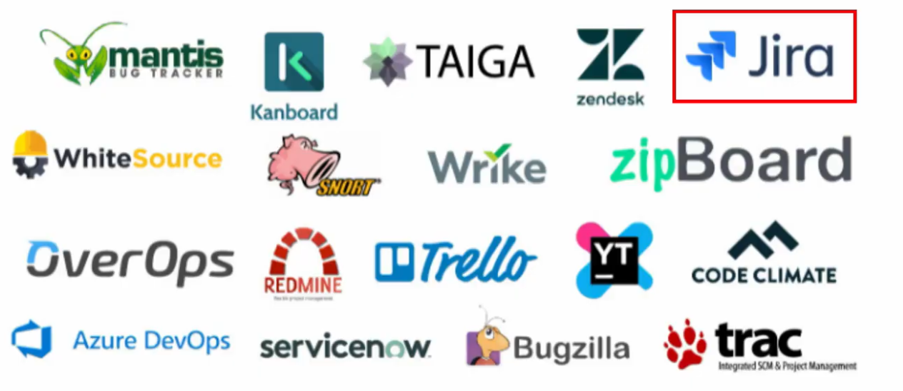
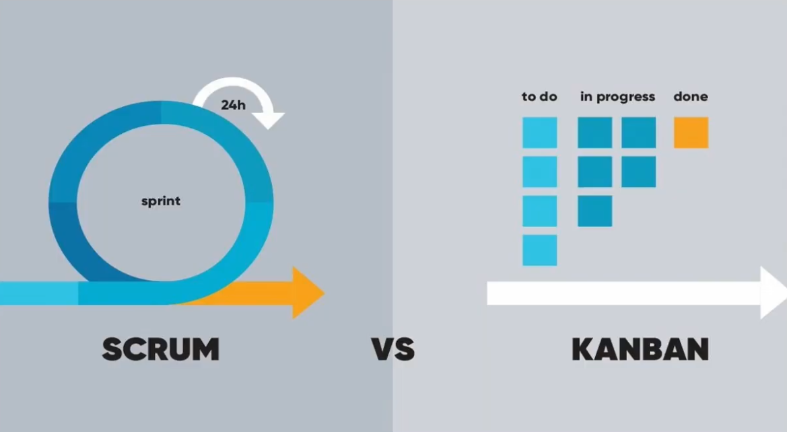
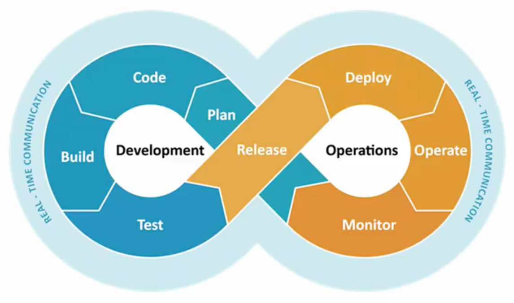
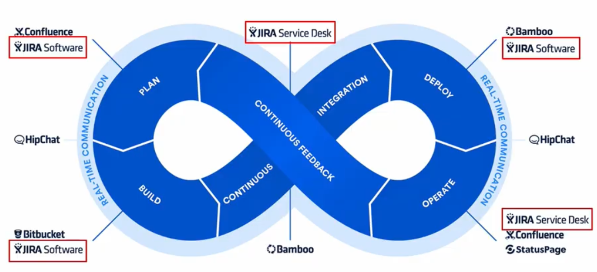
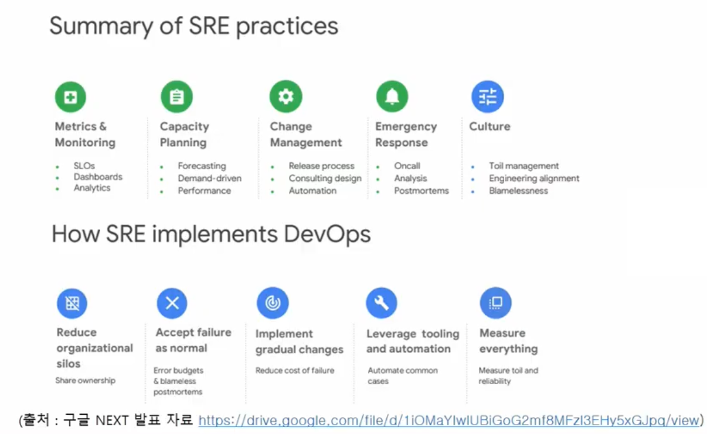

# JIRA 및 JQL 활용법

​                  

## 1. Issue Tracking

* My Todo
* Issue를 생성하고 관리/추적

​                  

## 2. Project Management

* 프로젝트 관리에서도 사용

​                

## 3. Scrum VS Kanban

* SCRUM: sprint(기간) 안에 할 일을 backload에 저장하고 열람하며 관리
  * Scrum meeting
* KANBAN: Issue를 통해 관리
  * 단점: 2~3일 단위로 업데이트하는 SCRUM과 달리 일이 몰릴 수 있다.

​                

## 4. DevOps

* 개발을 진행하면서 서로 책임을 미루는 사태가 발생

* 짧은 순환주기로 관리

​                  

### DevOps를 잘 수행하기 위한 조건

* 반복적인 작업들을 Tool을 이용해 자동화
* 팀원 모두가 알고 있는 하나의 공유된 지표가 필요
* 장애나 이슈가 있을 때 혼자만 알지 말고 팀원들과 공유 필요

​                 

### Atlassian DevOps & Jira

* 모든 단계에서 JIRA를 활용 가능

​                 

## 5. SRE(Site Reliability Engineering)

> class **SRE** implements **DevOps**

* 요지: 어떻게 하면 소프트웨어 개발에서 장애를 발생시키지 않고 진행할 수 있는가?

