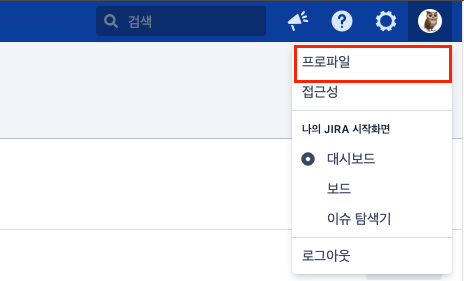
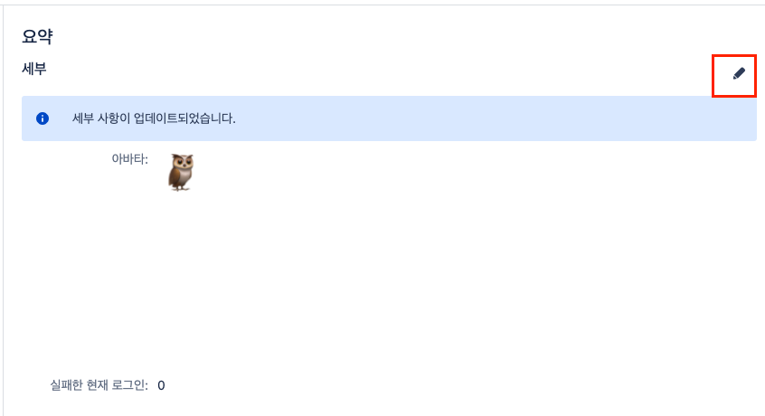
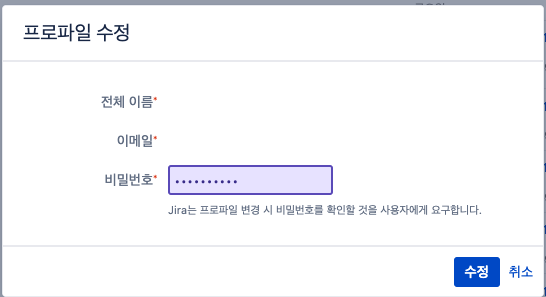
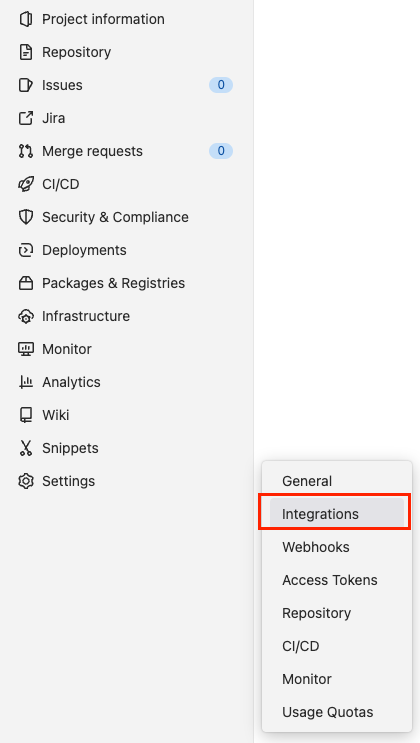
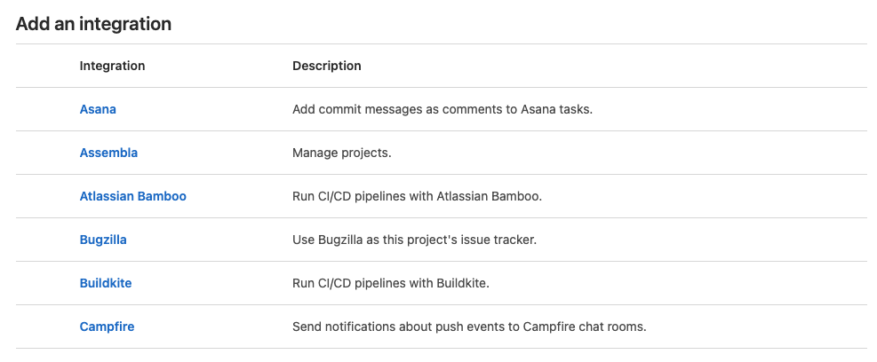
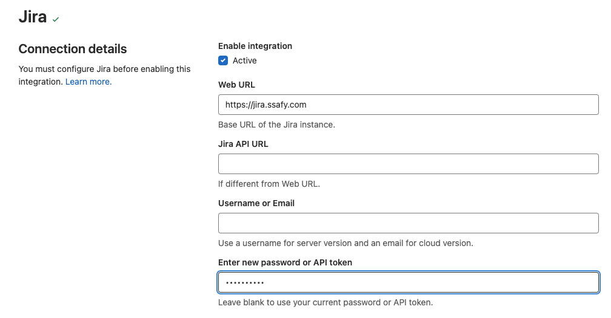
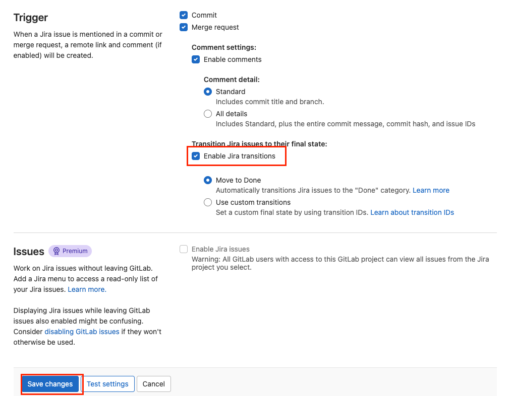
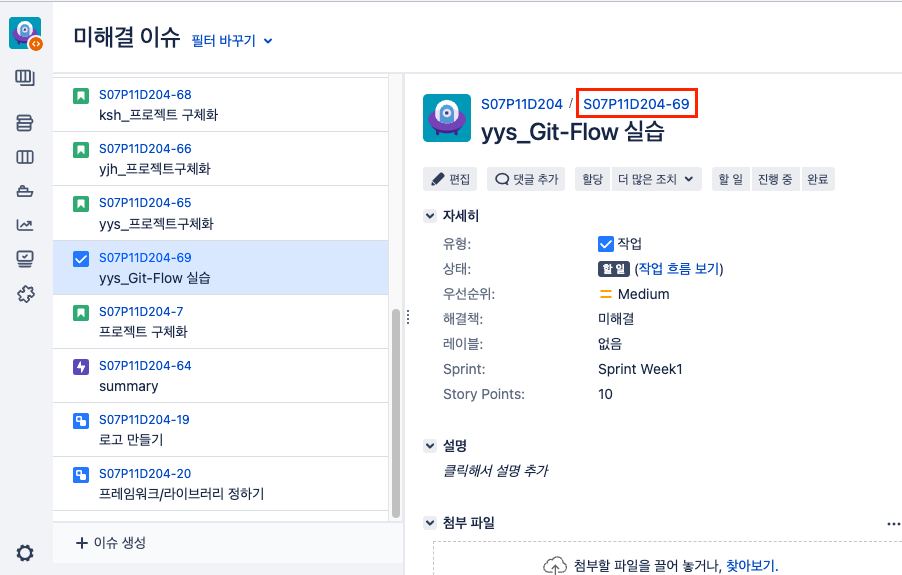
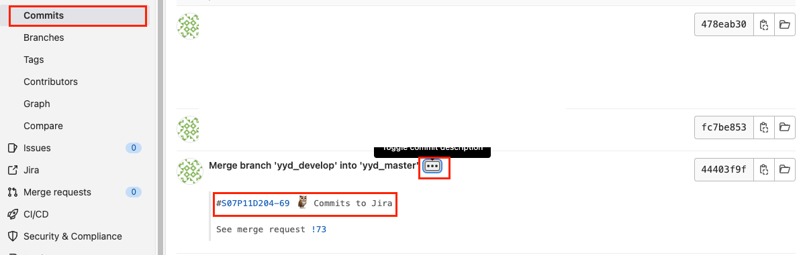

# Jira ↔ GitLab commit 연동

* `git commit`에서 Jira 이슈번호를 앞에 적으면 Jira comment에 커밋 내역을 자동으로 업데이트 

​                 

## # 설정 

### 1) 프로젝트와 연동된 Jira로 이동해서 `프로파일` 클릭



​                     

### 2) 세부 탭에서 연필 버튼 클릭



​                

### 3) Jira 계정 비밀번호 초기화



​                  

### 4) GitLab Settings

* Settings - Integrations



​               

### 5) Add an integration 에서 Jira 찾기



​               

### 6) 다음 내용들을 작성

* Web URL

  ```
  https://jira.ssafy.com
  ```

* Username or Email

  * Jira 프로파일 기준 자신의 아이디

* Enter new password or API token

  * 방금 변경한 비밀번호 입력



* Enable Jira transition 체크

  

* Save changes 클릭해서 저장하기

​                 

​                   

## # 테스트

### 0) 적당한 이슈를 찾아 이슈 번호를 복사한다.



​                     

### 1) GitLab은 브랜치 등록


### 2) 프로젝트 clone한 곳에서 파일을 수정하고 commit을 해본다.

* `[이슈] + 내용` 또는 `이슈 + 내용` 모두 가능 

```bash
# 파일을 수정했다고 가정
$ git add .
$ git commit -m "[S07P11D204-69] 🦉 Commit to Jira Test"
```

* Gitlab - Repository - Commits 에서 해당 커밋의 `...`을 클릭하면 Jira 이슈와 연동된 커밋내역을 확인할 수 있다.

  

​                   

### 3) comment 로 남기기

* 명령어를 사용해 Jira 이슈의 comment에도 저장할 수 있다.

  ```bash
  $ git commit -m "[S07P11D204-69] #comment 🦉 Commit to Jira Test"
  ```

  