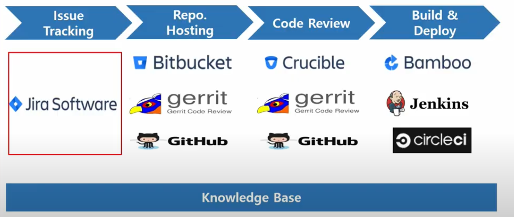

# JIRA의 사용

* 시작은 Issue의 생성이다

​               

### 1. Create Issue

* **epic**이라는 하위 개념을 추가할 수 있다.
* `more`-`create Sub-task`를 통해 issue를 세분화할 수 있다.


​                     

### 2. 관리

* Version
* Backlog
  * `아직 남은 할일`을 의미
* Release

​                  

​                         

# JQL 사용

* Jira Query Language
* Jira Issue를 구조적으로 검색하기 위해 제공하는 언어
* SQL(Standard Query Language)
* Jira의 각 필드들에 맞는 특수한 예약어들을 제공
* 쌓인 Issue들을 재가공해 유의미한 데이터를 도툴해내는데 활용(Gadget, Agile Board 등)

​                  

### 1. Basic Query & Advanced Query

* Advanced 사용: 명령어를 통해 검색


​                

#### - JQL Operators

* `=`, `!=`, `>`, `>=`
* `in`, `not in`
* `~ (contains)`, `!~ (not contains)`
* `is empty`, `is not empty`, `is null`, `is not null`

​                       

#### - JQL Keywords

* AND
* OR
* NOT
* EMPTY
* NULL
* ORDER BY

​             

### 2. 실제 사용

* 이슈 관리 창에서 Basic/Advance 모드로 이슈를 검색할 수 있다.

* Advanced Query 예시

  ```
  project = DP AND issuetype = Epic AND status = "In Progress" and assignee = komack.zip
  ```


​                        

### 3. 날짜 개념


* 2시간 전: -2h

​                 

#### - 날짜 Function

* `endOfDay()`, `startOfDay()`
* `endOfWeek()`(토요일), `startOfWeek()` (일요일)
* `endOfMonth()`, `startOfMonth()`, `endOfYear()`, `startOfYear()`
* `currentLogin()`
* `currentUser()`

​               

#### - 예제

```
project = DP AND assignee = currentUser() and updated > -1d
```

​                      

### 4. Filter share

```
project = DP AND assignee == currentUser() and resolution = Unresolved
```

```
project = DP AND updated > startOfWeek(1d) and updated < endOfWeek(-1d)
```


* `Details` - `Edit permissions` - `Edit Current Filter` - `save`
* Find Filters: 등록하면 같은 프로젝트 내의 사람들은 서로의 필터를 공유 가능

​               

### 5. Dash Board & Agile Board

​                

#### - Dash Board

* Projects - Manage Dash Board - create


* gadget: 가젯들을 추가해 정보들을 기록
  * gadget들을 추가해 Dash Board 관리

​                   

#### - Agile Board

* `Demo board` - `Create board`
* Scrum / Kanban Board 생성 가능
  * Scrum: sprint 생성/관리
  * Kanban: default 보드, filter로 지정해서 조건에 맞는 issue로 Kanban Board 생성 가능
    * 개인 이슈 관리


​                     

​                       

## 현업에서 Jira 활용



​                         

#### - smart commit


* Jira Issue와 Git 등 연동

​                  

#### - plug-in 제공

