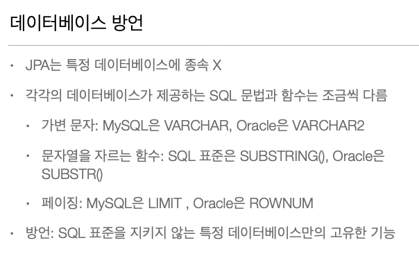
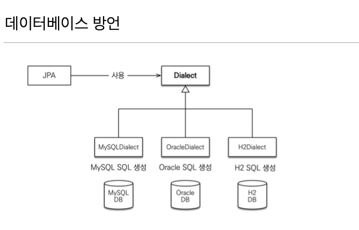
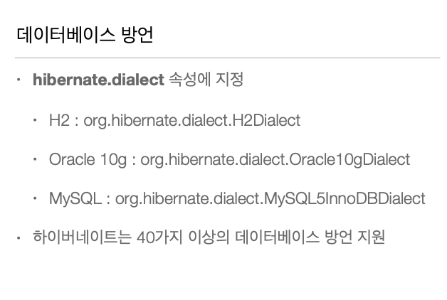

# Hello JPA

> 최대한 JAVA 8 버전 이상을 사용을 권장한다.
> IntelliJ Ultimate를 사용해 Spring을 빌드했다.
> Gradle을 사용했다.

## 0. 세팅

​                    

### 1) build.gradle

```java
dependencies {
		// Spring Web
    implementation 'org.springframework.boot:spring-boot-starter-web'
    // MySQL
    implementation 'mysql:mysql-connector-java'
    // JPA
    implementation 'org.springframework.boot:spring-boot-starter-data-jpa'
    testImplementation 'org.springframework.boot:spring-boot-starter-test'
}
```

### 2) application.properties

```
# MySQL 설정
spring.datasource.driver-class-name=com.mysql.cj.jdbc.Driver

# DB Source URL
spring.datasource.url=jdbc:mysql://localhost:3306/jpa?useUnicode=true&serverTimezone=Asia/Seoul

# DB username
spring.datasource.username=<ID>

# DB password
spring.datasource.password=<PASSWORD>

# true 설정시 JPA 쿼리문 확인 가능
spring.jpa.show-sql=true

# DDL(create, alter, drop) 정의시 DB의 고유 기능을 사용할 수 있다.
spring.jpa.hibernate.ddl-auto=update

# JPA의 구현체인 Hibernate가 동작하면서 발생한 SQL의 가독성을 높여준다.
spring.jpa.properties.hibernate.format_sql=true
```

​                   

## 1. 데이터베이스 방언







​                   

## 2. 


