# JPA 소개

​               

## 1. ORM?

* Object-relational mapping(객체 관계 매핑)
* 객체는 객체대로 설계
* 관계형 데이터베이스는 관계형 데이터베이스로 설계
* ORM 프레임워크가 중간에서 매핑
* 대중적인 언어에는 대부분 ORM 기술이 존재

​                

## 2. JPA 흐름도

### - JPA는 애플리케이션과 JDBC 사이에서 동작

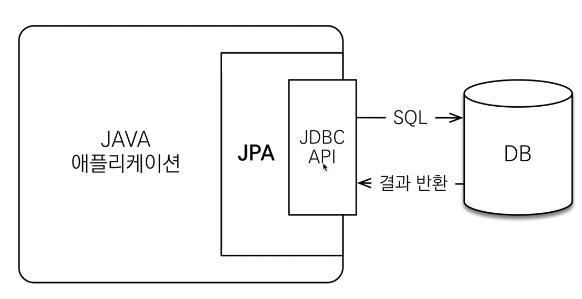

### - JPA 동작 : 저장

* 패러다임의 불일치 해결

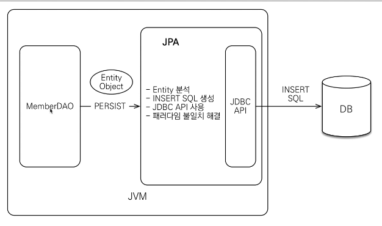

### - JPA 동작 - 조회

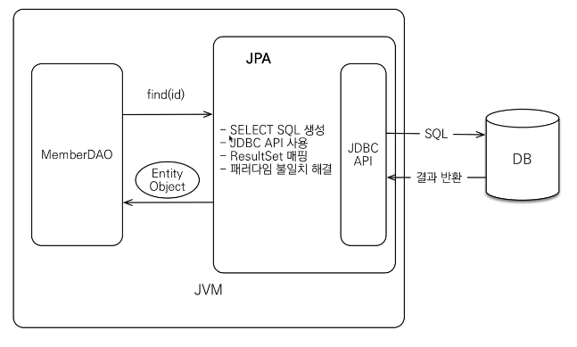

​               

## 3. JPA 소개

* EJB - 엔티티빈(자바 표준)
* 하이버네이트(오픈 소스)
* JPA(자바 표준)
  * 하이버네이트를 표준으로 다듬음

​               

### JPA는 표준 명세

* JPA는 인터페이스의 모음
* JPA 2.1 표준 명세를 구현한 3가지 구현체
* 하이버네이트, EclipseLink, DataNucleus
  * 하이버네이트가 레퍼런스가 가장 많다

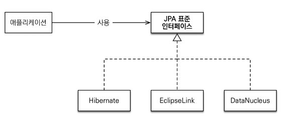

​             

## 4. JPA 버전

* JPA 1.0(JSR 220) 2006년 : 초기 버전. 복합 키와 연관관계 기능이 부족
* JPA 2.0(JSR 317) 2009년 : 대부분의 ORM 기능을 포함, JPA Criteria 추가
* JPA 2.1(JSR 338) 2013년 : 스토어드 프로시저 접근, 컨버터(Converter), 엔티티 그래프 기능이 추가

​                

## 5. JPA를 왜 사용해야 하는가?

​                   

### 1) 생산성 : JPA와 CRUD

* 저장: spa.persist(member)
* 조회: Member member = spa.find(memberId)
* 수정: member.setName("변경할 이름")
* 삭제: spa.remove(member)

​                  

### 2) 유지보수

* 기존: 필드 변경시 모든 SQL 수정
* JPA: 필드만 추가하면 SQL은 JPA가 처리

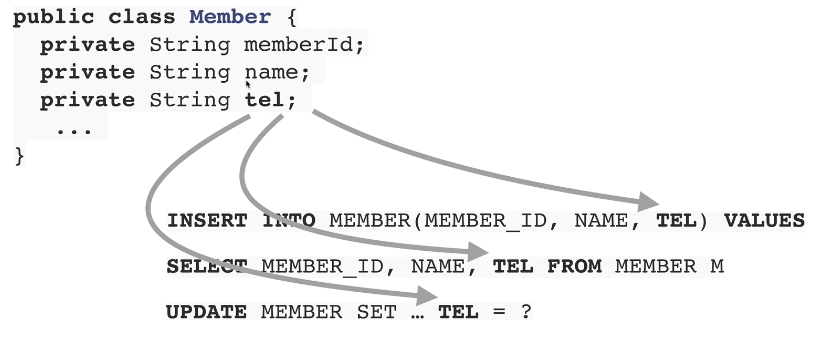

​                   

### 3) 패러다임의 불일치 해결

1. JPA와 상속

   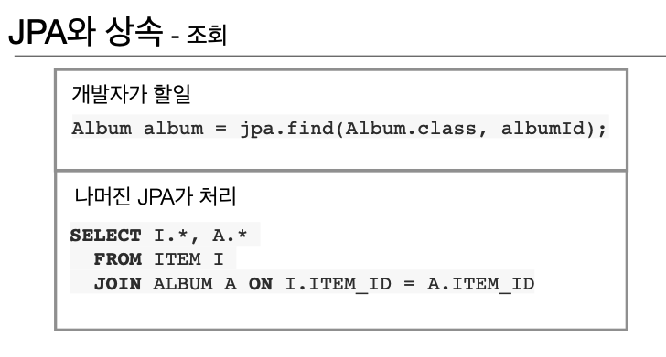

2. JPA와 연관관계

3. JPA와 객체 그래프 탐색

   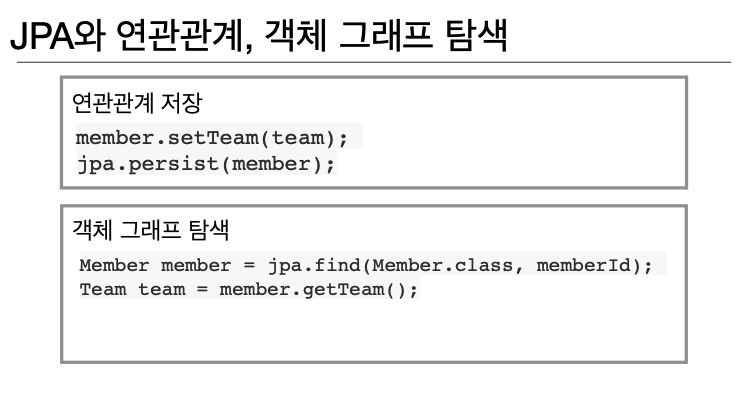

4. JPA와 비교하기

   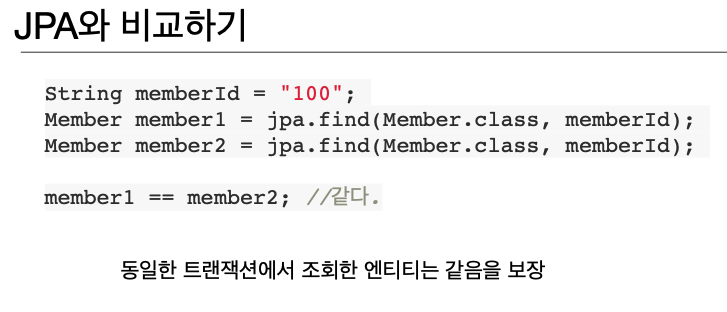

​               

### 4) JPA의 성능 최적화 기능

1. 1차 캐시와 동일성(identity) 보장

   * 2번이 중요

   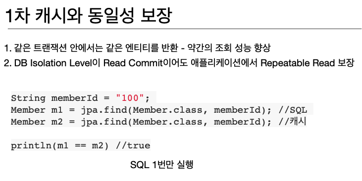

2. 트랜잭션을 지원하는 쓰기 지연(transactional write-behind)

   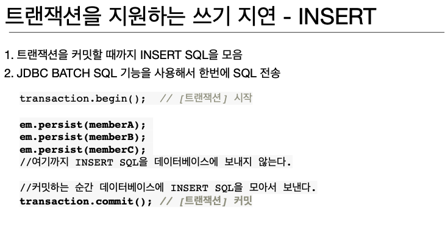

3. 지연 로딩(Lazy Loading)

   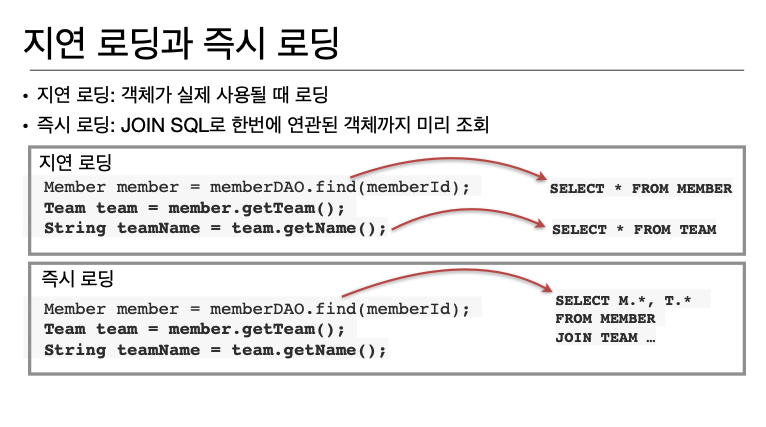