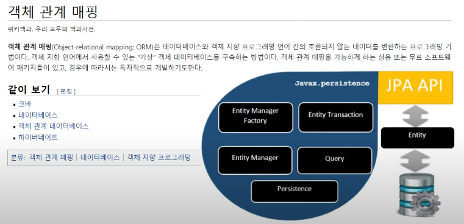

# JPA

## JPA : 표준 ORM(Object-Relational Mapping)

​                   

## 객체 관계 매핑 : 데이터가 담긴 자료구조들의 객체를 저장



### 장점 - 쿼리를 몰라도 구현할 수 있다.

​                

## 두 가지만 하면 된다!!
```
DB 테이블명 @Entity
원하는 것을 명령하는 쿼리가 되는 JpaRepository
```

|  |  |  | 누가 | 언제 | 어디서 | 무엇을 |  | 어떻게 | 왜 |
| ------ | ------ | ------ | ------ | ------ | ------ | ------ | ------ | ------ | ------ |
| 게시판 | UID |  | 글쓴 사람 | 글쓴 날짜 | ip 주소 | 제목 | 내용 | 모바일/웹 | N/A |
| Board | uid |  | user | createdDate | ip | title | contents | 1/2 |  |
| 댓글 | UID | 게시판_UID | 글쓴 사람 | 글쓴 날짜 | ip 주소 |  | 내용 | 모바일/웹 | N/A |
| Reply | uid |  | user | createdDate | ip |  | contents | 1/2 |  |

- 프로퍼티 설정

  ```bash
  # ddl을 사용하겠다
  spring.jpa.generate-ddl=true
  spring.jpa.hibernate.ddl-auto=update # create, create-drop, none, validate가 있는데 의미를 파악하자
  
  # 수행되는 쿼리의 바인딩 값을 확인 가능
  spring.jpa.show-sql=true
  spring.jpa.properties.hibernate.format_sql=true
  logging.level.org.hibernate.type.descriptor.sql.BasicBinder=trace
  ```

- resources/static/application.properties >> ddl의 옵션(create 등) 의미 자율학습

​                

## Relationship Mapping

- 다중성, 방향성, 연관관계의 주인

#### 다중성
- @OneToOne, @OneToMany...
- 일대일, 일대다, 다대일, 다대다
#### 방향성
- @JoinColumn
- 양방향은 JPA에서는 지양
#### 연관관계의 주인
- @OneToMany(mappedBy = "boardFk")
** 양방향일 경우 어떤 테이블 기준으로 데이터를 삭제하면 그것에 관련된 데이터들을 다 삭제할 것인가?
```
FK 키 관리 주인을 설정해 준다.
'다' 쪽이 주인이다.
@ManyToOne 은 항상 주인이다.
```

​                 

## JpaRepository

- Read : find**** 로 시작
- Delete : delete**** 로 시작
- Create : save
- Update : 객체 조회 후 값 변경 그리고 다시 save

​                 

## Builder : 객체 생성할 떄의 Tip
- 설계자가 객체를 생성할 떄 순서를 고려하지 않을 때를 방지, 생성자 앞에 @Builder 어노테이션을 작성.

​                

## SpringBoot JPA Docs

- 메소드 명이 곧 쿼리 (ex. findByID, findByTitle, findTop1000ByOrderByUidDesc...)

1. SpringBoot JPA는 Hibernate라는 ORM 프레임워크를 사용해서 구현한다.

2. 기본적으로 제공되는 레파지토리 메소드 이름 중에 조회에 사용되는 메소드는 find로 시작되는 메소드이다.

3. JPA를 사용할 때 꼭 구현해 줘야 하는 두 가지는 엔티티와 레파지토리다.

4. 연관관계를 설정할 때에는 3가지를 설정해 줘야 하는데 다중성, 방향성, 연관관계 주인을 설정해 주어야 한다.

   
