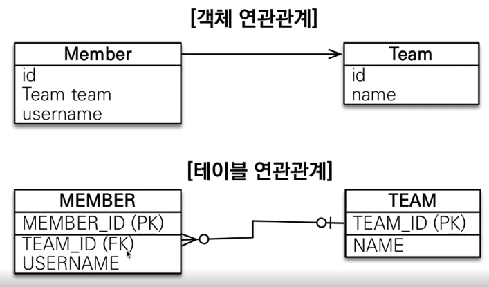
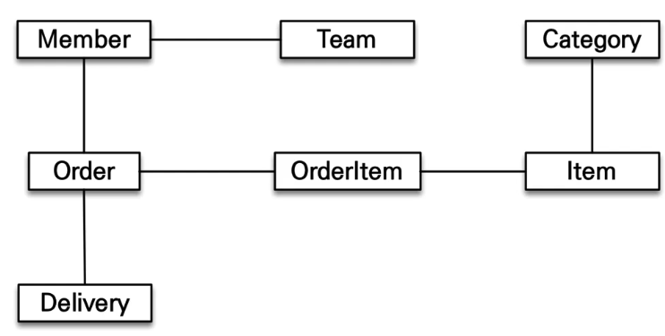
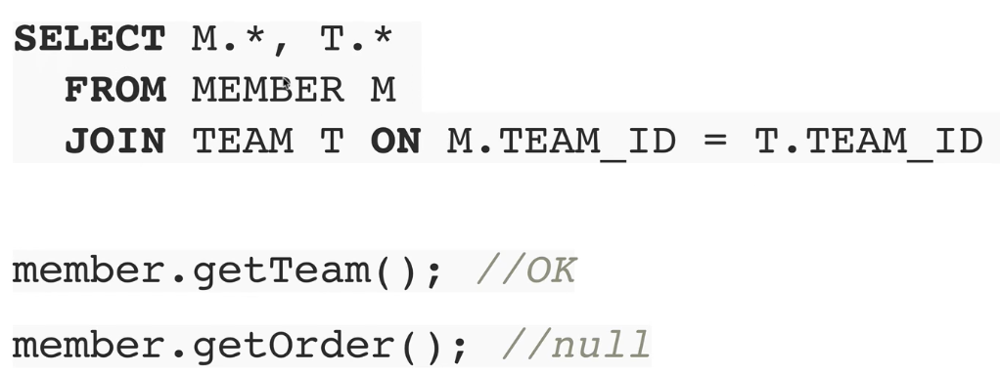
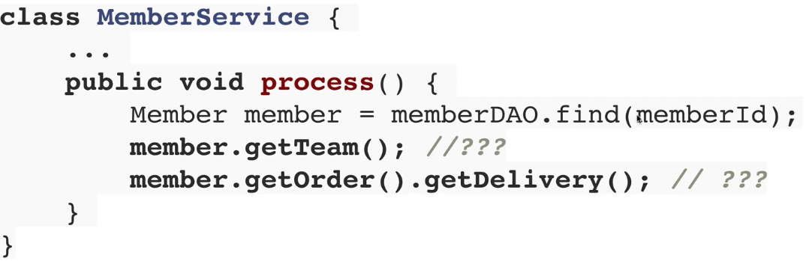
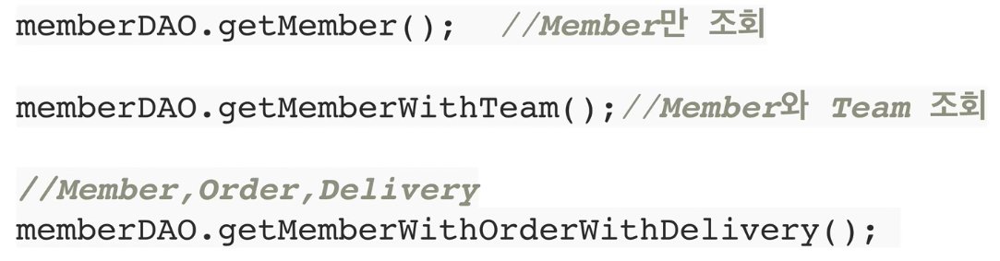

# SQL 중심적인 개발의 문제점

> 객체 지향 언어 - Java, Scala
> 데이터베이스 세계의 헤게모니: 관계형 DB - Oracle, MySQL
>
> 무한 반복, 지루한 코드: CRUD
> **SQL에 의존적인 개발을 피하기 어렵다**
> **패러다임의 불일치**: 객체 vs 관계형 데이터베이스
>
> 객체를 영구 보관하는 다양한 저장소
>
> * Object → RDB, NoSQL, File
>
> **결론: 계층형 아키텍처, 진정한 의미의 계층 분할이 어렵다. → 객체는 모델링을 할수록 매핑 작업만 늘어난다**
>                   

​                        

## 객체와 관계형 데이터베이스의 차이

1. 상속
2. 연관관계
3. 데이터 타입
4. 데이터 식별 방법

​                       

### 자바 컬렉션에 조회하면?

```java
Album album = list.get(albumId);

//부모 타입으로 조회 후 다형성 활용
Item item = list.get(albumId);
```

​                     

### 연관관계

#### - 객체는 참조를 사용: member.getTeam()

#### - 테이블은 외래 키를 사용: JOIN ON M.TEAM_ID = T..TEAM_ID



​                      

### 객체를 테이블에 맞추어 모델링

* 자바 컬렉션에 관리

  ```java
  list.add(member);
  
  Member member = list.get(memberId);
  Team team = member.getTeam();
  ```

  ​              

​                  

### 객체 그래프 탐색

* 객체는 자유롭게 객체 그래프를 탐색할 수 있어야 한다.



* 한계점: 처음 실행하는 SQL에 따라 탐색 범위 결정

  

* 위와 같은 이유로 엔티티 신뢰 문제 발생

  

* 모든 객체를 미리 로딩할 수는 없다

  * 상황에 따라 동일한 회원 조회 메서드를 여러벌 생성

    

