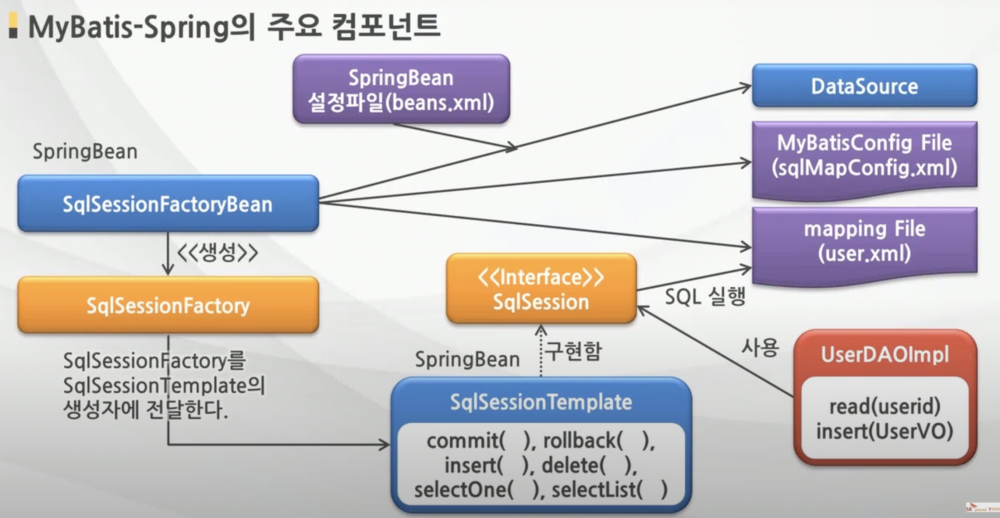

# MyBatis

> Java Object와 SQL문 사이의 자동 Mapping 기능을 지원하는 **ORM(Object Relational Mapping) Framework**
>
> * MyBatis는 SQL을 별도의 파일로 분리해서 관리
> * Object - SQL 사이의 parameter mapping 작업을 자동으로 해줌
> * MyBatis는 Hibernate나 JPA(Java Persistence API)처럼 새로운 DB 프로그래밍 패러다임을 익혀야 하는 부담이 없이, 개발자가 익숙한 SQL을 그대로 이용하면서 JDBC 코드 작성의 불편함을 제거해 주고, 도메인 객체나 VO 객체를 중심으로 개발이 가능

​              

### MyBatis 특징

* 쉬운 접근성과 코드의 간결함
  - 가장 간단한 persistence framework
  - XML 형태로 서술된 JDBC 코드라 생각해도 될 만큼 JDBC의 모든 기능을 MyBatis가 대부분 제공
  - 복잡한 JDBC 코드를 걷어내며 깔끔한 소스코드를 유지
  - 수동적인 parameter 설정과 Query 결과에 대한 mapping 구문을 제거
* SQL문과 프로그래밍 코드의 분리
  * SQL에 변경이 있을 때마다 자바코드를 수정하거나 컴파일 하지 않아도 됨
  * SQL 작성과 관리 또는 검토를 DBA와 같은 개발자가 아닌 다른 사람에게 맡길 수 있음
* 다양한 프로그래밍 언어로 구현가능
  * JAVA, C#, NET, Ruby

​                

### MyBatis와 MyBatis-Spring의 주요 Component

* MyBatis와 MyBatis-Spring을 사용한 DB Access Architecture

​               

### MyBatis와 MyBatis-Spring의 주요 Component

* MyBatis를 사용하는 Data Access Layer

* 3대 주요 Component

  

​                     

​                      

## MyBatis와 MyBatis-Spring의 주요 Component

* MyBatis 3대 주요 Component의 역할

| 파일                                     | 설명                                                         |
| ---------------------------------------- | ------------------------------------------------------------ |
| MyBatis 설정파일 (sqlMapConfig.xml) | 데이터베이스의 접속 정보, 객체의 alias, Mapping 파일의 경로 등 고정된 환경 정보 제공 |
| SqlSessionFactoryBuilder                 | MyBatis 설정 파일을 바탕으로 SqlSessionFactory 생성          |
| SqlSessionFactory                        | SqlSession을 생성                                            |
| SqlSession                               | 핵심적인 역할을 하는 Class로 SQL 실행이나 Transaction 관리를 실행 SqlSession 오브젝트는 Thread-Safe하지 않으므로 thread마다 필요에 따라 생성 |
| Mapping 파일 (member.xml)           | SQL 문과 ORMapping을 설정                                    |

​                          

### MyBatis와 MyBatis-Spring의 주요 Component

* MyBatis-Spring의 주요 Component

 

| 파일                                     | 설명                                                         |
| ---------------------------------------- | ------------------------------------------------------------ |
| MyBatis 설정파일 (sqlMapConfig.xml) | Dto 객체의 정보를 설정한다.(Alias)                           |
| SqlSessionFactoryBean                    | MyBatis 설정 파일을 바탕으로 SqlSessionFactory를 생성 Spring Bean으로 등록해야 함 |
| SqlSessionTemplate                       | 핵심적인 역할을 하는 클래스로서 SQL 실행이나 Transaction 관리를 실행 SqlSession Interface를 구현하며, Thread-safe하다. Spring Bean으로 등록해야함. |
| mapping 파일 (member.xml)           | SQL문과 ORMapping을 설정                                     |
| Spring Bean 설정파일 (beans.xml)    | SqlSessionFactoryBean을 Bean에 등록할 때 DataSource 정보와 MyBatis Config 파일 정보, Mapping 파일의 정보를 함께 설정함. SqlSessionTemplate을 Bean으로 등록. |

