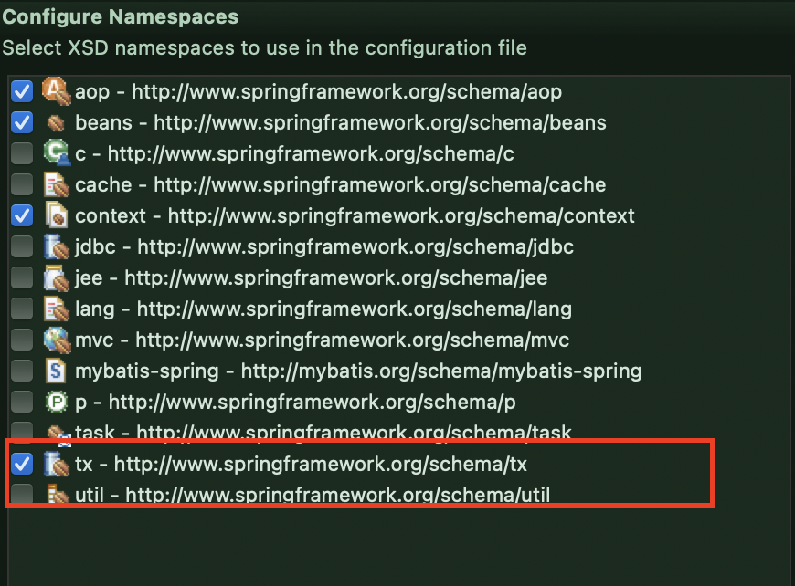

# MyBatis: Spring 연동

> java Config 파일이 사라진다.
> Dao의 구현체 DaoImpl이 사라지며 **Mapper**라는 이름을 사용한다.

​         

### Spring setting

* 이것을 Spring에 넘겨야 한다.

```java
package com.ssafy.util;

import java.io.IOException;
import java.io.Reader;

import org.apache.ibatis.io.Resources;
import org.apache.ibatis.session.SqlSession;
import org.apache.ibatis.session.SqlSessionFactory;
import org.apache.ibatis.session.SqlSessionFactoryBuilder;

public class SqlMapConfig {
	
	private static SqlSessionFactory factory;

	static {
		try {
			String resource = "mybatis-config.xml";
			Reader reader = Resources.getResourceAsReader(resource);
			factory = new SqlSessionFactoryBuilder().build(reader);
		} catch (IOException e) {
			e.printStackTrace();
		}
	}

	public static SqlSession getSqlSession() {
		return factory.openSession(); //생략시 openSession(false): 웬만하면 true를쓰지말자
	}
	
}

```

​              

### root-context.xml 를 수정

> SqlSession 클래스를 xml 상 bean으로 생성하고 그 내부에 필요한 파일들을 property로 넣어준다.
>
> 1. DataSource: bean으로 생성해주었고 SqlSessionFactory에 넣어준다.(ref로 bean을 가져옴)
> 2. mapper들의 위치를 알려줘야한다. (value로 직접 경로를 써줌)
> 3. Allias를 업데이트 해준다.(value로 직접 설정)
> 4.  3 대신에 패키지 검색을 통해 Allias를 업데이트할 수 있다.
>    * 즉, java Config 파일을 하나도 참조하지 않으므로 지워도 된다.

```xml
	<bean id="ds" class="org.springframework.jndi.JndiObjectFactoryBean">
		<property name="jndiName" value="java:comp/env/jdbc/ssafy"></property>
	</bean>
	
	
	<bean id="sqlSessionFactoryBean" class="org.mybatis.spring.SqlSessionFactoryBean">
		<property name="dataSource" ref="ds"></property>
		<property name="mapperLocations" value="classpath:mapper/*.xml"></property>
	<!-- <property name="configLocation" value="classpath:mybatis-config.xml"></property> -->
		<property name="typeAliasesPackage" value="com.ssafy.guestbook.model"></property>
	</bean>
```

* 아래 src가 아니라 설정파일이 있는 곳이면 classpath: 를 적어주어야 한다.

  ​                   

* SqlSession 생성해주기

  > 오류가 뜨는데 생성자로 sqlSession 팩토리로 넣어주어야 하기 때문이다.

```xml
<bean id="sqlSession" class="SST입력 후 자동완성"></bean>
```

```xml
<bean id="sqlSession" class="org.mybatis.spring.SqlSessionTemplate"></bean>
```

```xml
<bean id="sqlSession" class="org.mybatis.spring.SqlSessionTemplate">
  <constructor-arg ref="sqlSessionFactoryBean"></constructor-arg>
</bean>
```

​               

#### - root-context 최종

```xml
	<bean id="ds" class="org.springframework.jndi.JndiObjectFactoryBean">
		<property name="jndiName" value="java:comp/env/jdbc/ssafy"></property>
	</bean>
	
	
	<bean id="sqlSessionFactoryBean" class="org.mybatis.spring.SqlSessionFactoryBean">
		<property name="dataSource" ref="ds"></property>
		<property name="mapperLocations" value="classpath:mapper/*.xml"></property>
<!-- <property name="configLocation" value="classpath:mybatis-config.xml"></property> -->
		<property name="typeAliasesPackage" value="com.ssafy.guestbook.model"></property>
	</bean>
	
	<bean id="sqlSession" class="org.mybatis.spring.SqlSessionTemplate">
		<constructor-arg ref="sqlSessionFactoryBean"></constructor-arg>
	</bean>
```

​               

### ServiceImpl 에 생성한 SqlSession @Autowired

> `.getMapper`메서드를 활용하면 MyBatis가 내부적으로 인터페이스를 구현해서 넣어준다.

```java
@Service
public class MemberServiceImpl implements MemberService {
	
	@Autowired //private로 생성
	private SqlSession sqlSession;
	
	@Override 
	public int idCheck(String id) throws Exception {
		return sqlSession.getMapper(MemberMapper.class).idCheck(id);
	}
```

* MemberMapper 클래스를 매핑해서 idCheck 메서드를 수행해준다.

​         

### autocommit

* `@Transactional`를 적어주면 오류(Exception)이 발생했을 때 알아서 rollback 해주고 성공시 autocommit 해준다.

```JAVA
@Service
public class GuestBookServiceImpl implements GuestBookService {
	
	@Autowired
	private SqlSession sqlSession;

	@Override
	@Transactional
	public void registerArticle(GuestBookDto guestBookDto) throws Exception {
		GuestBookMapper guestBookMapper = sqlSession.getMapper(GuestBookMapper.class);
		guestBookMapper.registerArticle(guestBookDto);
		List<FileInfoDto> fileInfos = guestBookDto.getFileInfos();
		if (fileInfos != null && !fileInfos.isEmpty()) {
			guestBookMapper.registerFile(guestBookDto);
		}
	}
```

* 추가설정

  

​        

### root-context 트랜잭션 매니저 설정

> @Transactional 의 한계점이 존재한다(성공하면 autocommit, 오류시 rollback의 단순함).
> tx는 non-web이므로 root-context에서 관리할 수 있고 매니저를 이용해 관리할 수 있다.

```xml
	<bean id="transactionManager" class="org.springframework.jdbc.datasource.DataSourceTransactionManager">
		<property name="dataSource" ref="ds"/>
	</bean>
	
	<tx:annotation-driven transaction-manager="transactionManager"/>
```

