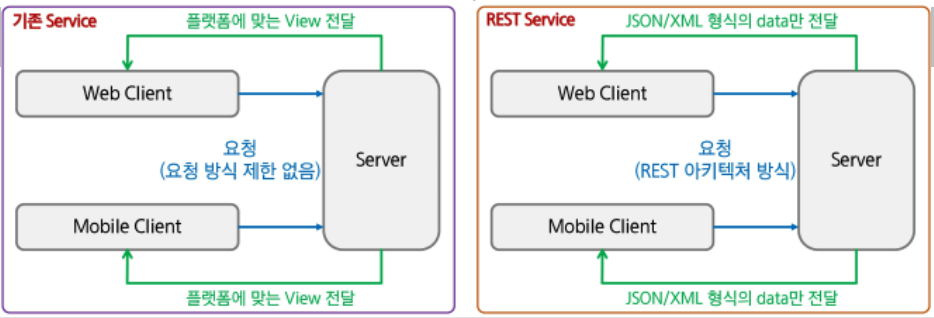

# SpringFramework - REST API

> **OPEN API (Application Programming Interface**
>
> * OPEN API는 프로그래밍에서 사용할 수 있는 개방되어 있는 상태의 Interface(**약속**)
> * naver, kakao 등 포털 서비스 사이트나 통계청, 기상청, 우체국 등과 같은 관공서, 공공 데이터 포털(https://www.data.go.kr)이 가지고 있는 데이터를 외부 응용 프로그램에서 사용할 수 있도록 OPEN API를 제공하고 있다.
> * OPEN API와 함께 거론되는 기술이 REST이며, 대부분의 OPEN API는 REST 방식으로 지원

​             

## REST(Representational State Transfer)

* 2000년도 로이 필딩(Roy Fielding)의 박사학위 논문에 최초로 공개
* REST는 'Representational State Transfer'의 약어로 하나의 URI는 하나의 고유한 리소스(Resource)를 대표하도록 설계된다는 개념에 전송방식을 결합해 원하는 작업을 지정한다.
  * URI + GET / POST / PUT/ DELELTE
* 웹의 장점을 최대한 활용할 수 있는 아키텍쳐(설계구조)로써 REST를 발표
* HTTP URI를 통해 제어할 자원(Resource)를 명시하고 HTTP Method(GET, POST, PUT, DELETE)을 통해 해당 자원(Resource)를 제어하는 명령을 내리는 방식의 아키텍처

​            

### 1. REST 구성

> 잘 표현된 HTTP URI로 리소스를 정의하고 HTTP method로 리소스에 대한 행위를 정의한다.
>
> 리소스는 JSON, XML과 같은 여러가지 언어로 표현할 수 있다.

* 자원(Resource) - URI
* 행위(Verb) - HTTP Method
* 표현(Representations)

​           

### 2. 기존 Service와 REST Service

* 기존 Service: 요청에 대한 처리를 한 후 가공된 data를 이용하여 특정 플랫폼에 적합한 형태의 View로 만들어서 반환

* REST Service: data 처리만 한다거나  처리 후 반환될 data가 있다면 JSON이나 XML 형식으로 전달. View에 대해서는 신경 쓸 필요가 없다. >> 이러한 이유로 Open API에서 많이 사용

  

​              

### 3. REST

* 기존의 전송방식과 달리 서버는 요청으로 받은 리소스에 대해 순수한 데이터를 전송한다.
* 기존의 GET/POST 외에 PUT, DELELTE 방식을 사용하여 리소스에 대한 CRUD 처리를 할 수 있다.
* HTTP URI을 통해 제어할 자원(Resource)을 명시하고 HTTP METHOD(GET/POST/PUT/DELELTE)를 통해 해당 자원(Resource)를 제어하는 명령을 내리는 방식의 Architecture이다.
* 자원을 표현할 때 Collection(문서, 객체의 집합)과 Document(하나의 문서, 객체) 사용
  * `https://www.sofia.com/sports(s로 여러 개 중 하나임을 표시)/baseball/player(s로 여러개중 하나임을 표시)/31`
* 가장 큰 단점은 딱 정해진 표준이 없어 '다들 이렇게 쓰더라~' 정도의 암묵적인 표준만 정해져 있다.
  * 하이픈(-)은 사용 가능하지망 언더바(_)는 사용하지 않는다.
  * 특별한 경우를 제외하고 대문자 사용은 하지 않는다.(대소문자 구분을 하기 때문)
  * URI 마지막에 슬래시(/)를 사용하지 않는다.
  * 슬래시(/)로 계층 관계를 나타낸다.
  * 확장자가 포함된 파일 이름을 직접 포함시키지 않는다.
  * URI는 명사를 사용한다.

​              

| 작업               | 예전방식 | 기존 방식                          | REST방식   | REST 방식        | 비고   |
| ------------------ | -------- | ---------------------------------- | ---------- | ---------------- | ------ |
| **C**reate(Insert) | POST     | /write.do?id=troment               | POST       | /blog/troment    | 글쓰기 |
| **R**ead(Select)   | GET      | /view.do?id=troment&articleno=25   | GET        | /blog/troment/25 | 글읽기 |
| **U**pdata(Update) | POST     | /modify.do?id=troment              | **PUT**    | /blog/troment    | 글수정 |
| **D**elete         | GET      | /delete.do?id=troment&articleno=25 | **DELETE** | /blog/troment/25 | 글삭제 |

* 기존의 블로그 등은 GET과 POST만으로 자원에 대한 CRUD를 처리하며, URI는 액션을 나타냈다.
* REST로 변경할 경우 4가지 method를 모두 사용하여 CRUD를 처리하며 URI는 제어하려는 자원을 나타낸다.

​                 

### REST API 설정

* Jackson library

  * Jackson-databind 라이브러리는 객체를 **JSON 포맷**의 문자열로 변환시켜서 브라우저로 전송한다.
  * https://mvnrepository.com/artifact/com.fasterxml.jackson.core/jackson-databind
  * Jackson-dataformat-xml 라이브러리는 객체를 xml로 브라우저로 전송한다.
  * https://mvnrepository.com/artifact/com.fasterxml.jackson.dataformat/jackson-dataformat-xml
  * Pom.xml에 추가

  ```xml
  <!-- https://mvnrepository.com/artifact/com.fasterxml.jackson.core/jackson-databind -->
  <dependency>
      <groupId>com.fasterxml.jackson.core</groupId>
      <artifactId>jackson-databind</artifactId>
      <version>2.13.1</version>
  </dependency>
  
  ```

  ```xml
  <!-- https://mvnrepository.com/artifact/com.fasterxml.jackson.dataformat/jackson-dataformat-xml -->
  <dependency>
      <groupId>com.fasterxml.jackson.dataformat</groupId>
      <artifactId>jackson-dataformat-xml</artifactId>
      <version>2.13.1</version>
  </dependency>
  ```

  ​      

​                

​                     

### REST 관련 Annotation

| Annotation      | Description                                           |
| --------------- | ----------------------------------------------------- |
| @RestController | Controller가 REST 방식을 처리하기 위한 것임을 명시    |
| @ResponseBody   | JSP 같은 뷰로 전달되는 것이 아니라 데이터 자체를 전달 |
| @PathVariable   | URL 경로에 있는 값을 파라미터로 추출                  |
| @CrossOrigin    | Ajax의 크로스 도메인 문제를 해결                      |
| @RequestBody    | JSON 데이터를 원하는 타입으로 바인딩                  |

* RestController: 하나의 컨트롤러 자체를 Rest 방식을 사용하는 것으로 명시

* Request/Response Body: JSON 타입을 바인딩, 데이터 전달할 때 사용

* PathVariable: URL 내 값을 추출할 수 있다

  ```
  @PathVariable("/blog/{id}")
  ```

* Cross Origin: 특정 Ajax만 접속할 수 있도록 한다