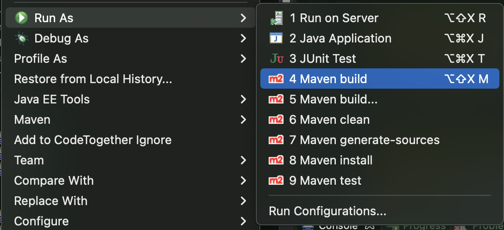
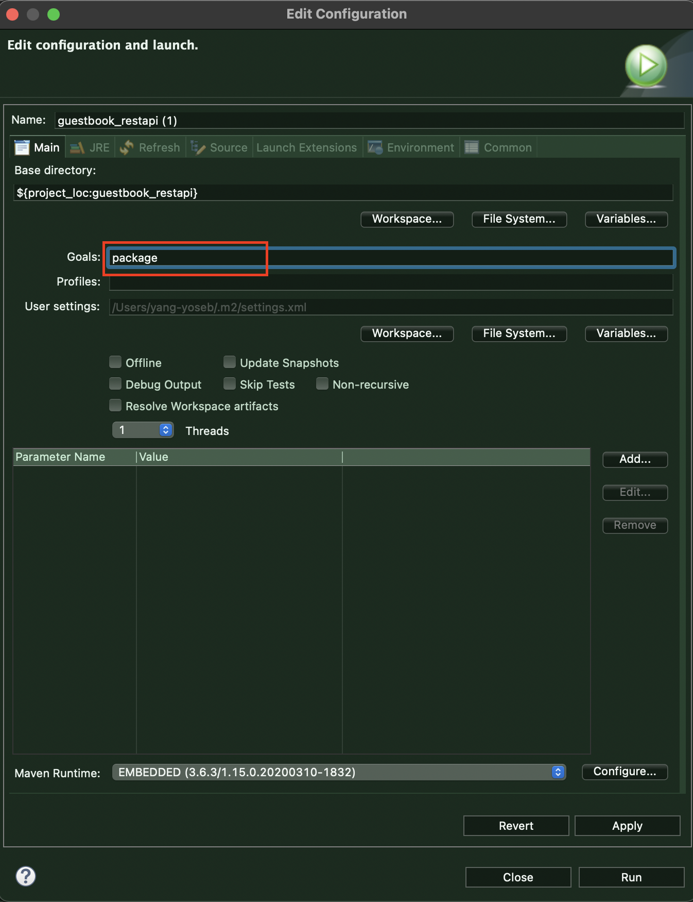
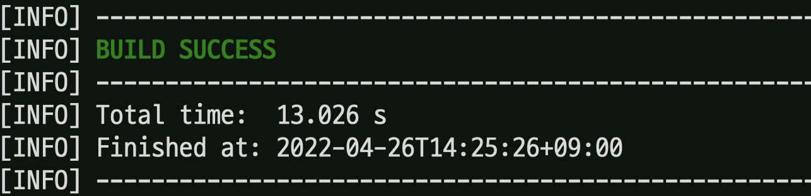
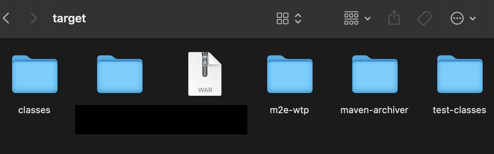
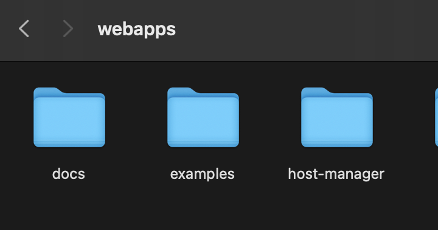
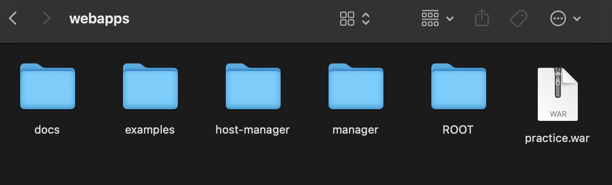
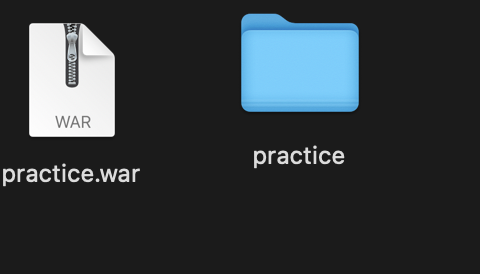

# REST API 실습

> 예제를 통해 확인한다.

​      

## 0. 변화점들

​           

### - Ajax 를 통한 jsp 의 출력

```javascript
	$.ajax({
        url: '${root}/user/idcheck', //url 경로
        data: {'ckid': ckid}, //보낼 파라미터
        type: 'GET', //보낼 데이터 타입
        dataType: 'json', //다시 되돌려받을 데이터 타입
        success: ~
        })
```

* **${ }**: 자바스크립트의 파라미터 값인지, el 문법인지에 대해 충돌이 발생한다.

  *  el문법 사용하기: ' '(작은 따옴표) 내부에 사용

    ```java
    <td>${'${user.userId}'}</td>
    ```

​          

### - Service에서 SqlSession의 사라짐

* root-context.xml

  ```xml
  <!-- <bean id="sqlSession" class="org.mybatis.spring.SqlSessionTemplate">
  		<constructor-arg ref="sqlSessionFactoryBean"></constructor-arg>
  	</bean> -->
  	
  	<!-- mybatis에서 제공하는 scan 태그를 통해 repository interface들의 위치를 지정. -->
  	<mybatis-spring:scan base-package="com.sofia.guestbook.model.mapper"/>
  ```

* Service 변경점

  ```java
  @Service
  public class GuestBookServiceImpl implements GuestBookService {
  	
    /*
    @Autowired
    private SqlSession sqlSession;
    */
    
  	@Autowired
  	private GuestBookMapper guestBookMapper;
  
  	@Override
  	@Transactional
  	public void registerArticle(GuestBookDto guestBookDto) throws Exception {
  		guestBookMapper.registerArticle(guestBookDto);
  		List<FileInfoDto> fileInfos = guestBookDto.getFileInfos();
  		if (fileInfos != null && !fileInfos.isEmpty()) {
  			guestBookMapper.registerFile(guestBookDto);
  		}
  	}
  ```

  ​           

### Mapper annotation 사용

> 사용하지 않아도 인식하지만 웬만하면 사용한다.

```java
@Mapper
public interface MemberMapper {

	MemberDto login(Map<String, String> map) throws Exception;
	
	int idCheck(String checkId) throws Exception;
	void registerMember(MemberDto memberDto) throws Exception;
	
	List<MemberDto> listMember() throws Exception;
	MemberDto getMember(String userId) throws Exception;
	void updateMember(MemberDto memberDto) throws Exception;
	void deleteMember(String userId) throws Exception;
	
}
```

​                

### Controller

* @RestController 설정시
  * ResponseBody를 일일히 메서드마다 써주지 않아도된다.

* View resolver에 의해 다음과 같은 리턴값은 사용할 수 없다.

  ```java
  // return "{idcount:'" + cnt + "'}";
  ```

* 특정한 annotation을 써주어야한다.

  ```java
  	@GetMapping("/idcheck")
  	public @ResponseBody String idCheck(@RequestParam("ckid") String checkId) throws Exception {
  		logger.debug("아이디 중복검사: {}", checkId);
  		int cnt = memberService.idCheck(checkId);
  		return "{idcount:'" + cnt + "'}"; //ResponseBody를 써주어야 넘어갈 수 있다.
  	}
  ```

* 하지만 데이터가 여러개 넘어갈 경우 리스트로 만들어서 던져주어야 한다. = String으로 일일히 타자를 쳐줄수가 없다.

  * **JSONOject**: json 관련 라이브러리를 사용한다.(내부적으로 map을 사용하므로 put으로 넣어준다.)

  ```java
  	@GetMapping("/idcheck")
  	public @ResponseBody String idCheck(@RequestParam("ckid") String checkId) throws Exception {
  		logger.debug("아이디 중복검사: {}", checkId);
  		int cnt = memberService.idCheck(checkId);
  		JSONObject json = new JSONObject();
  		json.put("idcount", cnt);
  		return json.toString(); //ResponseBody를 써주어야 넘어갈 수 있다.
  	}
  ```

* Dto를 이용해 자동으로 빼줄 수 있다.(ArrayList와 비슷한 JSONArray)

  ```java
  	@RequestMapping(value = "/user", method = RequestMethod.GET, headers = { "Content-type=application/json" })
  //	@ResponseBody ????
  	public String userList() throws Exception {
  		List<MemberDto> list = memberService.listMember();
  		System.out.println(list);
  		logger.debug("회원목록: { }", list);
  		JSONArray arr = new JSONArray();
  		for(MemberDto dto: list) {
  			JSONObject json = new JSONObject();
  			json.put("userid", dto.getUserId());
  			json.put("username", dto.getUserName());
  			json.put("userpwd", dto.getUserPwd());
  			json.put("email", dto.getEmail());
  			json.put("joindate", dto.getJoinDate());
  			arr.put(json);
  		}
  		JSONObject obj = new JSONObject();
  		obj.put("users", arr);
  		return obj.toString();
  	}
  ```

* pom.xml 에서 List로 던져줘도 알아서 받아주는 라이브러리가 있다.

  ```java
  	@RequestMapping(value = "/user", method = RequestMethod.GET, headers = { "Content-type=application/json" })
  //	@ResponseBody ????
  	public List<MemberDto> userList() throws Exception {
  		List<MemberDto> list = memberService.listMember();
  		return memberService.listMember(); //JSON으로 던져주지 않으면 오류가 나는게 정상
  	}
  ```

  ```xml
  		<dependency>
  			<groupId>com.fasterxml.jackson.core</groupId>
  			<artifactId>jackson-databind</artifactId>
  			<version>${jackson-databind-version}</version>
  		</dependency> 
  ```

  * 위의 xml을 추가하면 그냥 던져줘도 알아서 변환된다. 

​                           

​                  

### 1. 아이디 검사

```javascript
var isId = false;
// 아이디 중복검사
$("#userid").keyup(function () {
	var ckid = $("#userid").val();
	
  if(ckid.length < 6 || ckid.length > 16) {
		$("#idresult").text("아이디는 6자이상 16자이하입니다.").removeClass('text-primary').removeClass('text-danger').addClass('text-dark');
		isId = false;
	} else {
  		$.ajax({
        url: '${root}/user/idcheck',
        data: {'ckid': ckid},
        type: 'GET',
        dataType: 'json',
        success: function (response) {
              console.log(response);
              var cnt = response.idcount;
              if(cnt == 0) {
                $("#idresult").text(ckid + "는 사용가능합니다.").removeClass('text-dark').removeClass('text-danger').addClass('text-primary');
                isId = true;
              } else {
                $("#idresult").text(ckid + "는 사용할 수 없습니다.").removeClass('text-dark').removeClass('text-primary').addClass('text-danger');
                isId = false;
              }
    	}, 
    				error: function(request, status, error) {
      			console.log("status : " + request.status + "\tmsg : " + error);
    }
  });
}
}); 
```

​                      

​                         

### 2. admin 전용 기능

* GET, POST, PUT, DELETE 방식을 구분해서 CRUD를 구현한다.
* header를 통해 넘어오는 데이터가 json 파일임을 명시한다.

```java
@RequestMapping("/admin")
@CrossOrigin("*")
public class AdminController {

	private static final Logger logger = LoggerFactory.getLogger(AdminController.class);
	
	@Autowired
	private MemberService memberService;

	@RequestMapping(value = "/user", method = RequestMethod.GET, headers = { "Content-type=application/json" })
//	@ResponseBody ????
	public List<MemberDto> userList() throws Exception {
		return null;
	}
	
	@RequestMapping(value = "/user", method = RequestMethod.POST, headers = { "Content-type=application/json" })
	public List<MemberDto> userRegister(@RequestBody MemberDto memberDto) throws Exception {
		return null;
	}
	
	@RequestMapping(value = "/user/{userid}", method = RequestMethod.GET, headers = { "Content-type=application/json" })
	public MemberDto userInfo(@PathVariable("userid") String userid) throws Exception {
		return null;
	}
	
	@RequestMapping(value = "/user", method = RequestMethod.PUT, headers = { "Content-type=application/json" })
	public List<MemberDto> userModify(@RequestBody MemberDto memberDto) throws Exception {
		return null;
	}
	
	@RequestMapping(value = "/user/{userid}", method = RequestMethod.DELETE, headers = { "Content-type=application/json" })
	public List<MemberDto> userDelete(@PathVariable("userid") String userid) throws Exception {
		return null;
	}

}

```


### 3. Ajax URL 변수 받아주기

* Ajax

```javascript
$(document).on("dblclick", "tr.view", function() {
			let vid = $(this).attr("data-id");
			$.ajax({
				url:'${root}/admin/user/' + vid,  
				type:'GET',
        
        ....
```

* controller

```java
	@RequestMapping(value = "/user/{userid}", method = RequestMethod.GET, headers = { "Content-type=application/json" })
	public MemberDto userInfo(@PathVariable("userid") String userid) throws Exception {
		return memberService.getMember(userid);
	}
```

​                

### 4. Ajax에서 서버에러 받아주기

* Ajax: 서버 에러를 statusCode를 이용해 분기 처리로 받아줄 수 있다.

```javascript
		$.ajax({
			url:'${root}/admin/user',  
			type:'GET',
			contentType:'application/json;charset=utf-8',
			dataType:'json',
			success:function(users) {
				makeList(users);
			},
			error:function(xhr, status, error){
				console.log("상태값 : " + xhr.status + "\tHttp 에러메시지 : " + xhr.responseText);
			},
			statusCode: {
				500: function() {
					alert("서버에러.");
					// location.href = "/error/e500";
				},
				404: function() {
					alert("페이지없다.");
					// location.href = "/error/e404";
				}
			}	
		});
```

* Controller: 그래서 컨트롤러 입장에서는 깔끔하게 발생한 오류만 뿌려줘야한다.
  * ResponseEtity로 반환한다.

```java
	@GetMapping("/user")
	public ResponseEntity<?> userList() { //리턴할 때 타입을 모르는 경우 ?로 표기
		
	}
```

* 예제

```java
	@GetMapping("/user")
	public ResponseEntity<?> userList() throws Exception {
		List<MemberDto> list = memberService.listMember(); //service를 통해 가져와서
		if(list != null && !list.isEmpty()) { //검사
			return new ResponseEntity<List<MemberDto>>(list, HttpStatus.OK); //잘나왔다면 객체와 HttpStatus를 보냄 
      //return new ResponseEntity<String>("서버에러발생!!", HttpStatus.INTERNAL_SERVER_ERROR);
		}else { //잘 안나왔다면 Void 타입으로 HttpStatus.NO_CONTENT를 보냄
			return new ResponseEntity<Void>(HttpStatus.NO_CONTENT);
		}
	}
```

* 기타 예제

```java
	@GetMapping("/user")
	public ResponseEntity<?> userList() throws Exception {
		List<MemberDto> list = memberService.listMember();
		if(list != null && !list.isEmpty()) {
			//return new ResponseEntity<List<MemberDto>>(list, HttpStatus.OK);
			return new ResponseEntity<String>("서버에러발생!!", HttpStatus.INTERNAL_SERVER_ERROR);
		}else {
			return new ResponseEntity<Void>(HttpStatus.NO_CONTENT);
		}
	}
	
	@PostMapping("/user")
	public ResponseEntity<?> userRegister(@RequestBody MemberDto memberDto) throws Exception {
		memberService.registerMember(memberDto);
	return new ResponseEntity<List<MemberDto>>(memberService.listMember(), HttpStatus.OK);
	}
	
	@GetMapping("/user/{userid}")
	public ResponseEntity<?> userInfo(@PathVariable("userid") String userid) throws Exception {
		MemberDto memberDto =  memberService.getMember(userid);
		if(memberDto != null) {
			return new ResponseEntity<MemberDto>(memberDto, HttpStatus.OK);
		} else {
			return new ResponseEntity<Void>(HttpStatus.NO_CONTENT);
		}
	}
	
	@PutMapping("/user")
	public ResponseEntity<?> userModify(@RequestBody MemberDto memberDto) throws Exception {
		memberService.updateMember(memberDto);
		return new ResponseEntity<List<MemberDto>>(memberService.listMember(), HttpStatus.OK);
	}
	
	@DeleteMapping("/user/{userid}")
	public ResponseEntity<?> userDelete(@PathVariable("userid") String userid) throws Exception {
		memberService.deleteMember(userid);
		return new ResponseEntity<List<MemberDto>>(memberService.listMember(), HttpStatus.OK);
	}
```

​                

​                

### 5. 배포









* STS 내부 target 폴더 안에 배포파일(.war)가 생성된 것을 확인할 수 있다.

* 그리고 톰캣 폴더 내부 webapp 폴더에 배포파일을 복붙한다.

  

* 이름을 짧게 수정한다음 startup.bat 을 눌러 톰캣을 실행한다.

  

  * MAC: bin에 있는 startup.sh 를 실행할 때 오류가 발생했다.

    * Iterm2 버전을 최신으로

      ```shell
      upgrade_oh_my_zsh
      ```

      ```
      brew update
      ```

    * 이것도 안돼서 터미널을 수동으로 킨 후 .sh 파일을 끌어서 터미널에 넣어 실행시켰다.

    

    * 서버가 돌아가면 압축이 풀리면서 폴더가 새로 생긴다.

    * localhost:8080/index 에 연결이 된것을 확인한다.

      
